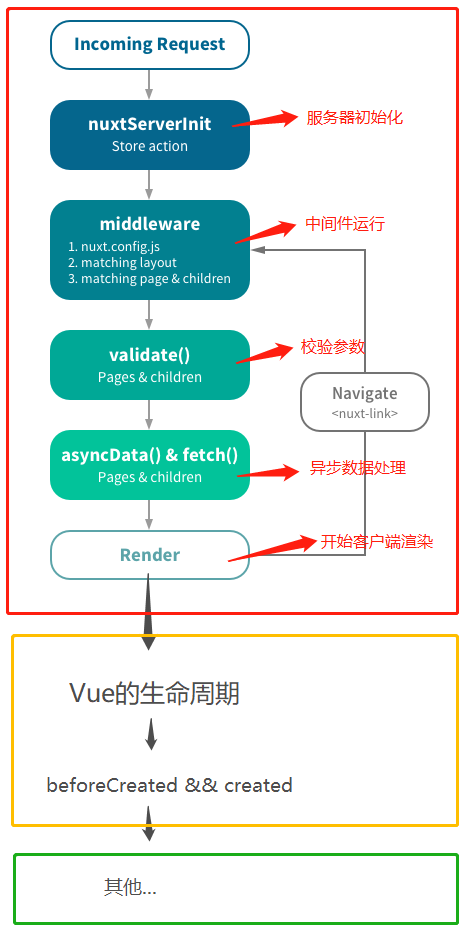
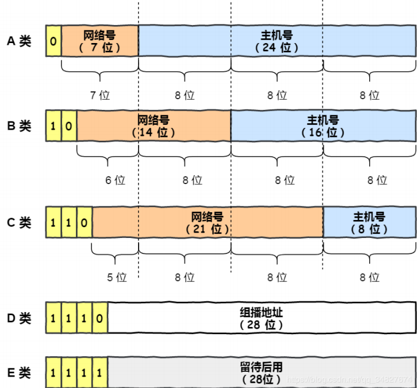
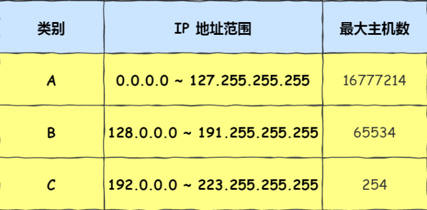
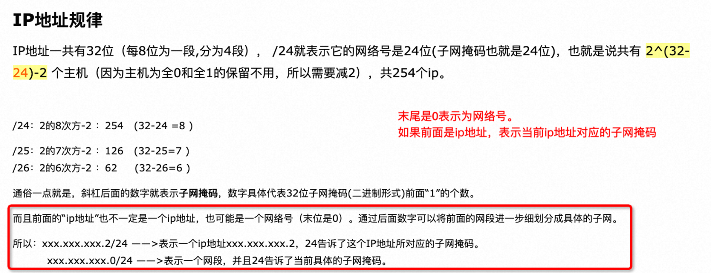
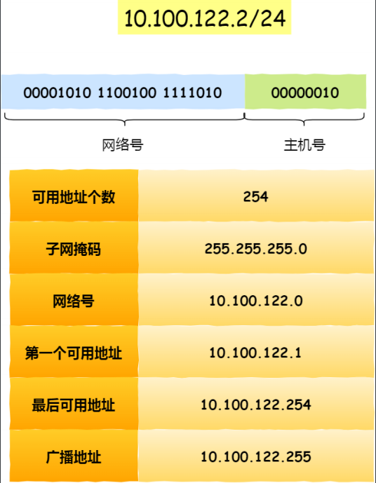
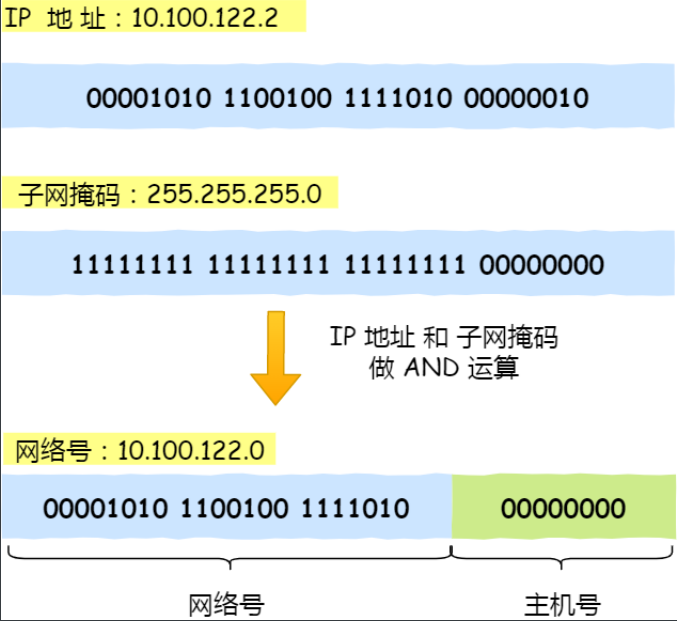
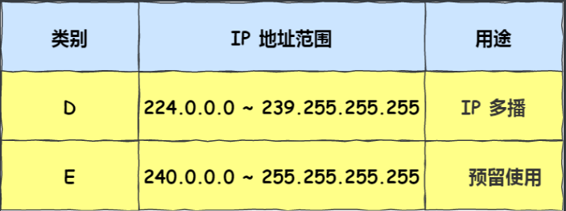
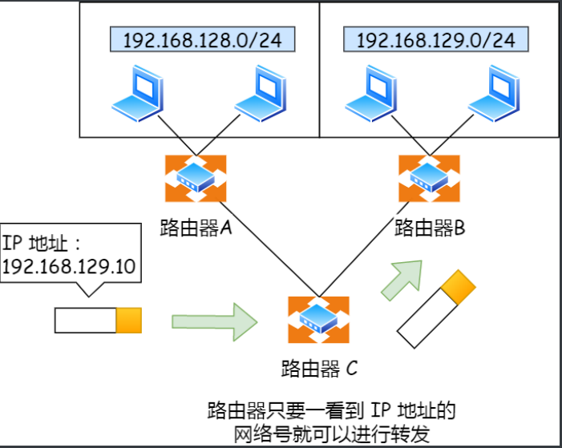

[TOC]


## 一、前端

### 1.1 Css/Scss

#### 1.1.1 层叠性
```
浏览器的渲染机制是从上至下, 当有多个样式同时应用到同一个dom元素时, 默认使用最后一个样式。(不考虑手动设置权重的case)
```
#### 1.1.2 继承性
```
  1. 前提: 标签之间是嵌套关系
  2. 文字颜色、字体大小、字体、行高、文字有关的属性都可被继承
  3. 特殊点:
    a标签不能实现字体颜色的集成, 字体大小可被继承
    h1标签不可以继承字体大小, 继承过来会做一些 `计算`.
```
#### 1.1.3 优先级
| 类别     | !important | 行内样式 | id选择器 | 类选择器 | 标签选择器 | 默认样式 |
| -------- | ---------- | -------- | -------- | -------- | ---------- | -------- |
| 对应权重 | 1000以上   | 1000     | 100      | 10       | 1          | 0        |

```
对于所有的选择器, 都会统计权重, 哪个权重大, 使用哪个(若权重一样, 则应用最后一个)
```
#### 1.1.4 backgroud设置背景图片样式顺序决定是否生效
1. backgroud: url('xxxx'); 的样式必须写在最前面。
   eg: background-size: 100%; 的参数才会生效, 因为它是override机制。
   同时可以在background: url('xxx') 接属性。
   eg:  background: url('xxx') no-repeat 100% 100%;  即一次性设置完。
2. 使用background-image: url('xxx') 的方式, 这样则不需要考虑前后顺序
#### 1.1.5 Vue在元素中要使用当前vue对象的属性作为图片路径显示在 background-image: url() css上解决办法
* 需要使用backgroundImage属性:
```js
  <div class="supply-index" :style="{backgroundImage: 'url(' + attributeObj.image + ')'}"></div>
```
注意: ```使用的是backgroundImage, 而不是background-image```

#### 1.1.6 div里面的内容如何垂直居中
```css
width: 100%;
top: 50%;
transform: translateY(-50%);
```
* 其实top: 50%, 已经是将该dom元素垂直居中了, 但是因为要内容居中, 所以需要Y轴移动元素内容高度的50%, 即transform: translateY(-50%)

#### 1.1.7 RGBA
* RGBA来标识颜色, 第四个参数可以增加透明度

#### 1.1.8 块级元素
* 常用块级元素: div, h1-h6, p, ul, li
* 特点:
    1. 独占一行
    2. 可以设置宽高
    3. 嵌套情况下, 子元素的宽度默认与父类一致
#### 1.1.9 行级元素
* 常用行级元素: span, a, strong, em, del, ins
* 特点:
    1. 在一行上显示
    2. 不能直接设置宽和高(若实在想设置宽和高, 可以设置成行内块元素)
    3. 元素的宽和高就是内容撑开宽和高
#### 1.1.10 行内块元素
* 常用行级元素: input, img
* 特点:
    1. 在一行上显示
    2. 可以设置宽高
#### 1.1.11 行高
* 定义: 浏览器默认文本大小为16px, 行高是基于基线与基线之间的距离 = 文字高度 + 上下边距(padding)
#### 1.1.12 浮动
* 定义: 标准文档流: 自上而下, 自左向右, 块元素独占一行, 行元素在一行上显示, 碰到父边框后换行

### 1.2 Java Script
#### 1.2.1 Object.assign
* 使用方式: 
* 注意事项: 若两个对象的key一致, 那么会覆盖value, key不会重复

#### 1.2.2 前端js获取滚动条距离顶部的位置
``` js
let scrollTop = document.documentElement.scrollTop || document.body.scrollTop
//获取当前window窗体的高度: document.documentElement.clientHeight
window.addEventListener('scroll', function(){}, true) //注册滚动条滚动事件

document.documentElment //获取的是html元素
```

#### 1.2.3 splice删除指定数组下标
```js
arr.splice(0, 1) // => 表示从下标为0开始删除一个元素,
arr.splice(0, 1, 'test') // => 则对arr数组下标为0开始添加一个test元素
```

#### 1.2.4 Object.keys(), Object.values()
* 处理数组的结果, 前者会返回数组的每一个元素对应的下标, 后者会返回每一个元素的value

#### 1.2.5 addEventListener注册事件注意点
1. 首先addEventListener添加的事件是不会被覆盖的
     其次若有层级关系(会冒泡), 则遵循以下规则：
       true的执行顺序在false之前
       true和true之间: 外层的先触发 
       false和false之间: 内层的先触发

#### 1.2.6 如何动态的为对象添加key的值

* 参考如下代码：

  ```js
  var objKey = "123"
  var objValue = 456
  // 如果我们想创建一个对象，使用objKey的值作为key，objValue的值作为value，比如如下操作:
  var obj = {objKey: objValue}  // ===> 此时的obj对象的结构为：{objKey: 456}
  // 如果我们一定要将obj变成{123: 456}, 那该怎么办呢？
  // 这样写：
  var obj = {[objKey]: objValue} // ===> 使用这种方式就能将obj变成 {123: 456}的结构了
  ```


#### 1.2.7 javascript ... 运算符

* 先看如下案例

  ```javascript
  let x = {a:1, b:2, c:3}
  let y = [{x:4}, {y:2}, {z:2}]
  let z = [x, ...y]
  
  console.log(z) // 
  /**
  0: {a: 1, b: 2, c: 3}
  1: {x: 4}
  2: {y: 2}
  3: {z: 2}
  */
  ```

* 很明显，JavaScript的**...**运算符具体的作用为**拆解**：将里面的元素拆解出来，但我们通常不单独使用它，因为会报错，**eg：...y**，会报：

  ```javascript
  Uncaught SyntaxError: Unexpected token '...'
  ```

  的错误。通常，使用**...**运算符时，会把元素拆解然后组装到一个新的对象（**可以是数组，也可以是普通的对象**）中去。**在上述案例中，我们将y进行拆解，然后把y的每一个元素和x对象放进了z数组中去**

### 1.3 Vue.js/Nuxt.js
#### 1.3.1 vue.js生命周期


#### 1.3.2 nuxt.js 生命周期

#### 1.3.3 computed(计算属性)
```javascript
/* 举个栗子: 当前vue对象中有一个属性叫imageUrl, 但是因为它只是一个url,在动静分离的项目中,  
如果要显示它必须还要在它前面添加oss host和ip, 所以此时可以使用计算属性对该属性进行处理, 计  
算属性的作用比监听器更好, 因为它自带内存机制. 若this.imageUrl值没有变, 则每次获取计算属性  
时都是从内存中获取
*/
computed: {
  realImageUrl: function() {
    return 'oss host : port ' + this.imageUrl
  }
}
```
* 在vue中computed的属性可以使用箭头函数, 第一个参数为vm(当前vue对象). eg:
```javascript
computed: {
  realImageUrl: vm => {
    return 'oss host : port ' + this.imageUrl
  }
}
```
* 在nuxt中, computed的属性请使用普通函数, 如上述第一种. 若使用箭头函数的方式, 会不定时(有时能将当前vue对象依赖注入到vm参数,
  有时却不能)的出现 ```imageUrl of undefined``` 的错误

#### 1.3.4 v-show和v-if
```txt
1. 首先要了解css中display: none; 该属性是将dom元素给隐藏且不占用文档流,但元素依然在网  
   页源码中可见(F12).  
2. v-show指令的功能就是上述所说. 
3. v-if指令的功能是将整个dom处于 '渲染-销毁' 这样的生命周期中. 
4. 区别:  
   v-show: 不管初始值为false/true, 都会先渲染对应的dom元素。 对于需频繁控制dom元素的隐藏/显示的需求, 消耗性能较小.  
   v-if:  懒加载dom元素, 只有当value为true的时候才会对dom元素进行渲染, 若由true -> false, 则会对dom元素的所有  
          属性(绑定的事件, 响应式数据的绑定等)进行销毁. 当由false -> true, 则会重新绑定, 所以相比v-show而言,  
          性能消耗较大.
```

#### 1.3.5 v-for
* 先看以下示例(刚接触vue的学者渲染列表数据的经典写法)

  ```html
  <div v-for="(item, index) of items" :key="index">
    <span>{{item.xxx}}</span>
  </div>
  ```

*  强烈建议不要使用上述的写法, 若你是做h5项目下拉式的分页功能倒无大碍. 若你是做web pc使用异步请求动态分页渲染列表时, 它会让你见到```非常奇怪```的数据. 你会发现后面的几页数据(不刷新页面的前提下)始终会与前面一页的数据, 但重新刷新页面时, 数据又正常了。 出现这样的case主要是因为vue为了减少性能消耗添加缓存的原因. 在vue中, 你可以为每一个dom元素绑定key属性, 改属性是vue使用缓存的依据. 对于上面的例子, 当在web pc使用异步请求动态分页渲染列表的情景下, 若我们使用index作为当前dom元素的key, 那么在渲染后面的页数时, 后面的index基本与上一页准备销毁的dom元素的key一致, vue为了尽可能高效的渲染元素, 若发现销毁队列中的dom元素中与将要渲染的dom元素的key一致, 则会采用销毁掉列中的dom元素进行渲染.所以, 在web pc使用异步请求动态分页渲染列表的情景下, 我们应该使用唯一标识作为dom元素的key, 这个唯一标识可以是  
   数据结构中的唯一值或者手动引入第三方uuid类库, 将uuid与dom元素的key绑定.

#### 1.3.6 this.$set/Vue.set 响应式属性
* 众所周知, vue的响应式数据是绑定在data方法中. 举个栗子:

  ```js
  <template>
    <h1>the man's name is: {{man.name}}</h1>
    <h2 v-if="man.age">the man's age is: {{man.age}}</h2>
    <button @click="modifyAge">modify age</button>
  </template>
  
  export default {
    data () {
      return {
        man: {
          name: 'eugene'
        }
      }
    },
    methods: {
      modifyAge () {
        this.man.age = 13
      }
    },
    mounted () {
      this.man.age = 12
    }
  }
  
  /*
  1. 首先, 页面上不会显示 the man's age is 12。 因为age这个属性并不是响应式属性,
  2. 其次, 就算点击 modify age button 页面也不会显示 the man's age is 13。 因
     为this.$set/Vue.set方法动态添加响应式属性的前提是对象中的key不存在(在该栗子下,
     虚拟dom树挂载到页面上时, mounted钩子方法就被调用了.), 否则该方法只做更新key对
     应的value操作
  3. 要在页面中显示the man's age is 12, 需要两个前提
     A. man对象中无age属性
     B. 在A的前提下调用this.$set(this.main, 'age', 12) 或 Vue.set(this.main, 'a
        ge', 12)方法
  */
  ```

* 场景: 在当前的vue实例中有一个名为currentUser的对象, 该对象只有一个id的属性, 现需要
  给该对象添加一个name和age属性, 以至于在页面中能够支持响应式渲染。

  ```javascript
  方法1: 在初始化vue对象的时候给currentUser对象添加name和age属性 value均为空字符串
  方法2: 使用Vue.set(this.currentUser, 'name', value) or this.$set(this.currentUser, 'name', value)
  方法3: this.currentUser = Object.assign({},  this.currentUser, {
      name: 'Eugene',
      age: 23
  })
  //一定要将Object.assign创建一个新对象并重新赋值给this.currentUser对象, 而不要这样使用
  Object.assign(this.currentUser. {
                name: 'Eugene',
                age: 23
                })
  // 因为Object.assign是将结果作为返回值返回
  ```

#### 1.3.7 自定义指令
1. 注册全局自定义指令
    ```js
    Vue.directive('disabled', {
      bind: (el, binding) => {
        // bind钩子函数, vue挂载dom元素时会触发, 且只调用一次
      },
      update: (el, binding) => {
        // 虚拟dom树更新时, 该钩子函数会被调用
      }
    }
    ```
    ```最好别在bind钩子函数中操作其他dom元素, 因为它在虚拟dom树被创建时会被触发, 此时html的dom树还没有生成, 无法获取其他dom元素, 至于update钩子函数是否可以获取其他dom元素待确认```

2. 解析


3. [自定义指令官方文档api：点击跳转](https://cn.vuejs.org/v2/guide/custom-directive.html)

#### 1.3.8 vue-router base属性
```
添加该属性后 route会默认在每次跳转路由前把这个前缀给加上, 此时在浏览器中添加这个前缀或者不添加这个前缀都能match上路由
```
#### 1.3.9 Nuxt v-for嵌套v-if的坑
* 如下case，一定要将前面的v-if改成v-show, 否则页面会在挂载(**mounted钩子函数不会被执行**)的时候失败。
  具体错误如下: [nuxt] Error while initializing app DOMException: Failed to execute 'appendChild' on 'Node': This node type does not support this method.
  **前提: message 在实例化vue 对象时 要为false**

  ```html
  <div v-if="message">{{message.type}}</message>
  ```

#### 1.3.10 .native添加原生事件
* 使用组件ui库, 若第三方ui库提供的组件中存在@click事件, 则直接使用@click会生效, 否者请加上.native    
  即 @click.native 表示使用原生的click事件

#### 1.3.11 nuxt.js重定向
```
Nuxt.js 在asyncData方法中使用context上下文的redirect重定向时, 
该方法有三个参数(statusCode, url, params)若只填一个url 则statusCode默认为302
若要传参数(只支持params的参数, 即锚点参数, 若存在query参数的话 重定向会失败), params参数是一个对象, key, value的格式
```
#### 1.3.12 vue深度监听属性
```js
watch: {
  属性: {
    //self: this,
    handler: function(newValue, oldValue) {
      console.log(newValue)
    },
    deep: true
  }
}
```
* 通常在pc端写table组件时会用到, 一般prop为数组时, 这个会常用。
* 使用该方式对数组进行深度监听, 否则普通的监听数组内部数据进行改变时, 不会触发监听事件.
  注: 在深度监听方式中, 如果要在里面处理当前vue对象, 最好别使用箭头函数, 因为此时的this为undefined,
    通常会添加self:this 属性来获取当前vue对象, 并在函数里面使用self来获取vue对象.

#### 1.3.13 vue脚手架3.0版本之前的路由配置
* vue router插件必须在src目录下(第一层)
#### 1.3.14 前端生成excel表格自定义组件
* npm插件包: Track to this [plug](https://www.npmjs.com/package/export-excel-eug)
* 插件包源码: Track to this [repository](https://github.com/AvengerEug/export-excel-eug)
* 测试包: Track to this [test repository](https://github.com/AvengerEug/test-export-excel-eug) 

#### 1.3.15 限制输入字符的语句在linux中会失效
* 使用 `return (/[\d]/.test(String.fromCharCode(ev.keyCode || ev.which))) || ev.which === 8` 的方式限制输入字符, 在window环境上是可行的, 但是在linux系统下会失效
#### 1.3.15 vue.js嵌套路由 子路由path的定义
* vue.js 嵌套路由 chidren中的path不需要加斜杠(/)
  ```js
  {
    path: '/user',
    component: () => import('具体的组件'),
    children: [
      {
  	  path: 'list',
  	  name: 'user-index',
  	  component: () => import('具体的组件')
      }
    ]
  }
  ```

#### 1.3.16 Nuxt.js 官网提供的自定义loading组件. 并将该组件定义在nuxt.config.js的loading 选项中
* 组件
  ```vue
  <template>
    <el-container class="loading-container" v-show="loading">
      <el-main class="loading-main" v-loading="true"
          element-loading-text="加载中"
          element-loading-spinner="el-icon-loading"
          element-loading-background="rgba(0, 0, 0, 0.3)"></el-main>
    </el-container>
  </template>
  
  <script>
    export default {
      data: () => ({
        loading: false
      }),
      methods: {
        start () { // 可以理解成钩子函数, 路由更新时被调用
          this.loading = true
        },
        finish () { // 路由更新完毕(asyncData方法调用完成且页面加载完)是被调用
          this.loading = false
        },
        fail () { // 路由更新失败时调用
        }
      }
    }
  </script>
  ```
* 配置 
  ```js
  /*
   ** Customize the progress-bar color
   */
  loading: '@/components/loading.vue', // 自定义loading组件的位置
  ```

#### 1.3.17 vue.js父子组件加载顺序
* 从上往下查看

|  父组件  |  子组件  |
| -------- | ------  |
|   beforeCreate   |         |
|   created   |         |
|   beforeMount   |         |
|      |    beforeCreate    |
|      |     created    |
|      |    beforeMount     |
|      |     mounted    |
|   mounted   |         |
|    beforeUpdate(可获取渲染之前的dom元素)    |  beforeUpdate  |
|    update(可获取最新的dom元素)    |  update  |
|      |    beforeDestroy(有vue实例)     |
|      |    子组件destroyed(无vue实例)     |
|   父组件beforeDestroy   |         |
|   父组件destroyed    |         |

#### 1.3.18 vue.js .sync修饰符
* 背景: 都知道在编写vue组件的时候只能使用一个v-model 完成双向数据绑定, 若想绑定多个双向数据绑定的变量呢？

* 解决方案: 使用.sync修饰符  
    1. 父组件parent.vue   
    
       ```html
       <children v-model="value" :customerAttr.sync="myValue" />
       ```
    
    2. 子组件chirldren.vue  
    
       ```javascript
       methods: {
           notify (valueInner) {
               this.$emit("update:customerAttr", valueInner)
           }
       }
       ```
    
         => 当在子组件中调用了notify方法时, 则会同时更新父组件的myValue的值为子组件$emit中的valueInner

#### 1.3.19 vue.js 实现自定义组件v-model

* 需求：我们需要针对一个组件添加一个属性，能支持双向数据绑定，如下

  ```html
  // parent.vue
  <my-component v-model="test" />
  ```

  当myComponent.vue文件中的test修改后，parent.vue中的test属性也会随之改变

* 实现步骤:

  1. 父组件

     ```html
     // parent.vue
     <my-component v-model="test" /
     ```

  2. myComponent

     ```javascript
      methods: {
          notify (valueInner) {
              // 此段代码会将valueInner中的值会同步至parent.vue文件中的test
              this.$emit("input", valueInner)
          }
      }
     ```

     

### 1.4 ElementUI
### 1.5 npm
#### 1.5.1 package.lock.json
```
npm 5.6之后是以package.lock.json的版本为主, 5.1之前package.lock.json基本上没啥用, 因为就算指定了版本但还是会install最新的
```
#### 1.5.2 package.json文件中的依赖
```
后面使用的是^符号(eg: ^2.0.0)的话, 如果依赖包更新了 那么会下载最新的依赖(前提, package.lock.json中没把版本定死),
若确定是使用某个依赖包的话, 那么使用~符号  eg: ~2.0.0  则只会下载2.0.0版本的依赖
```
#### 1.5.3 npm install指定版本依赖并保存至package.json
* eg: 安装前端生成excel表的依赖 xlsx: 0.14.0

  ```shell
  npm install --save xlsx@0.14.0
  npm install --save file-saver@2.0.0
  ```
#### 1.5.4 npm发布自己编写的vue.js组件库
1. 使用vue3.0版本之前的脚手架, 搭建webpack-simple模板
   ```
   vue init webpack-simple export-excel-eug
   ```
2. 修改webpack.config.js文件, 配置别名 '@': resolve('src')
   ```
    个人习惯, 习惯于使用@与根目录进行映射
   ```
3. 撰写自定义组件
4. 调用Vue.component api全局注册组件
5. 修改webpack.config.js文件, 修改打包配置
   ```txt
   output配置: 
   1. 新增library="exportExcel"  -> // 模块名, 其他类库使用require的方式引用的原因就是配置了这个
   2. 新增libraryTarget="umd" -> // libraryTarget会生成不同umd的代码,可以只是commonjs标准的，也可以是指amd标准的，也可以只是通过script标签引入的
   3. 新增umdNamedDefine="true" -> // 会对 UMD 的构建过程中的 AMD 模块进行命名。否则就使用匿名的 define
   4. 修改filename为exportExcel.js
   
   entry配置
   1. 修改entry配置为: entry: './src/index.js',  => 指定插件打包时使用哪个入口，此index.js文件内容一般就是添加一个对象， 且对象中包含一个叫install的方法，此install方法的第一个参数就是vue，当调用Vue.use方法时就会把当前的vue对象传入，目的就是可以使用vue这个对象创建对象的组件、指令等等
   ```
6. 修改package.json文件, 指定插件入口  
   ```json
   "private": false,  -> 需要发布, 因此需要将这个字段改为 false
   "main": "dist/exportExcelEug.js",  -> 当在第三方使用类库, 使用 import ExportExcelEug from 'export-excel-eug'时, 会根据插件的package.json的main入口找文件
   ```
   ```txt
   library：指定的就是你使用require时的模块名
   libraryTarget：为了支持多种使用场景，我们需要选择合适的打包格式。常见的打包格式有 CMD、AMD、UMD，CMD只能在 Node 环境执行，AMD 只能在浏览器端执行，UMD 同时支持两种执行环境。显而易见，我们应该选择 UMD 格式。
   有时我们想开发一个库，如lodash，underscore这些工具库，这些库既可以用commonjs和amd方式使用也可以用script方式引入。
   这时候我们需要借助library和libraryTarget，我们只需要用ES6来编写代码，编译成通用的UMD就交给webpack了
   umdNamedDefine：会对 UMD 的构建过程中的 AMD 模块进行命名。否则就使用匿名的 define
   ```
7. 由于插件的指定路口在dist打包目录下, 所以先把包打好再发布
8. 遇到的坑

    |  错误  |  原因  |
    | ----   |  ---- |
    | no_perms Private mode enable, only admin can publish this module | 默认镜像非官方的, 需要重新设置.命令: npm config set registry http://registry.npmjs.org　|
    | npm publish failed put 500 unexpected status code 401 | 没有登录，需要登录: npm login 即可|
    | npm ERR! you do not have permission to publish "your module name". Are you logged in as the correct user? | 包名被占用, 需要重新命名. 命名之前最好先去npm官网查看包名是否被占用 |
    | You cannot publish over the previously published versions | 每次发布时需要更新版本, 修改package.json文件的version字段即可.|
    | npm publish时经常报403 | 可以确认下注册的账号是否在邮箱中验证完毕 |
9. 发布包的一句核心话就是: 将所有的插件(插件存在install方法)export出去, 并在使用组件项目入口使用Vue.use(插件)的方式   
   (Vue.use方法时会触发插件的install方法)生效.

   [附带详细教程](https://blog.csdn.net/avengerEug/article/details/107144595)

#### 1.5.5 npm+git搭建私有npm仓库
* 背景: 当项目中有自己内部写好一些类库, 但是不想发布到npm公网中, 搭建私有仓库为不二选择。
* 搭建npm私有仓库的三种方式:
    1. cnpm搭建
    2. verdaccio搭建
    3. git

    > 每种方式都自己的优劣势, 感兴趣可以自己研究。
    
* npm + git搭建私有仓库
    1. 选择该方式原因
       ```shell
       npm + git 搭建、集成速度快
       ```
    2. 创建私有git仓库(最好是创建一个npm私有仓库的group, 易于管理。 注:gitlab中能创建group以及私有仓库, github不能创建group, 且私有仓库需要付费)
       ```
       假设在git上创建了一个group, 叫npm-pr, 私有仓库名为hello-world。
       url为http://host/npm-pr/hello-world.git 或 git@host:npm-pr/hello-world.git
       ```
    3. 初始化scope
       ```shell
       npm init --scope=npm-pr
       ```
    4. push代码

    ***
    上述4步算完成私有仓库的搭建

    5. 项目依赖类库, 从私有仓库中获取(package.json文件中配置)
       ```json
        // 采用ssh的方式拉取指定branch的依赖
        "dependencies": {
          "@npm-pr/hello-world": "git+ssh://git@host:npm-pr/hello-world.git#branchName"
        },
       
        // 采用https的方式拉取指定branch的依赖
        "dependencies": {
          "@npm-pr/hello-world": "git+https://用户名:密码@host:npm-pr/hello-world.git#branchName"
        },
       ```
    6. 安装依赖
       ```shell
       npm install @npm-pr/hello-world
       
       # 安装后的包路径为node_modules/npm-pr/hello-world  所以在对应前端框架引用插件入口出要注意文件的位置
       ```

#### 1.5.6 npm 和 cnpm的坑

* 在前后端分离的项目中，我们前端通常是使用模块化开发的方式进行开发，这样就需要使用npm 和node.js。 在拉取项目进行开发的时候，我们通常要进行install操作，目的就是为了和mvn项目一样，引入一些依赖。但是，npm的镜像源是国外，因此会出现网络不稳定的情况，于是乎我们会使用cnpm来进行安装依赖。这里就会出现一个坑：当你同时使用npm和cnpm来安装依赖时，有可能出现不兼容的情况，我本人今天就出现了babel版本不一致的情况，直接导致项目启动不起来。经过网上的调研后，发现这种情况是属于npm和cnpm混用才会发生，而且有时候在纯使用cnpm时，也会出现一般奇奇怪怪的情况。因此，在开发时，建议使用原生的npm，如果出现这种奇奇怪怪的情况时，果断的使用npm来安装依赖

### 1.6 Html

#### 1.6.1 手动设置ie浏览器以最新版本渲染页面
* 添加meta,使IE用最新版本渲染页面
```html
<meta http-equiv="X-UA-Compatible" content="IE=Edge">
```
#### 1.6.2 指定浏览器对html文件的编码格式
* HTML 页面, 在head标签的meta标签中设置charset='utf-8' 就能使浏览器以utf-8的标准去解码
```html
<meta charset="UTF-8">
```

### 1.7 ES6语法
#### 1.7.1 export 和 export default的区别
  1. 首先, ES6中存在多模块的概念, 相当于java中的pacakge, 在使用它的时候需要import,  但是它不同与java的package的是, 它需要手动export出去, 即将包暴露出去
     
  2. export default 只能暴露出一个接口.eg: xxx.js文件
     
     ```js
     export default class xxx {
       static a = 'attribute'
       static f = () => {console.log('f')}
     } 
     ```
     
     xxx中包含许多属性和方法, 且需要static修饰.
     
     使用时：
     
      ```js
     import xxx from 'xxx文件的路径'
     获取a属性: xxx.a
     调用f方法: xxx.f()
      ```
     
  3. export 通常是可以暴露多个接口, 但是在import时, 需要加上 {} 来import指定的接口。eg: xxx.js文件:
     
     ```js
     const a = 'attribute'
     const f = () => {console.log('f')}
     export {
       a,
       f
     }
     ```
     
     使用时:
     
```txt
     获取a属性: import { a } from 'xxx文件路径'
     获取f方法: import { f } from 'xxx文件路径'
     同时获取a属性和f方法: import { a, f } from 'xxx文件路径'
```

  4. module.exports = {} 和export default {} 时等价的

***

### 1.8 跨域
#### 1.8.1 出现跨域的原因
  * 违背同源策略(协议、域名、端口都要相同)时, 就会出现跨域
     ```text
     eg: vue.js项目使用localhost:8080作为默认url, 而springboot项目若使用localhost:8081作为服务, 那么这就是两个不同应用程序, 当8080项目在网页中要请求springboot项目8081的一些数据时, 若8081后台没有做跨域处理, 那就会出现跨域. 在这个过程中, 是因为浏览器发现我要请求的资源并不是当前的应用程序。在请求资源时, 浏览器还会根据简单请求和非简单请求进行'预检'操作.
     ```
#### 1.8.2 预检操作
  * 浏览器将跨域请求分为两类, 简单请求和非简单请求
    1. 简单请求: 
      ```txt
    包括HEAD, GET, POST方法请求, 且HTTP请求头信息不会超过以下几种字段: Accept, Accept-Language, Content-Language, Last-Event-Id, Content-Type(只限于3个值: application/x-www-form-urlencoded, multipart/form-data, test/plain)
      ```
    2. 非简单请求:
      ```txt
    包括PUT, DELETE方法的请求以及Content-Type为application/json。
    针对于非简单请求, 浏览器会'预检'(preflight)请求, 主要目的为确认服务器是否允许本地请求(包括源、请求方法、请求头信息等等), 只有预检通过时, 浏览器才会真正的发送XMLHttpRequest, 否则报错(跟跨域相关, 但具体时预检请求没有得到正确的返回状态)。
      ```

### 1.9 some方法
  * some方法的主要用途时some内的表达式返回true则为true, 意为存在的意思, 注意如下几种情况的写法, 主要是看箭头函数右侧的返回值
    ```js
      [{a: 1, b: 2}, {a: 2, b: 1}].some(_ => _.a === 2)   =======  true
      [{a: 1, b: 2}, {a: 2, b: 1}].some(_ => { _.a === 2 })  ======= false
      [{a: 1, b: 2}, {a: 2, b: 1}].some(_ => { return _.a === 2 })  ======= true
    ```

### 1.10 React

#### 1.10.1 在生命周期中调用异步请求的坑

* 子组件要获取父组件的一些异步请求资源，如果父组件是在生命周期钩子函数调用的，那么这个异步请求资源就会一直pendding，**直到父子组件都渲染结束后，这个请求才会继续往下走**。

#### 1.10.2 react dispatch的坑

* 在react中，如果我们使用dispatch机制调用了module的某个具体的方法，其中，我们对这个dispatch做了promise的then操作，目的是在dispatch执行完毕后执行then里面的操作来达到同步的目的。但是，若dispatch中的逻辑有错误，比如出现了这种**xxx of undefined**的错误，此时不会进入then方法，如果dispatch中有call api的操作，此时的api就会一直处于pendding状态。总结就是：dispatch内部的逻辑出错后，不会进入then后面的操作，且不会报错，这个错误会被框架给吃掉的。

## 二. 后端
### 2.1 Java basic
#### 2.1.1 Double引发的Null Pointer Exception
```java
Double amount = null;
amount += 123;  --> Null pointer exception , 底层后调用 amount.valueOf() + 123  进而导致NullPointerException
```
#### 2.1.2 强转类型前提
* Java不能直接使用(Long)的方式将integer类型强转成Long类型. 因为Integer和Long两个类没有继承关系。
    ==> **只有存在继承关系的两个类才能使用括号的方式进行强转**。
#### 2.1.3 基础数据类型相等的判断
* 最好使用包装类型并使用equals方法进行判断, 拿Integer和Long类型举例,在(-128 ~ 127)的范围内,是从缓存中取数据, 当不在这个范围内时, 每次都是创建新对象. 栈内存中存放对象引用地址不一致, 使用 == 来判断相等时, 当然不一致。
#### 2.1.4 Split方法
* java split方法, 这种字符串切割 "a, b, c," 若单独的使用split(",")的方式  
  那么最后的数组长度为3而不是4, 因为这会调用split一个参数的重载方法, 
  可以指定长度 split(",", 4) 则指定长度为4
#### 2.1.5 异常中try, finally, catch中return的顺序
* 前提: 程序抛了异常, 并且try catch住了.
1. 在catch中有return，finally中无return:  
   会先执行catch中的所有语句, 包括return后面的逻辑, 执行完之后不会立刻return, 而是去找有没有finally,
   如果有则执行finally的语句, 再返回到catch中的return
2. catch和finally中都有return:  
   会先执行catch中的所有语句, 包括return后面的逻辑, 执行完之后不会立刻return, 再进finally, 此时发现
   finally中有return, 那么就会走finally中的return逻辑, 从而catch中的return失效了, 即出口在finally了
#### 2.1.6 Servlet中没有暴露出无参构造器(手动编写了带参构造器)
* 访问时会报500, 因为系统会采用反射的机制调用无参构造器初始化当前servlet
#### 2.1.7 根据oss url获取远程图片, 并转成base64
1. 使用ossClient的getObject方法获取图片的输入流
2. 使用1024字节长度的方式, 读取输入流的信息, 并同时写进ByteArrayOutputStream输出流
     ``` java
     ByteArrayOutputStream outStream = new ByteArrayOutputStream();
     int len = 0;
     while ((len = ossObject.getObjectContent().read(buffer)) != -1) {
         outStream.write(buffer, 0, len);
     }
     ```
3. 再将输出流转成byte数组
      outStream.toByteArray()
4. 使用jdk自带的Base64 encode编码方法, 将byte数组转成base64

* 使用字节限制每次读取的长度, 使用while循环保证能读取整个流

#### 2.1.8 动态代理抛出实际真实异常
* 因为动态代理对象抛出的异常对象为顶级对象Throwable, 所以要获取真实对象的话, 需要调用异常的e.getCause()方法

#### 2.1.9 多线程基础
##### 2.1.9.1 volatile关键字与System.out.print的欢喜冤家
* volatile关键字的作用大家也都明白, 大致就是提供多线程对临界区变量的可见性、一致性和有序性(JMM主要围绕这三个特性: Java内存模型)
  在 `实战Java并发程序基础`一书中有提到, 当jvm采用server模式运行java程序时, 由于`配置比较高大上(暂时先这么理解)`, 导致jvm有闲
  情进而导致cpu有闲情对系统进行优化, 尽量让所有的临界区的变量变得可见。
* 上面的背景只是就先介绍到这里, 咱们看下面一段代码: 
  ```java
  public class Thread9 {
      private static boolean ready;
      private static int number;
  
      public static class ReaderThread extends Thread {
  
          @Override
          public void run() {
              while(!ready);
  
              System.out.println("死循环结束, number = " + number);
          }
      }
  
      public static void main(String[] args) throws InterruptedException {
  
          new ReaderThread().start();
          Thread.sleep(1000);
          number = 43;
          ready = true;
          System.out.println("主线程休息3秒");
          Thread.sleep(3000);
      }
  }
  
  /* 
      针对如上的理解, 我们可以得知, 开启ReaderThread线程时, 在主线程睡眠1秒时, ReaderThread线程一直处于死循环中,
      当主线程修改临界区number和ready的变量时, 由于ReaderThread线程一直处于死循环中, 压根没给jvm留出一丝的空闲
      时间, 所以jvm没法对系统进行优化，尽量让所有的临界区的变量变得可见, 所以上述代码运行结果位: ===>  
        控制台输出 "主线程休息3秒" 并程序一直在运行中, 给人的感觉就是无任何反应
  
       ==>  若想让线程能够执行完毕, 则只需要在ready变量添加volatile标识符进行修饰即可。
       同时：还有一种能让人意想不到的方法, 在ReaderThread线程的run方法的死循环中, 添加System.out.print()输出语句,
          输出任何信息都行, 你会发现我不添加volatile标识符, 线程也能正常结束！！！！
  
          这是为什么呢？？？
  
          ==>  原因就在于System.out.print()源码中有synchronized关键字, 对于jvm而言, 有synchronized关键字的是需要
               获取和释放对象的锁的, 这些操作对于jvm而言是需要等待时间的, 而此时jvm发现我有闲情了, 那么它就会优化
               系统代码, 尽量保证临界区的变量能够对所有线程可见, 所以线程就正常结束了。
  */   
  ```

##### 2.1.9.2 JDK线程状态及转换图


#### 2.1.10 抽象类和接口的区别
* 抽象类
    1. 子类必须重写抽象类的`抽象`方法
    2. 包含抽象方法的一定是抽象类
    3. 不能直接实例化对象
    4. 抽象方法只有声明，无方法体，方法权限不能为private

* 接口
    1. 可以同时实现多个接口
    2. 方法都是默认public修饰的，无方法体
    3. 接口中的变量默认都是public static final修饰的常量
    4. 实现接口的类一定要实现接口中的所有方法

* 共同点
    1. 都不能实例化对象
    2. 都有抽象方法
    3. 派生类都要重写或实现抽象方法

#### 2.1.11 Overload和Override的区别
* Overload(重载)
    1. 参数个数、类型不同
    2. 与返回值和函数修饰符无关
    3. 存在于同一个类中

* Override(重写)
    1. 子类重写父类方法
    2. 方法名、参数名、参数个数、参数类型完全一致
    3. 子类方法权限不能小于父类, 方法权限 >= 父类
    4. 子类方法抛出的异常不能大于父类, 方法抛出异常 <= 父类
    5. final修饰的方法不能被重写

#### 2.1.12 ArrayList，LinkedList，Vector

| 类别     | 底层实现 | 是否线程安全 | 是否可重复 | 是否有序 | 其他|
| ----| ------ | ------ | ------ | ------ | ------ |
| ArrayList |   线性表(数组)  |  `否`  |   是   |    否   |   默认容量为10，每次扩容1.5倍 + 1，查询快，新增、删除慢|
| LinkedList |   链表  |  `否`   |  是  |   无  | 对于新增、删除快，查询慢，一个链表，内部维护了一个叫Node的内部类，代表的就是链表上的每一个元素 |
| Vector |   线性表   |  `是`   |   是   |   是   | 同ArrayList，线程安全是因为内部所有操作数组的方法都加了synchronized关键字 |

#### 2.1.13 HashMap, HashTable, ConcurrentHashMap

|  类别   | 底层实现 | 是否线程安全 | 是否可重复 | 其他 |
| ----| ------ | ------ | ------ | ------|
| HashMap |   ---   |  `否`   |   否   |  可允许key或值为null，实现的是Map接口|
| HashTable |   ---   |  `是`   |   是   |  不允许key或值为null, 实现的是Directory接口 |
| ConcurrentHashMap | -- | `是` | 是 | 与HashMap一致，内部使用的分段锁segment提高效率，使用大量的CAS操作来保证线程安全 |

* HashMap源码

  * 属性描述

    ```java
    // 默认容量大小
    static final int DEFAULT_INITIAL_CAPACITY = 1 << 4;
    
    // 最大的容量大小, 即2的30次方
    static final int MAXIMUM_CAPACITY = 1 << 30;
    
    // 默认的负载因子，扩容的参数
    static final float DEFAULT_LOAD_FACTOR = 0.75f;
    
    // 转为红黑树的阈值, 当map中的size达到了8，此时变为红黑树
    static final int TREEIFY_THRESHOLD = 8;
    
    // 红黑树转链表的阈值，当map的size慢慢减少到了6，此时就会转化成链表
    static final int UNTREEIFY_THRESHOLD = 6;
    
    // 数组长度至少达到64才会进行转化红黑树，否则进行的是扩容操作
    // 所以如果针对同一个index对应的长度为8的链表，连续插入两个数据，数组长度就会扩容到64，
    // 再插入一次数据就会变化成红黑树
    static final int MIN_TREEIFY_CAPACITY = 64;
    ```

  * put方法

    ```java
    final V putVal(int hash, K key, V value, boolean onlyIfAbsent,
                   boolean evict) {
        // 定义了三个变量
        // tab为hashMap中的数组
        // p为数组中的链表
        // n为数组的长度
        // i为当前key hash过的index
        Node<K,V>[] tab; Node<K,V> p; int n, i;
        
        // 若当前HashMap的实例变量table为null 或者长度为0
        // 则进行实例变量table初始化
        if ((tab = table) == null || (n = tab.length) == 0)
            // resize() 为jdk1.8的扩容方法
            // 此方法包含了初始化table和扩容操作
            // resize默认容量为16
            // 扩容时，负载因子是0.75
            // 所以当size 的长度 > 12 即插入第13个元素时，会进行扩容
            n = (tab = resize()).length;
        
        // i = (n - 1) & hash  ---> 获取hash的下表
        // p为拿到key对应的节点(链表)
        // 如果等于null，则表示数组中的i的位置上没有元素，直接new一个新的
        // 节点放进去即可
        if ((p = tab[i = (n - 1) & hash]) == null)
            tab[i] = newNode(hash, key, value, null);
        else {
            // 如果key 对应的index中有数据, 
            // 则有两种可能: 
    	    // 链表转红黑树，或者直接塞在链表后面
            
            // e为要插入的新节点
            // k为新节点key
            Node<K,V> e; K k;
            
            // key相同的情况下，替换数组中的链表节点
            if (p.hash == hash &&
                ((k = p.key) == key || (key != null && key.equals(k))))
                e = p;
            
            // 如果当前节点已经是树节点了，那么直接把它put到树中即可
            else if (p instanceof TreeNode)
                e = ((TreeNode<K,V>)p).putTreeVal(this, tab, hash, key, value);
            
            // 否则是链表的情况，准备把新节点塞到链表中
            else {
                // 无限循环(遍历链表)，使用binCount属性来统计链表中的个数
                for (int binCount = 0; ; ++binCount) {
                    // 如果p节点是最后一个节点
                    if ((e = p.next) == null) {
                        // 新建一个节点放在p的后面  <============> 这里是尾插法
                        p.next = newNode(hash, key, value, null);
                        // 如果此时链表的长度为8，则变成红黑树，要put第九个时才会转
                        // 因为在put第8个的时候，size还没有加1
                        if (binCount >= TREEIFY_THRESHOLD - 1) // -1 for 1st
                            treeifyBin(tab, hash);
                        break;
                    }
                    
                    // 经过了上述if ((e = p.next) == null)的代码，
                    // e存储的对象是p的下一个节点
                    // 如果p的下一个节点与新增的节点是一模一样的，则直接跳出循环
                    if (e.hash == hash &&
                        ((k = e.key) == key || (key != null && key.equals(k))))
                        break;
                    
                    // 此时将e赋值给p，而e是p的next节点
                    // 所以现在要开始处理p的下一个节点了
                    p = e;
                }
            }
            
            // 若e != null, 一定是走了
    	    // if (e.hash == hash &&
            //           ((k = e.key) == key || (key != null && key.equals(k))))
            //           break;
            // 的逻辑
            if (e != null) { // existing mapping for key
                V oldValue = e.value;
                if (!onlyIfAbsent || oldValue == null)
                    e.value = value;
                afterNodeAccess(e);
                return oldValue;
            }
        }
        ++modCount;
        
        // 对map长度 + 1, 并且跟阈值作比较，如果比阈值大，则进行扩容
        if (++size > threshold)
            resize();
        afterNodeInsertion(evict);
        return null;
    }
    ```

  * 为什么hashMap初始容量为16？

    ```txt
    因为初始容量会参与index的运算。在hashMap中，index = (n - 1) & hash; 其中的n就是为数组容量，hash是指key的hashCode方法 返回值h与h跟16做亦或操作后的值。因为16的二进制底四位全为0， 而16 - 1 = 15的底四位就全为1了。在hashMap的设计中，为了保证hash的散列性，如果以16来和hash做&运算的话，基本上index取决于为1的那一个位置。若变成15后，低四位全为1，所以index将会取决与key的hash值，这增加了key的散列性，即为了保证key能在数组中均匀分布
    ```

  * jdk 1.7和jdk 1.8的区别

    ```txt
    在jdk1.7时，hashMap的put操作采用的头插法，扩容条件除了size要大于默认容量16 * 负载因子0.75 = 12以外还需要数组当前index位置上不为空。而jdk1.8之后，扩容条件只有size大于12即可，并且put元素的时候采用的尾插法。
    这解决了jdk1.7头插法在高并发的情况下会产生出环的情况。并且在jdk1.8时，对index的处理结果也变简单了，少了很多位运算，散列性相对于变低了，但是这影响不大，因为散列性变低了，可能发生的情况就是链表长度会比较长，但是在jdk 1.8中，当size数量超过8个且数组长度大于64时才会把链表转成红黑树。因为红黑树的查询、插入效率比链表的效率高，所以长度边长了也没关系
    ```

    1.7在高并发下会变成环的示意图:

    

  * 有什么线程安全的类可以代替吗？

    ```java
    可以使用Collections.synchronizedMaps()将map进行转化或者使用hashTable进行替换。它们两者差别都不是特别大，都是将一些操作元素的方法加了synchronized关键字，但HashTable中put的value不能为null
    ```

  * 链表什么时候会被转化成红黑树？

    ```markdown
    当`map的size大于数组长度 * 负载因子` 且 `数组要被扩容两次达到64的长度后`，再往一个长度大于8的链表插入数据时，此时会被转化成红黑树
    ```

  * 默认初始化大小是多少？为啥是这么多？为啥大小都是2的幂？

    ```txt
    默认大小是16，至于为什么是16，这个我不太清楚，我觉得还可以是32,64,128. 为什么呢？因为hashMap为了保证它的每个key的散列性，会执行这么一个算法: (n - 1) & hash. 其中n是数组容量大小16，hash是key的hashcode并跟16做了异或运算。因为16 的二进制为 0001 0000(这里只列出后8位)，而16 - 1 = 15的二进制为0000 1111。两者相比，前者16做完运算后，只取决于hash的一个位置，而后者15取决于hash的后四位，能保证index在0-15的范围内。所以是为了保证key分布在数组中的散列性，即均匀分布。
    ```

  * HashMap的主要参数都有哪些？

    ```txt
    负载因子、默认容量大小、链表转红黑树的两个阈值(16 * 0.75 和 64)、红黑树转链表的阈值
    ```

  * HashMap是怎么处理hash碰撞的？

    ```txt
    通过使用key的hashcode值以及跟默认容量长度16做右移和异或操作
    ```
  
* concurrentHashMap原理

  * 构造方法

    ```java
    /**
       * initialCapacity: ConcurrentHashMap中存储HashEntry的总个数
       * loadFactor: 加载因子
       * concurrencyLevel: Segment的个数 ---> ConcurrentHashMap中维护的数组长度
      **/
    public ConcurrentHashMap(int initialCapacity,
                             float loadFactor, int concurrencyLevel) {
        if (!(loadFactor > 0) || initialCapacity < 0 || concurrencyLevel <= 0)
            throw new IllegalArgumentException();
    
        // 当传入的segment数量个数大于2的16次方，则使用2的16次方
        // 所以segment最大数量为2的16次方
        // MAX_SEGMENTS = 2的16次方
        if (concurrencyLevel > MAX_SEGMENTS)
            concurrencyLevel = MAX_SEGMENTS;
        // Find power-of-two sizes best matching arguments
        int sshift = 0;
        int ssize = 1;
    
        // concurrencyLevel默认等于16
        // 默认情况下
        //               sshift     ssize
        // 1 < 16  =>      1          2
        // 2 < 16  =>      2          4
        // 4 < 16  =>      3          8
        // 8 < 16  =>      4          16
        // 16 < 16 停止循环
    
        // 由上可知，
        // ssize存储的值与传入的concurrencyLevel相同，即segment的个数(内部维护数组的长度)
        // sshift --->  存储的是ssize的2的次方幂的数字，比如16 = 2的4次方，所以sshit = 4
        while (ssize < concurrencyLevel) {
            ++sshift;
            ssize <<= 1;  // 左移1位，乘以2的一次方
        }
        // 32 - 4 = 28 ---> 这个变量是计算segment数组下标时用的
        // 因为hash值是一个32位的int类型数字，这里用32的原因就是
        // 后面会使用hash的高4位与segmentMask做&运算
        this.segmentShift = 32 - sshift;
    
        // segment数组长度减一, 猜测是为了计算index时用的
        this.segmentMask = ssize - 1;
    
        // 校验ConcurrentHashMap中的HashEntry的个数是否比1 << 30大
        if (initialCapacity > MAXIMUM_CAPACITY)
            initialCapacity = MAXIMUM_CAPACITY;
    
        // 来确定每个segment中的hashEntry数组的长度
        // initialCapacity为ConcurrentHashMap中HashEntry的个数
        // ssize为ConcurrentHashMap中segment的个数, 
        // initialCapacity / ssize  ==> 能得到一个segment中的HashEntry数组的长度
        // 若initialCapacity = 默认的16, 那么1为segment中的HashEntry数组的长度
        // 此时 1 * 16 < 16, 所以c不需要自增，
        // 若initialCapacity = 33, 而ssize = 16, 此时c = 2
        // 而 1 * 16 < initialCapacity = 33 所以此时c会加1
        // 所以这一段代码的作用就是向上取整
        // 从这也能看出, 因为Segment中维护的HashEntry数组的长度最小为2
        // 所以至少会有 2 * ssize(concurrencyLevel)个HashEntry
        // 若传入的initialCapacity > 2 * ssize
        // 则必须要增加每个segment中HashEntry数组的长度
        // eg: 上述所说的: initialCapacity = 33, ssize = 16的情况
        // 33 > 2 * 16, 此时放不下33个hashEntry，所以要将
        // segment中HashEntry中的数组长度加大
        int c = initialCapacity / ssize;
        if (c * ssize < initialCapacity)
            ++c;
    
        // cap = MIN_SEGMENT_TABLE_CAPACITY = 2, 即HashEntry数组的最小长度，
        // 所以就算算出来的c = 1，但是最后默认长度也会变成2
        // 对于上述的情况，假如initialCapacity = 33, ssize = 16
        // 那么算出来的c就会等于3. 但是呢，数组等于3，这样不好，因为最后在对计算index
        // 时，无法保证index分布均匀，在hashMap中，一般的容量都是2的幂方次的数
        // 所以此时，还要对cap进行处理，来获取大于c的2的幂次方的数
        // 比如上述情况下的c = 3，所需要找出比3大的2的幂次方的数字
        // 于是会执行下面一段代码，在c = 3的情况下，
        // cap执行完代码2 << 1 后，会变成4
        int cap = MIN_SEGMENT_TABLE_CAPACITY;
        while (cap < c)
            cap <<= 1;
    
        // create segments and segments[0]
        // 创建一个Segment对象，并将里面的HashEntry的扩容值给算出来了
        // 通过内部也维护了上述算出来的长度为cap的HashEntry数组
        Segment<K,V> s0 =
            new Segment<K,V>(loadFactor, (int)(cap * loadFactor),
                             (HashEntry<K,V>[])new HashEntry[cap]);
    
        // ss为放在table中的第一个segment数组, 长度为传入的concurrencyLevel
        Segment<K,V>[] ss = (Segment<K,V>[])new Segment[ssize];
    
        // 使用UNSAFE类操作数组， SBASE为Segment的offset
        // 在静态块中对SBASE进行了赋值
        // SBASE = UNSAFE.arrayBaseOffset(sc);   --> 指定位置
        // 所以这段代码是将so放在了SBASE的位置上
        UNSAFE.putOrderedObject(ss, SBASE, s0); // ordered write of segments[0]
        this.segments = ss;
    }
    ```

    ===> 构造方法总结：Hash表的长度有限制，最大为2的16次方。即先确认hash表的长度，再根据传入的hash表长度和hashEntry的长度来确定segment中要维护多少个hashEntry，主要将hashEntry的长度对hash表长度做除法，并向上取整。最终就是初始化了hash表长度和内部维护的hashEntry数组的长度。除此之外，还确定了两个变量：一个叫segmentMask，另一个叫segmentShift。其中segmentMask其实就是`hash表的长度 - 1`，segmentShift为hash表的2的幂次方的数字，比如hash表长度是16，那么segmentShift就是4(2的4次方为16)

  * put方法

    ```java
    public V put(K key, V value) {
          Segment<K,V> s;
          // ConcurrentHashMap的value不能为null --> 其实key也不能为null, 
          if (value == null)
              throw new NullPointerException();
          // 内部key并没有做null处理
          int hash = hash(key);
          
          // 这个就是要put进来的对象存放在segment数组的下标
          // 其中segmentMask在构造方法里就处理过了，它的值为segment数组的长度
          // hash >>> segmentShift 是无符号右移，高位全部补0
          // 在构造方法中总结过了, segmentShift为 32 - segment长度的2的幂次方的数字(eg: segment的长度为16，那么此数字就是4)，所以segmentShift = 28
          // 因为hash是一个int类型的数字，所以会执行如下操作
          // hash: 01000011 01000011 01000011 01000011   ===>  假设是一个任意hash值
          // 当hash >>> 28后会变成如下:
          // hash >>> 28: 00000000 00000000 00000000 00000100
          // 所以可以看到最终j的值取决于hash >>> 28操作的后四位
          // 即hash的高四位，因为segmentMask为15
          // 所以(hash >>> segmentShift) & segmentMask的结果为：
          // hash        00000000 00000000 00000000 00000100
          // &
          // segmentMask 00000000 00000000 00000000 00001111
          // j的结果: 00000000 00000000 00000000 00000100 = 4
         	// 由此可以得出segment数组默认为16的情况下, 
          // 新put进来的元素放在segment的index的值取决于hash的高四位
          int j = (hash >>> segmentShift) & segmentMask;
          
          // 使用UNSAFE在segment数组中拿第(j << SSHIFT) + SBASE位置上的元素
          // 获取segments中(j << SSHIFT) + SBASE)位置上的元素
          /**
           详细解释下使用UNSAFE获取数组指定元素的逻辑
           1. 获取UNSAFE对象，这里写的是伪代码
           Unsafe unsafe = getUnsafe();
           2. 获取数组中存储的对象的对象头大小， 数组类型，默认为4
           ns = unsafe.arrayIndexScale(Object[].class);
           3. 获取数组中第一个元素的起始位置, 数组类型，默认为16
           base = unsafe.arrayBaseOffset(String[].class);
           4. 获取下标为4的元素
           unsafe.getObject(arr, base + 3 * ns)  ==> 获取的是数组中下标为4的元素
      
           // ConcurrentHashMap中
           1. 同理，获取对象头信息
           int SBASE = UNSAFE.arrayBaseOffset(Segment[].class);
           2. (j << SSHIFT) + SBASE 根据SSHIFT和SBASE的获取逻辑，将变形为如下代码:
           SBASE + (j << (31 - Integer.numberOfLeadingZeros(UNSAFE.arrayIndexScale(Segment[].class))))
           UNSAFE.arrayIndexScale(Segment[].class)获取的是对象类型，所以返回的值默认为4
           而4的二进制为 00000000 00000000 00000000 00000100
           而Integer.numberOfLeadingZeros(4) = 29
           最终变形为:
           SBASE + (j << (31 - 29)) = SBASE + j * 2的平方 = SBASE + j * 4
           所以找到的是第五个位置
          **/
          if ((s = (Segment<K,V>)UNSAFE.getObject          // nonvolatile; recheck
               (segments, (j << SSHIFT) + SBASE)) == null) //  in ensureSegment
              // 如果获取的为null，则创建一个新的
              s = ensureSegment(j);
          
          // 最后在将put进来的对象放入至HashEntry中
          return s.put(key, hash, value, false);
      }
    ```

    ===> ConcurrentHashMap的put方法总结：主要是计算出新put进来元素要放置在哪个segment下，确定下表后，再使用cas操作获取segment，最终再调用segment的put方法添加元素

  * 创建新的segment， `ensureSegment`方法

    ```java
    private Segment<K,V> ensureSegment(int k) {
        // 假设在外部put了一个元素到ConcurrentHashMap，
        // 此时要定位这个元素放在哪个segment数组的下表中
        // 这个k就是下标，因为此下标上没有segment对象，所以需要创建一个
        // 但是这个k并不是使用UNSAFE从数组中获取对象的下标,
        // 这个k是使用hash算法后的下标
        final Segment<K,V>[] ss = this.segments;
    
        // 因为并发的情况，需要使用UNSAFE去操作数组，于是要计算
        // UNSAFE操作数组时的下标
        long u = (k << SSHIFT) + SBASE; // raw offset
    
        // 要新创建的segment对象
        Segment<K,V> seg;
    
        // 使用UNSAFE校验，segment中下标为k中是否有对象
        if ((seg = (Segment<K,V>)UNSAFE.getObjectVolatile(ss, u)) == null) {
            // 使用构造方法中创建的segment对象
            // 因为此对象中存储了当前ConcurrentHashMap中每个segment内部的HashEntry数组的信息
            Segment<K,V> proto = ss[0]; // use segment 0 as prototype
            // 默认为2
            int cap = proto.table.length;
            // 加载因子
            float lf = proto.loadFactor;
            // 扩容的阈值
            int threshold = (int)(cap * lf);
            // 创建了一个HashEntry数组
            HashEntry<K,V>[] tab = (HashEntry<K,V>[])new HashEntry[cap];
    
            // 再次校验，segment中下标为k的地方有没有对象
            // 因为有可能在高并发的情况下，第一个线程走完了上述的第一个校验
            // 但是第二个线程可能已经把新建segment的流程都走完了。
            // 所以在关键的地方又校验了一遍
            if ((seg = (Segment<K,V>)UNSAFE.getObjectVolatile(ss, u))
                == null) { // recheck
                // 新建一个segment对象
                Segment<K,V> s = new Segment<K,V>(lf, threshold, tab);
                // 这里使用了自旋锁
                // 终止自旋的条件有两个
                // 1. segment中index=k的位置上已经有segment对象了
                // 2. 将新建的segment对象添加成功
                // 在这里可能发生如下并发的情况:
                // 若第一个线程在while条件中校验通过了，此时进行cas操作时，操作系统发现
                // 指定位置上的值不为null(被其他线程给cas成功了)，此时为false,
                // 于是再走while条件，发现已经不为null了，于是自旋结束
                while ((seg = (Segment<K,V>)UNSAFE.getObjectVolatile(ss, u))
                       == null) {
                    if (UNSAFE.compareAndSwapObject(ss, u, null, seg = s))
                        break;
                }
            }
        }
        return seg;
    }
    ```

  * HashEntry的put方法

    ```java
    final V put(K key, int hash, V value, boolean onlyIfAbsent) {
        // 因为Segment继承了ReentrantLock类，所以它自己是一把锁
        // 在高并发情况下，如果tryLock()方法返回的true，即加锁成功
        // 可以放心的处理后面的逻辑了。如果加锁失败，又会采用自旋的
        // 策略进行加锁
        HashEntry<K,V> listNode = tryLock() ? null :
        scanAndLockForPut(key, hash, value);
        V oldValue;
        try {
            // 获取内部维护的数组
            HashEntry<K,V>[] tab = table;
            // 使用获取index的算法，与HashMap一致
            int index = (tab.length - 1) & hash;
            // 使用cas获取指定位置的元素，校验有没有值
            HashEntry<K,V> first = entryAt(tab, index);
    
            // 一个死循环
            for (HashEntry<K,V> e = first;;) {
                // 如果指定位置上有值
                // 和hashMap一致，key相同则覆盖，并返回原来的值
                // 若key不相同，则继续遍历，所以 if (e != null)
                // 的分支处理的逻辑是key相同的情况
                if (e != null) {
                    K k;
                    if ((k = e.key) == key ||
                        (e.hash == hash && key.equals(k))) {
                        oldValue = e.value;
                        if (!onlyIfAbsent) {
                            e.value = value;
                            ++modCount;
                        }
                        break;
                    }
                    e = e.next;
                }
                else {
                    // TODO listNode ！= null的情况为获取锁失败，即在高并发的情况下，待总结
                    if (listNode != null)
                        listNode.setNext(first);
                    else
                        // 如果指定位置上没有值，则新new一个
                        listNode = new HashEntry<K,V>(hash, key, value, first);
                    // 将ConcurrentHashMap的数量 + 1
                    int c = count + 1;
                    // 判断是否需要扩容
                    if (c > threshold && tab.length < MAXIMUM_CAPACITY)
                        rehash(listNode);
                    else
                        // 使用UNSAFE将新增的元素放在指定位置上
                        setEntryAt(tab, index, listNode);
                    ++modCount;
                    count = c;
                    oldValue = null;
                    break;
                }
            }
        } finally {
            // 解锁，完成put操作
            unlock();
        }
        return oldValue;
    }
    ```


#### 2.1.14 创建Class对象的几种方法

* 根据类加载器
    ```java
    Class c = Class.forName("包.类名");
    ```

* 根据实例对象
    ```java
    String str = new String("test");
    Class c = str.getClass();
    ```

* 根据类获取
    ```java
    Class c = String.class;
    ```

#### 2.1.15 ArrayList.asList()的坑
```java
String strArr[] = new String[] {"a", "b"};
List list = Arrays.asList(strArr);

// => 此时执行list.add()方法会抛出UnsupportedOperationException异常, 因为返回的list类型为Arrays的内部类, 里面并没有重写add方法, 所以调用了父类的AbstractList add方法, 在AbstractList类中的add方法中抛出了UnsupportedOperationException异常并且执行strArr[0] = "h"  list中的第一个元素也会改变
```

#### 2.1.16 不要在 foreach 循环里进行元素的 remove/add 操作
```
由于单线程的fail-fast机制, 当多个线程对fail-fast集合进行修改时, 可能会抛出ConcurrentModificationException  
所以最好是通过迭代器 Iterator来操作, 利用迭代器的remove方法来进行删除
```

#### 2.1.17 JVM 类加载器
  * 背景:
      ```
      我们都知道java是跨平台的，但所谓的跨平台是指编译后的class字节码文件通过jvm能运行在不同的平台上，而jvm在   
      对应平台jdk的安装过程中就已经安装完成。那么运行一个普通的java程序(eg: 控制台输出Hello World)jvm在底层   
      做了哪些事呢？
      ```
  * javac命令:  
      ```
      javac命令的主要作用就是将.java后缀名文件编译成.class字节码文件, 在大多数IDE中, 这一步骤在run程序的时候   
      都帮我们完成了。
      ```
  * java命令:  
      ```
      java命令就是将javac命令编译后的.class字节码文件运行起来。在此时, JVM将起着非常重要的作用。   
      首先, 一个普通无继承的类拥有四个类加载器:   
      1. 自身的classLoader:  
      2. AppClassLoader:  
      主要加载应用程序的类, 如自己编写的类、第三方jar包的类库。eg: maven中引入中的所有第三方jar包
      3. ExtClassLoader:  
      能拿到它的引用，一般加载jdk安装目录下的jre/lib/ext文件下的所有jar包。
      4. null(根类加载器):  
      在程序中拿不到它的引用，但是它实际存在，由c++编写, 根加载器一般加载比较重要的类. 比如jdk安装目录下的jre/lib/rt.jar类库(里面存放着jdk类库的字节码文件, 这就是我们能使用jdk api的原因)
      ```
  * 具体java应用程序class加载时间调用顺序如下图所示:
    

#### 2.1.18 Map put进去的默认类型
  * Map<String, Object>格式的map, 若put进去的类型时int类型, 那么get出来时虽然时object类型, 但是此时如果long类型来接收的话, 会抛出转型异常, 因为get出来的是int类型, int类型不能直接强转成long类型

#### 2.1.19 AtomicInteger CAS操作流程
  * 实例对象(eg: atomicInteger), atomicInteger.incrementAndGet() -> atomicInteger内部的UnSafe类的compareAndSwapInt方法 -> 虚拟机中的unsafe.cpp文件(c语言编写的compareAndSwapInt方法) -> 汇编语言实现原子性 -> cpu调用指令(因为整个操作变成了一个指令, 所以具备原子性了)

#### 2.1.20 为什么要面向抽象编程
  * 最大的好处是为了以后的扩展, 假设以后自己写的实现类不能实现某些需求的时候, 可以通过产生代理对象的方式
    对这个类型进行填充, 这样的代码扩展性就高。
  * 抽象也是面向对象设计语言的一个特性，它包含：封装、继承、抽象、多态。利用这4个特性和设计模式是可以写出扩张性高的代码的。

#### 2.1.21 ArrayList源码及其总结

* ArrayList长度能自定义，但是实际长度不能自定义，就算使用构造方法添加了默认长度，但是实际上他的长度还是0(因为传入的长度是指给了arrayList一个缓冲区的数组长度)，它的实际长度是要通过add方法一个一个去添加时才会变，因为arrayList的size方法就是获取它内部的一个叫`size`的属性，而这个属性只有通过add方法时才会对它进行递增。

* add("element")方法默认扩容：当前数组实际长度 + 当前数组实际长度/2，即扩容当前长度的1.5倍，且扩容的过程为创建一个比原来数组长度 * 1.5倍的数组，然后把原数组完全copy过去，最终再将新加入的元素放在最后，完成扩容。

* add(index, "element")方法的扩容：首先会校验index是否越界，其次再根据将`index即后面所有的元素copy成一个新数组，然后再将它们放在index + 1的位置上，最后再将新增的元素放入index处`，

* remove(index)方法的删除：其实在arrayList中，这个不叫删除，它只是将`index + 1及其后面所有的元素copy成一个新数组，然后再把这个数组放在index位置上`，它只是一个覆盖的过程

* arrayList线程不安全，要想线程安全，可以使用Vector或者使用Collections.synchronizedList api，把一个list包装成一个线程安全的list，其实就是给所有方法加了synchronized关键字，与vector一致

* Arraylist是一个数组，在插入和删除数据时都会造成整个数组结构的变化，所以一般不建议使用arrayList作为队列

* 源码注意事项：

  ```txt
  A. DEFAULT_CAPACITY  =>  ArrayList的默认大小，默认为10
  B. EMPTY_ELEMENTDATA  ==> 内部维护的一个空数组，当使用带容量的构造方法初始化arrayList时，会将此对象赋值给elementData  
  C. DEFAULTCAPACITY_EMPTY_ELEMENTDATA ==> 内部维护的一个空数组，
  	----> 其实这一点我觉得做的蛮好，jdk做到了变量单一原则，每个变量有自己的意义
  
  D. elementData  ===>  实际存放数据的数组
  E. size ==>  数组的真实大小   
  
  -----------------------------------------
  1. 默认构造方法
  直接将DEFAULTCAPACITY_EMPTY_ELEMENTDATA空数据 赋值为elementData，完成初始化
  
  2. 带容量的构造方法
  若大于0  ==>  根据容量大小直接new一个新的   
  若==0   ===>  直接将EMPTY_ELEMENTDATA赋值给elementData
  若小于0 ===> 抛异常
  
  所有的构造方法中，对于arrayList的所有默认大小都没有变化, 一直都是10
  
  3. add操作
  因为要add，容器长度肯定会变成size + 1
  所以需要用size + 1 去判断是否需要扩容
  
  扩容的逻辑(ensureCapacityInternal):
    --> 如果elementData是DEFAULTCAPACITY_EMPTY_ELEMENTDATA的话, 即使用的是默认构造方法构造ArrayList的话
        会从DEFAULT_CAPACITY和传入的 size + 1 取出谁最大，取出最大的值后再调用ensureExplicitCapacity(最大       值)方法
        可以确定的是，如果通过指定容量的方式来初始化arrayList的话，基本上不会走这一个逻辑，因为此时的
        elementData是新new出来的而不是DEFAULTCAPACITY_EMPTY_ELEMENTDATA
    
    --> 明确扩容大小(ensureExplicitCapacity)
        modCount++  ==>  用来标识此arrayList数据被修改多少次
        有一个扩容的条件, 需要传入的值 与容器实际元素的大小的差 > 0
  	 (minCapacity - elementData.length > 0), minCapacity为上述说的DEFAULT_CAPACITY和size + 1的最大
  	 值随后调用grow扩容
  	 扩容机制就是，扩大elementData数组长度的1.5倍(1.8采用了右移一位的方式，性能比除以2高)
  	 然后创建一个长度为elementData数组长度的1.5倍的数组，最后将原数组加进来，
       完成扩容后，最后再将新元素放到elementData.length + 1的位置上
  	  
  所以这里可以看到，arrayList的size 都是通过add操作来添加的，它的大小并不是与elementData.length对等的，
  比如说我新new一个长度自定义的，此时的elementData.length就是自定义的长度，但是size还是0
  
  4. add(index, element)操作
     rangeCheckForAdd  --->  校验index的可靠性
     ensureCapacityInternal  --->  扩容机制，新增一次扩容的变量
     这里的扩容机制也是通过数组复制的方式，
     如果长度够，不需要扩容，则把index 及其后面的数据都copy一份，然后把它放在index + 1的位置上，
       最后再将新增的元素放在index位置上
     如果长度不够，则需要扩容，扩容后，同上，也是将index及其后面的数据copy一份，并放在index + 1的位置上，
       最后再将新增的元素放在index位置上
  	 
  5. remove操作
     rangeCheck  -->  校验index的可靠性， 是将index与size进行比较，而size的大小是通过add方法一步步增加的
     删除的操作也比较有意思，它并不是真正的删除，而是将index + 1及其后面的数据copy了一份，
     最后将这份数据放置index的位置上
  ```

#### 2.1.22 如何判断类A是否为类B的子类

```java
// 父类.class.isAssignableFrom(子类.class)
System.out.println(B.class.isAssignableFrom(A.class));
```

#### 2.1.23 BigDecimal的几个总结

* 使用`signum()`方法判断一个BigDecimal是否为正负数

* 精度问题导致的**java.lang.ArithmeticException: Rounding necessary**异常：

  ```txt
  如果我们调用bigdecimal的setScala调整精度问题时，需要指定舍入模式，eg: 四舍五入模式。
  如果没有指定舍入模式时。默认使用的是ROUND_UNNECESSARY模式，在此模式下，如果bigdecimal的
  值为10.222444的话，你强行给他保留两位小数时，jdk会抛出信息为Rounding necessary的计算异常。
  所以我们在调用setScala方法设置精度时，可以为它添加一个舍入模式，来预防这种情况下使用哪种
  舍入模式进行处理，比如我们可以设置ROUND_HALF_UP模式，即四舍五入模式, 这样的话，当我们传入
  10.222444的数字进来之后，会进行四舍五入，最终变成10.22
  ```

#### 2.1.24 时间区间校验遇到的坑

* 在工作中，通常会有与第三方系统的调用，但难免会出现第三方系统的维护阶段。假设第三方系统规定了：在22:00 到 00:30之间是不允许调用第三方系统的，即使调用了，也会返回不允许调用的错误。此时，作为调用方，需要对时间段做一些内部校验，比如：在22:00 到 00:30之间不允许调用第三方接口。因此，在做校验时，需要判断当前时间是否位于22:00 到 00:30之间。

* 起初，自己做的方法很“傻”，被这个时间段给吓住了，觉得跨天了，应该会很难。结果去询问下同事后，被同事给“教训”了，同事说：不需要想那么多，只需要获取到当前时间的小时和分钟就行了，然后挨个对比。被他这么一说，我恍然大悟，于是我们可以这个去做：

  ```txt
  只需要获取当前时间的 时分 时间即可，然后分别对小时、分钟上的数字进行比较即可。
  可以使用SimpleDateFormat formatter = new SimpleDateFormat("HH:mm")的format来获取。
  ```

  大致的代码如下所示：

  ```java
  SimpleDateFormat formatter = new SimpleDateFormat("HH:mm");
  String dateString = formatter.format(currentTime);
  String[] split = timeShort.split(":");
  int hourVal = Integer.valueOf(split[0]);
  int minVal = Integer.valueOf(split[1]);
  if ((hourVal >= 22 && minVal >= 0) || (hourVal == 0 && minVal <= 30)) {
  	// 位于22:00 到 00:30
      // todo 
      return false;
  }
  ```

* 总结起来就是：自己对时间的操作不是特别熟悉，有时候请教下同事就能达到事半功倍的效果。如果让自己在跨天这个思维里面一直走的话，那肯定是一个死胡同，费时费力

#### 2.1.25 对接第三方需要发起https请求的证书存储策略

* 在对接第三方应用时，无疑需要以https的方法进行交互的，这就涉及到一个问题：需要我们在代码层面发送一个https请求，而https请求的特点就是需要一个CA颁布的证书，因此我们需要在请求中携带证书，而证书是一个二进制文件。在存储它的时候我们有多种方式，以及他们的优缺点如下所示：

  |                       存储证书的方式                        |                             优点                             |                             缺点                             |
  | :---------------------------------------------------------: | :----------------------------------------------------------: | :----------------------------------------------------------: |
  | 将证书放在项目中的classpath下，到时候直接使用文件流读取即可 |                          简单，方便                          | 1、不安全，证书直接放在了项目中了</br>2、每次读取需要有io消耗，耗时，性能低 |
  |                将证书转成base64存在数据库中                 | 1、相对安全，将证书存在持久层了</br>2、每次读取直接从数据库中查，相对而言耗时少，性能高 | 1、每次要进行base64解码，这段过程可能会消耗一点性能，但与io消耗相比，可以忽略不计 |

#### 2.1.26 使用BooleanUtils判断true或false不是“画蛇添足，多此一举”

* 案例如下：

  ```java
  Boolean x = param.getX();
  if (BooleanUtils.isTrue(x)) {
      // do something
  };
  当x为Boolean包装类型时，它不是多此一举，因为里面会判空
  如果直接修改成如下代码：
  if (x) {
      // do something
  }
  此时如果x为null的话，因为会进行拆箱，底层会调用x.booleanValue()方法拆箱，最终会抛出空指针异常
  ```
  
* 因此，使用BooleanUtils判断true或false时，它内部已经覆盖了对象是否为null的情况，避免拆箱操作导致的空指针问题。

#### 2.1.27 布尔类型反序列的坑

* 布尔类型的变量且名称是以is开头的，在反序列化时，只识别去掉is的情况。因为在jdk生成的set、get方法时，也是去掉了is。 因此，最终的反序列化的基本逻辑，都是按照set和get方法来确定的，我们只需要关注set、get方法即可

#### 2.1.28 再次理解“线程安全”

* 为什么要再次理解一遍**线程安全**呢？因为我们经常在嘴上说线程安全、线程安全。但在真正写代码的时候却很容易忽略这个问题，为什么呢？因为我们认为的线程安全就是防止多线程来操作同一个资源，这也是我们做过最多的一个实验。但其实在其他的一些情景中，你可能会忽略到它。比如自己在写公司的业务逻辑时，发现了自己的不足。
* 背景是这样的：我有一个更新的api，同时还有一个定时的job任务，他们都会有一样的操作，**更新数据库中的某条记录**。而我在编写update操作的时候，却没有加锁，导致出现了ABA的问题。即，我更新过数据，但发现最终的结果却是我**没有更新数据**。当然，要解决这个问题我们可以采用乐观锁，但因本人图方便，直接把update的一连串代码给上**锁**了，查询和修改数据的过程全部在锁中进行操作，为了就是防止多个update操作互相影响。其实在这种情况中，update操作就是一个资源，可能有api和job会同时使用它，因此我们需要保证update操作是线程安全的。**当然，在实际的开发中，我们必须要了解项目中的很多细节，要在合适的地方加锁，而不是不思想的加锁，有些地方就是不会出现并发的情况，你又何必加一把锁呢？**

#### 2.1.29 所谓的并发编程

* 之前也有总结过：所谓**线程安全**的含义，其实并发编程也就是为了保证线程安全的。其实我们在写业务时，有很多业务是有状态的，每种状态代表着不同的含义。拿支付系统来举例的话，支付系统中最具有代表意义的就是：**支付单**。对于**支付单**而言，它抽象起来其实就是一种交易，因为它应该拥有交易的几种状态：

  > 1、发起
  >
  > 2、等待
  >
  > 3、处理中
  >
  > 4、失败
  >
  > 5、失败废弃
  >
  > 6、成功

  在编写业务时，我们一定要定义业务的一些状态，每一种状态会对应**一些**操作。同时，要确定哪些状态是**终态（到底终态后，当前业务结束，后续如果还有相同的业务的话，需要创建一笔的业务数据）**。由于每一种状态都会对应一系列的操作，比如针对支付单而言，**支付成功**后，我们需要操作两个账户（一个账户加钱另外一个账户减钱）。因此，针对**支付成功**这个状态而言，**我们一定要保证这样的操作只会发生一次**。很显然，要保证只能操作一次，因此我们就要保证在更新**支付成功**状态前，需要校验下之前的状态是不是**支付成功**，只有之前的状态为可转化成支付成功状态的状态时（eg：处理中），我们才更新为支付成功。因此，这里有两个步骤：1、判断之前的状态是否可转化成支付成功的状态。 2、触发更新成功后的各种操作。 这两个步骤要是原子操作。这里提到了原子操作，那必然就要加锁了呀。加了锁，那不就是**线程安全**的么？线程安全不就是**并发编程**么？

* 以上的一个例子只是在说明在更新支付单为**支付成功**状态时一些操作，其实，如果想比较傻瓜式的保证线程安全的话，将所有带有**唯一性**的操作都上一把锁，变成线程同步的操作，在同步代码块中结合各种业务状态来保证某些操作不被多次执行。因此，我们对**唯一性**这三个字要求比较高，我们得分析出当前**业务的唯一性、某些操作的唯一性**等等。

#### 2.1.30 使用https对接第三方的通用流程

* 如下图所示：

  

  万变不离其宗，唯一不同的地方可能就是signType（非对称加密的算法）和encryptType（非对称加密的算法）了，这两个字段主要是用来标识对随机秘钥加密的方式以及签名的方式而已。这相当于就是一个说明，告知对方我当前请求对随机秘钥的处理方式以及对加密数据的验签方法。

#### 2.1.31 动态修改java注解中方法的值

* 参考文章：https://www.cnblogs.com/wangnanhui/p/10334027.html

#### 2.1.32 list的sort方法排序原理

* 在开发过程中，通常会对某些list进行排序。举个例子，拿下面例子来说：

  ```java
  List<String> list = new ArrayList<>();
  list.add("avenger");
  list.add("eug");
  list.add("aaa");
  
  List list2 = list.stream().sorted((item1, item2) -> {
      // 排序，值为eug的放在最后面
      if ("eug".equals(item1)) {
          return 1;
      }
  
      if ("eug".equals(item2)) {
          return -1;
      }
  
      return 0;
  }).collect(Collectors.toList());
  System.out.println(list2);
  ```
  

在sorted方法中，需要传入一个compare对象，compare对象返回的是一个int类型的值，同时也会传入两个对象：item1和item2。compare内部的逻辑有如下的标准：

1. return 0 ==> 不交换位置、不排序
2. return 1 ==> 交换位置
3. return -1 ==> 不交换位置
4. return item1 - item2 ==> 升序排列
5. return item2 - item1 ==> 降序排列

#### 2.1.33 bigDecimal构造方法

* 若在bigDecimal的构造方法中传入null进去，会抛出NPE的异常，在使用之前要保证传入的值不为null才行

### 2.2 Spring Cloud

#### 2.2.1 服务注册中心Eureka
* 服务注册中心包括Eureka和zookeeper
* 选择Eureka作为服务注册中心原因如下:
  1. Eureka完全开源, 由Netflix公司生产环境三年的更新迭代,功能和性能上都非常稳定,且社区活跃
  2. 是SpringCloud首选推荐的服务注册与发现组件
  3. 与SpringCloud的其他组件 eg: Ribbon, Hystrix, Zuul等组件能无缝对接.

* 工作角色:
  1. 服务注册中心(register Service)
  2. 服务提供者(Provider Service)
  3. 服务消费者(Consumer Service)

#### 2.2.2 ApiGateWay(Zuul)
* 选择Zuul作为路由网关的原因
  1. Zuul，Ribbon以及Eureka相结合，可以实现智能路由和负载均衡的功能
  2. 对外只暴露一个api端口, 由内部转发至具体服务
  3. 可以做用户身份认证和权限认证, 可以起到保护服务的作用
  4. 可以实时对请求进行日志输出
  5. 实现流量监控, 在高流量的情况下, 对服务进行降级

* 若在配置路由规则时，指定了请求的url那么zuul底层的ribbon就不会做负载均衡功能了

#### 2.2.3 FeignClient
* 解析如下FeignClient定义的代码

  ```java
  @FeignClient(value="service-user", configuration = FeignConfig.class)
  @RequestMapping(value = {"/users"})
  public interface UserClient {
  
      @RequestMapping(value = { "/{userId}/inner" }, method = RequestMethod.GET)
      FeignMessage getByIdInner(@PathVariable(value = "userId") Long userId);
  }
  
  /*
     1. @FeignClient(value="service-user", configuration = FeignConfig.class)
        => FeignClient的定义: 表明使用该client是，会找到service-user模块(在服务网eureka注册服务时指定的service.application.name配置)
           并配置了FeignClient的配置(FeignConfig.class), 可以添加请求拦截器已经响应拦截器
     2. @RequestMapping(value = {"/v1/users"})
        => 配置了FeignClient发送RPC请求时的requestMapping
     3. @RequestMapping(value = { "/{userId}/inner" }, method = RequestMethod.GET)
        FeignMessage getByIdInner(@PathVariable(value = "userId") Long userId);  
        => 配置了当调用geByIdInner方法时的路径, 所以当在代码中调用
           userClient.getByIdInner(1L)时. 底层会发送一个 method=GET, url=/users/1/inner 的HTTP Request,
           返回值通过自定义的FeignMessage来接收(底层会做序列化和反序列化操作)
     4. 最重要的一个点: 如何将userClient注入到Spring的IOC容器？
        => 在需要用到userClient的service的入口处添加
           @EnableFeignClients(basePackages = {"UserClient的包路径"})
           这样在服务启动时就会添加UserClient的实例至Spring IOC容器中
     */
  ```

* 另外, FeignClient RPC底层使用的是HTTPClient, 在传递参数的时候必须要有个顺序, 所以会将Map转成LinkedHashMap

#### 2.2.4 Swagger
* SpringCloud集成swagger
  1. 需要添加swagger依赖(所有需要暴露swagger的服务都要添加, 所以可以统一加到root的pom.xml上)
    ```xml
  <dependency>
      <groupId>io.springfox</groupId>
      <artifactId>springfox-swagger2</artifactId>
      <version>2.6.1</version>
  </dependency>
  
  <dependency>
      <groupId>io.springfox</groupId>
      <artifactId>springfox-swagger-ui</artifactId>
      <version>2.6.1</version>
  </dependency>
    ```
  2. 在api网关处添加swagger配置信息(添加Bean到Spring IOC容器中去)
    ```java
  @Configuration
  public class SwaggerResourcesConfiguration {
  
      @Primary
      @Bean
      public SwaggerResourcesProvider swaggerResourcesProvider() {
          return new SwaggerResourcesProvider() {
              @Override
              public List<SwaggerResource> get() {
                  List resources = new ArrayList();
                  resources.add(createResource("service-user", "service-user", "1.0"));
                  return resources;
              }
          };
      }
  
      private SwaggerResource createResource(String name, String registeredEurekaServiceName, String version) {
          SwaggerResource swaggerResource = new SwaggerResource();
          swaggerResource.setName(name);
          swaggerResource.setLocation("/" + registeredEurekaServiceName + "/v1/docs");
          swaggerResource.setSwaggerVersion(version);
          return swaggerResource;
      }
  }
    ```
  3. 在ApiGateWay入口文件处添加@EnableSwagger2注解开启swagger功能

#### 2.2.5 ServerConfig
#### 2.2.6 SpringCloud常用组件及作用
* Eureka: 服务注册与发现中心, 用来存储每个服务的对应的ip和端口
* Zuul: 路由网关, 微服务api请求统一路口, 类似于nginx方向代理, 需配置一套规则才能请求到具体的服务
* Ribbon: 负载均衡, 该组件存储在ApiGateWay中, 采用轮询算法, 依次请求服务的每一个实例
* Feigh: 服务间内部调用, 底层采用动态代理, 根据feignClient接口中mvc的一些注解, 组装http请求
* Hystrix: 熔断器, 防止因某个微服务崩溃而导致整个微服务雪崩。具体内部使用采用的是每个服务走自己的线程池
#### 2.2.7 微服务开发需要注意的点

*  微服务开发中，假设A依赖了B的model，且B的model做了修改，那么一定要将A重启，否则使用的是老对象

### 2.3 Spring
#### 2.3.1 @RequestParam 类型映射
|  后台定义类型 |  前台传数据格式 |
| -------| ------ |
|   数组类型   | value1, value2, value3   以逗号隔开 |
|   List类型   |  [value1, value2, value3]  以数组的形式 |
#### 2.3.2 @RequestMapping 方法映射关系
* @RequestMapping(value="test")  -> 在启动项目时, 框架会自动映射成/test. 最好还是加上斜杠, 规范一些。

#### 2.3.3 @RequestBody注解接收Post请求ContentType为application/x-www-form-urlencoded格式的数据
* 在通常的前后端分离项目中, 一般在前端框架使用的异步请求框架都会全局设置ContentType为application/json.
  导致在接触第三方jar包回调时遇到不同的ContentType不知如何处理
  ```
  在SpringBoot中的@RequestBody底层只有FormHttpMessageConverter支持解析application/x-www-form-urlencoded这种格式,
  但它只能将请求体中的内容转成MultiValueMap对象。
  ```
#### 2.3.4 @RequestMapping支持多种请求方法
* 注解中存在method属性, 是一个数组, 可以支持多种请求方式
    ```java
    eg: @RequestMapping(
        method = {RequestMethod.POST, RequestMethod.GET},
        value = "/user-mapping")
    ```
#### 2.3.5 @RequestMapping指定request和response的contentType
* 注解中存在consumes和produces注解属性
  前者指定request的ContentType, 后者指定response的ContentType, 属性都为数组, 支持多种类型
    ```java
  eg: @PostMapping(
      value = "/callback",
      consumes = {MediaType.APPLICATION_FORM_URLENCODED_VALUE + ";charset=UTF-8"},
      produces = {MediaType.APPLICATION_FORM_URLENCODED_VALUE + ";charset=UTF-8"})
  //指定请求和响应的ContentType为application/x-www-form-urlencoded;charset=UTF-8 的方式
    ```
#### 2.3.6 SpringBoot使用对象来接收query参数
*   不需要@RequestParam注解, 直接添加对象类型的参数即可.

#### 2.3.7 Spring mvc 全局异常处理注解@ExceptionHandler
* 该注解是方法级别的注解, 通常用来全局处理api请求时发生的异常
  所以一般会写一把BaseController并让所有的Controller都继承它, 这样就能catch到所有Controller抛出的异常

#### 2.3.8 Spring获取ioc容器上下文的两种方式
1. 通过WebApplicationContextUtil.getApplicationContext(ServletContext)的方式
   ```java
   WebApplicationContextUtil.getApplicationContext(request.getSession().getServletContext())
       // 通常需要获取tomcat容器中的HttpServletRequest对象来获取上下文,  
       // 虽然 HttpServletRequest 对象可以直接在方法里将该对象注入进去, 但是还是引入了比较重的对象, 不推荐该方式
   ```
2. 通过ApplicationContextAware接口
   ```
   1. 创建类并实现这个接口, 添加静态的ApplicationContext类型的对象。
   2. 重写里面的方法setApplicationContext方法, 初始化ApplicationContext类型的对象
   3. 将当前类注入到Spring IOC容器中. 
   
   这样, Ioc容器对象就是上述的 静态的ApplicationContext类型的对象. 
   想要具体的bean对象, 直接调用getBean方法即可.
   (注入到Spring IOC容器中的原因: spring启动时, 若有这样的类, 将会将上下文对象注入到
   实现ApplicationContextAware接口的对象的ApplicationContext属性中去)
   ```

* 两种方式, 建议使用第二种。

#### 2.3.9 Spring核心
* 单例模式: 所有注入ioc容器中的对象都是单例的
* Bean工厂方法
    1. 静态工厂方法
         * 通过使用静态方法来获取实例 
    2. 实例工厂方法:
         * 通过使用非静态方法来获取实例
* Inject控制反转(常用)
    1. set方法
    2. 构造函数
* Aop
    1. Aspect(切面): 定义了切面是什么以及何时使用
       Before——在方法调用之前调用通知
       After——在方法完成之后调用通知，无论方法执行成功与否
       After-returning——在方法执行成功之后调用通知
       After-throwing——在方法抛出异常后进行通知
       Around——通知包裹了被通知的方法，在被通知的方法调用之前和调用之后执行自定义的行为
    2. Join point(连接点): 业务方面的代码, 作为连接点
    3. Advice(引入): 引入允许我们向现有的类中添加方法或属性
    4. Pointcut(切点): 切点定义了"何处"需要执行code, 即表达式定义。 切点会匹配通知所要织入的一个或者多个连接点
* Annotation

#### 2.3.10 Spring bean作用域
  * singleton: 单例模式, 默认。只存在一个实例
  * propytype: 原型。每次注入属性时都是new一个新对象
  * request: 针对每次http请求, 都会new一个新对象, 适用于WebApplicationContext环境
  * session: 每次会话都会new一个新对象, 同一次会话共用一个实例
  * global-session: 所有会话共用一个实例

#### 2.3.11 SpringBoot使job注解和异步调用注解生效前提
* 异步注解:  @Async
    要使注解生效, 需要在入口处添加@EnableAsync注解
* job注解: @Scheduled  
    要使job定时器生效, 需要在入口处添加@EnableScheduling注解

#### 2.3.12 Springboot yml文件配置的坑
* **在2.0.5.RELEASE版本中**(其它版本没有测试)若使用key为no/yes时, load到内存中的key会发生变化
  eg: 存在这样一个配置
  
   ```yml
  product:
    no: product_01
    yes: product_02
   ```
  
  spring在将配置文件load到内存后, 使用@Value("${product.no}")的方式是会报错的: 报无这样的key
  为啥呢？ 因为spring会将key load成 product[false] 或 product[true]

#### 2.3.13 @Autowired和@Resource的区别

* @Autowired: 默认按照byType的方式进行bean匹配, 是spring框架中的注解
* @Resource: 默认按照byName的方式进行bean匹配, 是jdk中自带的注解

  ```txt
  @Autowired默认是根据byType的方式依赖注入, 若byType的类型的实例不止一个(内部把异常吃掉), 则会根据byName的方式来注入(也就是变成@Resource功能),此时是根据属性名来注入的, 它会将属性名首字母大写, 前面添加set关键字变成set方法, 然后利用反射调用set方法完成注入, 所以此时的 ***属性名*** 很重要,与自己添加的set方法无关. 所以此时的byName依赖注入方式与xml配置的byName又有差异, 因为xml配置依赖注入的byName方式是根据显示的set方法名决定的。
  
  byName的几种情况:
  *   1. xml配置的byName, 会根据set方法来注入
  *   2. @Resource注解的byName, 会根据属性名(其实这个属性名就是bean的名字),
  *      这个属性名又分是注解中的属性名还是变量名. 总而言之, 不管是@Resource注解中的
  *      name属性名还是要依赖注入的变量名, 在@Resource的byName方式下, 这个名字一定
  *      就是bean的名字
  *   3. @Autowired注解当注入的类型有多个时, 会退化成@Resource的功能
  
  byType自动装配有多个相同类型bean时的处理方法:
  *   1. 将属性名设置成 要注入bean的名字(原理是会降级成@Resource注入模式, 即下述的第三点)
  *   2. 在一个bean中添加@Primary注解, 表示当遇到多个类型的时候, 使用此bean进行注入
  *   3. 修改成@Resource注解, 添加存在bean的set方法或者注解中添加bean的名称
  *   4. @Autowired和@Qualifier结合使用, 并在@Qualifier注解中添加指定注入bean的name
  ```

#### 2.3.14 SpringBoot默认包扫描路径
* 默认包扫描路径为Springboot项目入口类所在包及子包，所以如果项目中会依赖一些common的jar包, 并且jar包中包含一些
  springboot的注解时, 必须要保证依赖common包的路径能被springboot扫描注解时扫描到
  
  eg: 
    ```
  假设一个springboot项目依赖一个jar包, 其中这个jar包会存在一个spring 上下文的工具类(一般用于因加载顺序无法
  进行依赖注入属性时, 会用它来获取spring管理的bean, 通常是实现ApplicationContextAware接口)。 当在使用redis
  作为mybatis的二级缓存时, 需要对实现mybatis Cache接口的类添加redisTemplate类型的对象, 并重写一些方法,
  此时redisTemplate是无法依赖注入进去的。 此时就会通过获取spring上下文的工具类来获取bean, 所以此时若该工具类
  存在实例化bean的相关注解时, 必须保证该类会在springboot的包扫描有效路径下。
  
  不仅是在这种case下, 比如说在过滤器、拦截器中要注入一些属性时, 也是会注入失败的(因为过滤器或者拦截器加载的时
  间是在spring上下文之前的), 此时必须要依赖spring上下文来获取bean对象。
    ```
  

#### 2.3.15 springboot后台允许跨域及实现自定义请求头
  1. 集成WebMvcConfigurerAdapter类, 重写addCorsMappings方法, 添加针对请求mapping设置允许的请求方法、源等其它关于跨域的设置.如下:
     ```java
      @Override
      public void addCorsMappings(CorsRegistry registry) {
        registry.addMapping("/**").allowedMethods("PUT", "GET", "POST", "DELETE").allowedOrigins("*");
     
      }
     ```
  2. 引入spring security类库. 写一个过滤器继承WebSecurityConfigurerAdapter并重写configure方法, 配置允许自定义请求头的部分信息，以及将继承OncePerRequestFilter的过滤器添加到UsernamePasswordAuthenticationFilter过滤器前面. 如下
      ```java
      public class CorsConfigration extends WebSecurityConfigurerAdapter {
      
          @Override
          protected void configure(HttpSecurity http) throws Exception {
              http.csrf()
                  .disable()
                  .cors()
                  .and()
                  .authorizeRequests()
                  .antMatchers(
                  "/**"
              )
                  .permitAll()
                  .anyRequest().authenticated();
      
              http.headers().cacheControl().disable();
      
              // add jwt filter
              http.addFilterBefore(new JwtAuthFilter(), UsernamePasswordAuthenticationFilter.class);
          }
      }
      ```

      ```java
      public class JwtAuthFilter extends OncePerRequestFilter {
      
          @Override
          public void doFilterInternal(HttpServletRequest request, HttpServletResponse response, FilterChain chain) throws IOException, ServletException {
      
              Boolean isFilter = !request.getRequestURI().equals("/user/login");
      
              if (isFilter) {
      
                  if (getJwtToken(request) == null) {
                      response.sendError(HttpServletResponse.SC_UNAUTHORIZED, "无token");
                      return;
                  }
      
                  String authToken = request.getHeader("jwt-token");
                  logger.info(authToken);
              }
      
              chain.doFilter(request, response);
          }
      
          @Override
          public void destroy() {
              // Nothing to do
          }
      
          private String getJwtToken(HttpServletRequest request) {
              return request.getHeader(ContextUtil.JWT_TOKEN);
          }
      
      }
      ```


#### 2.3.16 spring 描述bean的信息
  1. class: 类的全路径
  2. name: bean的名称
  3. scope: 作用域
  4. constructor-arg: 注入依赖关系
  5. properties: 注入依赖关系的
  6. lazy-initialization mode: 是否懒加载
  7. initialization方法: 在bean的所有属性注入之后调用的钩子函数
  8. destrction方法: 包含bean的容器被销毁时的钩子函数

#### 2.3.17 spring自动装配
  1. byName: 
       * 优点：解决了byType多个类型注入抛异常的问题
       * 缺点: 代码有点看不懂, eg: xml配置了UserDao类型的两个bean, id分别叫userDao和userDao1。其中userService依赖了UserDao的类型(不使用@Autowired注解), 它的名字叫testDao, 并存在如下方法:
         ```java
         public void setUserDao(UserDao userDao) {
             this.testDao = userDao;
         }
         ```
          , 那么它会将id为userDao(bean中name没配置的话, id=name)的bean注入到testDao中, 若存在如下方法:

         ```java
         public void setUserDao1(UserDao userDao) {
             this.testDao = usreDao;
         }
         ```
         , 那么它会将userDao1这个bean注入到testDao中去

         总而言之就是, byType是根据bean name的首字母变成大写, 并添加set的方法名来注入的。
  2. byType: 
     
       * 缺点： 当同一个类型有多个bean的时候, 注入时会抛出异常, 因为spring不知道注入哪一个
  3. 全局设置(xml配置): 
     ```xml
      在spring的beans标签中添加属性default-autowire="byType"
      <default-autowire="byType">
      可取值: byType, byName, default, no  其中default的功能等同于no, 则为不开启自动装配功能
     ```
  4. 作用于单个bean:
     ```xml
      <bean id="xxx" class="com.xx.xxx.xxxx" autowire="byName"/>
     ```

#### 2.3.18 spring事件驱动模型的坑
  * spring事件驱动模型三个关键类: ApplicationEvent, ApplicationListener, ApplicationContext
  * 步骤
      1. 事件本身继承ApplicationEvent类, 事件本身, 可以自定义逻辑属性, 在监听器中会用到该类
      2. 添加事件处理监听器, 实现ApplicationListener<E extends ApplicationEvent>接口 => 需要将该类添加到spring容器中, 否则监听不到事件
      3. 使用springContext上下文发布事件, ApplicationContext.publishEvent(事件实例);

#### 2.3.19 Springboot parent jar包包含的功能
  1. 默认的jdk1.8编译环境
  2. UTF-8编译环境
  3. 自身依赖了一些jar包, 比如log4f等等
  4. 可以支持resource目录下的文件使用pom文件中定义的一些属性
        5. 内部依赖了内置三方包的版本

#### 2.3.20 spring-boot-starter-actuator
  * 常用于生产环境, 可用于项目的监管和check

#### 2.3.21 @SpringBootApplication注解
  * 包含了@EnableAutoConfiguration和@ComponentScan注解, 可以使用这两个注解代替@SpringBootApplication注解启动一个springboot程序

#### 2.3.22 使用SPI功能集成spring自定义事件功能
  * 背景: jdk默认支持SPI功能, 原则是在classpath中添加META-INF/services文件夹, 并在里面添加以接口命名的文件, 内容为接口的实现类, 这样执行java程序的时候使用ServiceLoader类就能获取到实例并执行对应的方法了
  * 集成spring SPI步骤
    1. 在classpath路径下添加如下文件 META-INF/spring.factories
    2. 在spring.factories类中存储值: org.springframework.context.ApplicationListener=自定义监听器的全路径(若有多个, 使用逗号隔开)
    3. 监听器类要实现org.springframework.contextApplicationListener接口, 并重写里面的方法
  * 所有实现了org.springframework.contextApplicationListener接口的监听器会在如下几个场景中被触发:
    1. 在启动springboot时, 由ApplicationStartingEvent类来进行第一次触发
    2. 当已知要在上下文中使用的环境但在创建上下文之前, 由ApplicationEnvironmentPreparedEvent触发
    3. 在刷新开始之前但在加载bean定义之后由ApplicationPreparedEvent触发
    4. 在刷新上下文之后但在调用任何程序和命令行运行程序之前由ApplicationStartedEvent触发
    5. 在调用任何应用程序和命令行程序之后, 由ApplicationReadyEvent触发
    6. 如果启动时发生异常, 由ApplicationFailedEvent触发

#### 2.3.23 启动springboot后执行某个特定的方法
  1. 两个实现方式: 实现CommandLineRunner或ApplicationRunner接口可实现
  2. 若两种方法都实现了, 并且像按照某些顺序执行, 则可以继续实现org.springframework.core.Ordered接口或者使用org.framework.core.annotation.Order胡杰来达到要求

#### 2.3.24 springboot引用其它yml或者properties配置文件
  * 使用spring.profiles.include来配置. eg: spring.profiles.include=common 则会加载applicatioin-common.yml或application-common.properties文件

#### 2.3.25 IOC和DI的关系:
  * IOC是控制反转的意思(Inversion of control): 是面向对象的一种设计原则, 可以用来降低代码之间的耦合
    DI(Dependency Injection)是依赖注入, 是IOC的一种实现, IOC的实现除了DI还有Dependency Lookup(eg: JNDI的实现)
  * 依赖注入的方式: 构造器、set方法、接口注入(Spring3才有的, Spring4之后就没有了)

#### 2.3.26 Spring的编码风格
  1. schemal-based --- xml格式
  2. anotation-based --- annotation
  3. java-based --- javaconfig  =>  springboot基本上就是基于此模式开发的

#### 2.3.27 循环依赖
  * spring 单例与单例之间的循环引用是ok的, 但是如果相互引用的bean中有原型对象(scope="prototype")的话, 那么会报错

#### 2.3.27 单例bean中依赖原型bean生效的方法
  * 背景: 当一个单例bean中依赖了原型bean时, 当每次使用单例bean的时候里面的原型bean都是同一个对象， 这样就失去了原型bean的作用。现在要期待每次使用单例bean时里面的原型bean都是新new出来的
  * 解决方法:
      1. 除去依赖原型bean, 每次使用它的时候从使用spring上下文的getBean方法获取
      2. 使用@Lookup注解。 如下, 每次都使用PrototypeUtils.getBasicService()来获取原型BasicService对象, 重载的带参数方法, 表示需要注入内部的属性, 所以BasicService需要提供不同的构造方法, 如下述的BasicService类
         ```java
         @Component
         public abstract class PrototypeUtils {
         
             @Lookup
             public abstract BasicService getBasicService();
         
             @Lookup
             public abstract BasicService getBasicService(String name);
         }
         ```

         ```java
         @Component
         @Scope("prototype")
         public class BasicService {
         
             private String userName;
         
             public String getUserName() {
                 return userName;
             }
         
             public void setUserName(String userName) {
                 this.userName = userName;
             }
         
             public BasicService(String userName) {
                 this.userName = userName;
             }
         
             public BasicService() {}
         }
         ```

#### 2.3.28 spring aop
  * 参考[此文件](https://github.com/AvengerEug/spring/tree/develop/aop)

  * 关于spring的aop，它支持同一个织入绑定多个切点，eg:

    ```java
    @Pointcut(
                "execution(public * org.springframework.data.repository.CrudRepository.save(..)) || " +
                "execution(public * com.baomidou.mybatisplus.core.mapper.BaseMapper.insert(..)) || " +
                "execution(public * com.baomidou.mybatisplus.core.mapper.BaseMapper.update*(..))")
    public void aroundPointcut() {
    }
    
    @Around("aroundPointcut()")
    public Object process(ProceedingJoinPoint proceedingJoinPoint) {
        // Do something
    }
    ```

    如上代码指定了，一个环绕通知同时绑定了三个切点：分别为**org.springframework.data.repository.CrudRepository的save方法**、**com.baomidou.mybatisplus.core.mapper.BaseMapper的insert方法**、**com.baomidou.mybatisplus.core.mapper.BaseMapper以update打头的方法**。在执行这三个切点指定的方法之前，都会执行环绕通知内的逻辑

#### 2.3.29 构建spring 5.0.x源码
  1. 安装gradle, 并配置环境变量(建议4.4.1版本)
  2. 查看源码根目录的`import-into-idea.md`文件, 按照提示将`spring-aspects`模块去除, 并要先编译`spring-core` 和 `spring-oxm`两个项目
  3. idea导入项目, 设置gradle安装目录和本地仓库地址。
     为了避免jvm内存溢出,配置jvm参数 `-XX:MaxPermSize=2048m -Xmx2048m -XX:MaxHeapSize=2048m`
  4. 导入项目进行build, 若报错`No such property: value for class: org.gradle.api.internal.tasks.DefaultTaskDependencyPossible solutions: values`
     打开`spring-beans.gradle`文件并将`compileGroovy.dependsOn = compileGroovy.taskDependencies.values - "compileJava"`注释掉 
  5. 重新build, 应该会成功
  6. 若自己添加module进行集成并发现`spring-beans`模块编译报错, 一般是某个jar报没导入, 请确认`SpringNamingPolicy`类中的`DefaultNamingPolicy`
     是否正常导入, 若无, 请依次执行如下命令: `gradle objenesisRepackJar`, `gradle cglibRepackJar`
  7. 若出现 `java: 找不到符号 符号: 变量InstrumentationSavingAgent 位置` 错误, 请先编译下`spring-instrument`模块, 
     最好是build完之后, 执行下gradle 根目录的编译按钮, 这样所有的子模块都会进行编译

#### 2.3.30 BeanDefinitionRegistryPostProcessor和BeanFactoryPostProcessor类型的后置处理器区别

  1. BeanDefinitionRegistryPostProcessor继承了BeanFactoryPostProcessor后置处理器  
  2. BeanDefinitionRegistryPostProcessor可以获取BeanDefinitionRegistry, 可以手动添加自定义的  
     BeanDefinition至bean工厂而BeanFactoryPostProcessor只提供了BeanFactory(ConfigListableBeanFactory),  
     没有手动添加BeanDefinition的api
        3. 通过上下文的addBeanFactoryPostProcessor方法添加BeanDefinitionRegistryPostProcessor类型的后置处理器是最先执行,  是在执行BeanDefinitionRegistryPostProcessor(分别执行实现了PriorityOrdered、Ordered、和没实现PriorityOrdered和Ordered接口的)类型的后置处理器之后完成的

#### 2.3.31 springboot默认扫描路径导致无法加载第三方jar包的bean

```txt
SpringBoot默认包扫描路径为入口类所在包及所有子包, 当依赖其他包(其他包中有springboot的相关注解, eg: 通用类的jar包)时, 依赖的包毕竟在扫描范围内注解才会生效。 背景: 主项目的默认扫描包为com.eugene.demo(即springboot入口类在该包下), 而依赖的一个类ApplicationContextHolder(主要是为了获取spring的上下文，方便获取bean)在com.eugene.demo中, 导致这个类的注解一直没有生效。
```

#### 2.3.32 spring 抽象父类也支持Autowired

* spring若子类是一个bean，父类没有添加相关注解，那么父类的一些属性如果有@Autowired注解的话，也是能依赖注入的(就算父类为抽象类一样能完成注入)

#### 2.3.33 spring @ConditionalOnBean注解的工作原理

* spring中@ConditionalOnBean注解的工作原理大致可以以如下步骤进行描述

  ```txt
  首先@Condition系列的注解的工作原理是发生在构建BeanDefinition的check部分，在spring中我们可以把扫描出来的对象以BeanDefinition的形式进行描述。在构建好BeanDefinition对象后，因为有条件注解功能的存在，所以spring需要对BeanDefinition进行check。其中有一个注解叫@ConditionalOnBean。它的含义为：当前bean的构建依赖于@ConditionalOnBean注解传入的值。那么就有可能出现依赖的bean还未被扫描到就进行了check，进而导致bean不能被spring扫描到。
  因此@ConditionalOnBean注解的使用需要check的bean是否在check之前就被加入到spring容器中去了
  ```

#### 2.3.34 spring集成mongodb的几个总结

* springboot集成mongodb，添加@Indexed注解就可以为某个字段添加缓存。看了下源码：这是因为它内部有一个MongoPersistentEntityIndexResolver的类在底层为指定的字段添加了索引。
* spring集成mongodb，只需要在接口中定义方法就可以进行数据查询了。如果方法的定义是一个list接收的话，会返回一个list。如果是一个单纯的po对象接收的话，假设插件条件可以查出来多条，但是最终获取到的是第一条数据
* mongodb更新一条记录时，若字段不存在了，那在保存时，此字段也不会在mongo中保存了。即若id为1的记录保存在mongo时，它存在name个age的属性，假设下次存储id为1的记录时，它只提供了一个叫age的属性，那么在mongdo中存储的数据将会只包含id和age属性，name属性就会**消失**。

#### 2.3.35 spring的spel表达式

* spring的spel表达式还是很不错的。其中我在集成kafka消费者时，需要动态的指定groupId，来保证所有的消费者都能处理对应的消息。因此，最终使用了如下表达式实现了这个功能，其代码如下所示：

  ```java
  @KafkaListener(topics = "test.topic", groupId = "#{T(java.util.UUID).randomUUID().toString()}")
  ```

  spring在识别@KafkaListener注解时，会解析groupId的值，最终会执行UUID.randomUUID().toString()这段代码，在此处，主要用到了T(Type)的格式。关于更多的格式可以参考此文章：https://www.freebuf.com/vuls/197008.html

#### 2.3.36 spring集成多个kafka实例

* 参考此仓库：[https://github.com/AvengerEug/springboot-study/tree/develop/springboot-multikafka](https://github.com/AvengerEug/springboot-study/tree/develop/springboot-multikafka)

#### 2.3.37 开发一个二方库的starter需要注意的事项

* 所有使用到中间件的配置需要自己开发客户端，不要使用spring提供的，否则会和集成方有冲突。集成方拥有spring客户端高优先使用权
* 自动配置类添加包扫描路径，方便二方库内部其他bean能被扫描到
* 自动配置类添加条件系列的注解@Condition，比如开发一个需要与kafka集成的二方库，那么就得要求classpath下有kafka的客户端的依赖才自动装配。所以可以添加@ConditionalOnClass(name = {"org.apache.kafka.clients.producer.KafkaProducer"})的注解。
* 每个自动配置类需要被@Configuration标识，因为@Configuration标识的类上如果有@Condition相关系列的注解的话，会被优先处理
* 二方库的maven依赖的scope全部设置成provider，不做依赖传递，与集成方的依赖解耦。
* 二方库提供的服务应该要尽量简单、合理，方便集成方集成

#### 2.3.38 springboot使用maven打包，并使用java -jar启动项目，提示无主清单

* 这种情况是因为springboot项目缺少依赖了一些maven插件。但具体要怎么处理还是要参考当前springboot的依赖逻辑。

* 模式一：如果是以parent的方式依赖了springboot的整体依赖。如下所示：

  ```xml
  <parent>
    <groupId>org.springframework.boot</groupId>
    <artifactId>spring-boot-starter-parent</artifactId>
    <version>2.0.4.RELEASE</version>
    <relativePath/> <!-- lookup parent from repository -->
  </parent>
  ```

  有显示的指定parent为springboot项目，这种情况下，只需要找pom文件中添加build插件即可解决此问题

  ```xml
  <build>
  	<plugins>
  		<plugin>
  			<groupId>org.springframework.boot</groupId>
  			<artifactId>spring-boot-maven-plugin</artifactId>
  		</plugin>
  	</plugins>
  </build>
  ```

  这里可以不用指定版本号，因为相关依赖在spring-boot-starter-parent中已经定义好了

* 模式二：以dependencyManager的方式依赖

  ```xml
  <dependencyManagement>
    <dependencies>
      <dependency>
        <!-- Import dependency management from Spring Boot -->
        <groupId>org.springframework.boot</groupId>
        <artifactId>spring-boot-dependencies</artifactId>
        <version>2.0.4.RELEASE</version>
        <type>pom</type>
        <scope>import</scope>
      </dependency>
    </dependencies>
  </dependencyManagement>
  ```

  这种情况下，也是需要添加spring-boot-maven-plugin插件，只不过要指定版本号。因此，需要添加如下配置：

  ```xml
  <build>
    <plugins>
      <plugin>
        <groupId>org.springframework.boot</groupId>
        <artifactId>spring-boot-maven-plugin</artifactId>
        <version>2.0.4.RELEASE</version>
      </plugin>
    </plugins>
  </build>
  ```

  这里有个细节，就是spring-boot-maven-plugin插件中指定了版本号。 并且需要跟dependencyManagement中依赖的spring-boot版本号一致才行（防止有冲突问题）

### 2.4 Mybatis

#### 2.4.1 parameterType为int/long时, 参数为0的处理
  * 若传入的参数为0, mybatis会将它当成```空字符串```处理, 所以会查出name为空字符串的数据
    ```xml
    <select id="countApplicant" parameterType="int" resultType="long">
        <![CDATA[
            SELECT COUNT(1)
            FROM applicant
            WHERE name = #{parameter}
        ]]>
    </select>
    ```

#### 2.4.2 $和#区别
  * $会存在sql注入的风险, #不会。 因为$是将数据和sql语句一起编译的 而#是先编译sql语句再将数据绑定上去, 即跟原生jdbc的问号占位符一样(?, ?, ?....)
  * 所以通常在模糊模糊查找时会添加bind标签将需要模糊查找的key预先编译好, 再直接用#将bind定义的变量keywordWrapper进行筛选即可,。
    ```XML
    <bind name="keywordWrapper" value="keyword + '%'"/>
    
    <![CDATA[
        SELECT * FROM user WHERE name LIKE #{keywordWrapper}
    ]]>
    ```

#### 2.4.3 ORM映射文件 type和map后缀的区别
  1. parameterType和parameterMap

     ```markdown
     * parameterType指的是传递进去的参数类型, 基本数据类型以及pojo类型(map或类对象)
     * parameterMap 一般很少用
     ```

  2. resultMap和resultType

     ```markdown
     * resultType 返回基本数据类型
     * resultMap 返回对象类型, 同时该对象需要在xml文件中配置model与db字段的映射关系
     ```

#### 2.4.4 Mybatis resultMap中type=map, 使用枚举的typeHandler前提
  * 需要在字段中添加javaType类型, 指定具体的枚举类是什么, 否则直接使用typeHandler会抛出
    Object does not represent an enum type的异常
    ```xml
    <resultMap id="demoMap" type="map">
        <result column="user_id" property="userId"/>
        <result column="status" property="status" javaType="枚举的具体类的class路径" typeHandler="org.apache.ibatis.type.EnumOrdinalTypeHandler"/>
        <result column="age" property="age"/>
    </resultMap>
    ```

#### 2.4.5 使用springboot 通过继承SqlSessionDaoSupport类集成mybatis
  * 必须重写setSqlSessionTemplate或者setSqlSessionFactory方法, 同时在方法中添加``@Autowire``注解来开启mybatis功能(注入sqlSessionTemplate)，
    否则会抛初始化sqlSessionTemplate相关的异常

#### 2.4.6 typehandler
  * resultMap中的typeHandler需要加双引号
    ```xml
    <resultMap type="Order" id="orderMap">
    	<id column="order_id" property="orderId"/>
         <result column="status" property="status" typeHandler="com.eugene.dao.mybatis.typehandler.OrderStatusTypeHandler" />
         <result column="price" property="price"/>
         <result column="payment_type" property="paymentType" typeHandler="org.apache.ibatis.type.EnumOrdinalTypeHandler"/>
    </resultMap>
    ```
  * insert和update中属性转换不需要双引号
    ```xml
    <insert id="insertSelective" parameterType="com.eugene.sumarry.sbrabbitmq.Entity.OrderRecord">
        INSERT INTO
        	ORDERS
        VALUES
        	#{orderId},
        	#{status, typeHandler=com.eugene.dao.mybatis.typehandler.OrderStatusTypeHandler}
    </insert>
    ```

#### 2.4.7 mybatis集成oracle的坑
  1. sql语句中不能添加分号, 否则会抛 ORA-00911: 无效字符的异常
  2. 需要全局配置jdbcTypeForNull为null, 才能插入null。
     ```txt
     springboot配置的值为: mybatis.configuration.jdbcTypeForNull= 'NULL'
     根据mybatis源码的configuration类中有jdbcTypeForNull属性得知上述配置, 当然也可以看官网
     ```

#### 2.4.8 mybatis用redis作为二级缓存的坑
  1. 控制台输出二级缓存Cache Hit Ratio一直未0.0

     ```txt
     从如下几个方面检查问题:
     1. 命名空间是否开启了二级缓存
     2. mybatis的二级缓存是否配置为true
     3. 实体类是否实现了序列化接口
     ```

#### 2.4.9 mybatis @Select注解版本的坑

* 在mybatis支持将sql写在@Select注解中，eg

  ```java
  @Select("SELECT * FROM user WHERE user_id = #{userId}")
  ```

  但是这有个前提，就是保证mybatis的版本在**3.4.3**及以上。在今天遇到的坑是：

  项目中依赖**mybatis-spring-boot-starter 1.2.0**版本你，其内置依赖的mybatis版本为**3.4.2**，而项目中使用到了**@Select注解**，导致项目启动一直失败，报错如下：

  ```java
  Caused by: java.lang.NoSuchFieldError: INSTANCE
  	at com.baomidou.mybatisplus.core.MybatisMapperAnnotationBuilder.parseStatement(MybatisMapperAnnotationBuilder.java:341)
  	at com.baomidou.mybatisplus.core.MybatisMapperAnnotationBuilder.parse(MybatisMapperAnnotationBuilder.java:155)
  	at com.baomidou.mybatisplus.core.MybatisMapperRegistry.addMapper(MybatisMapperRegistry.java:86)
  	at com.baomidou.mybatisplus.core.MybatisConfiguration.addMapper(MybatisConfiguration.java:122)
  	at org.apache.ibatis.builder.xml.XMLMapperBuilder.bindMapperForNamespace(XMLMapperBuilder.java:408)
  	at org.apache.ibatis.builder.xml.XMLMapperBuilder.parse(XMLMapperBuilder.java:94)
  ```

  追踪至MybatisMapperAnnotationBuilder类的parseStatement方法的**341**行后发现：

  ```java
  public class NoKeyGenerator implements KeyGenerator {
  
    /**
     * A shared instance.
     * @since 3.4.3
     */
    public static final NoKeyGenerator INSTANCE = new NoKeyGenerator();
      
    // .....
  }
  ```

  其内部调用的**NoKeyGenerator.INSTANCE**属性在**3.4.3**版本才生效，因此项目启动不起来。最终发现，它与@Select注解有关。因此解决这个问题有两个方案：一个是升级**mybatis-spring-boot-starter**为**1.3.0**版本，另一个是将@Select注解的功能移动到xml中去。为了不影响其他的模块(微服务项目)，因此选择将@Select注解的功能移动到xml中去，完美解决这个问题。


### 2.5 MySQL

#### 2.5.1 export database/table command
```mysql
mysqldump -h host -u username -p database > target file

eg: 导出指定服务器(127.0.0.1)的test数据库到本地 test_local.sql 文件
    mysqldump -h 127.0.0.1 -u root -p test > c:\test_local.sql

eg: 导出指定服务器(127.0.0.1)的test数据库的user表到本地 test_user.sql 文件
    mysqldump -h 127.0.0.1 -u root -p test user > c:\test_user.sql
```
#### 2.5.2 import database/table command
```mysql
mysql --default-character-set=utf8 -h host -u username -p database > source file

eg: 将c盘根目录下test数据库的sql文件test_local.sql 导入本地test_local数据库
    mysql --default-character-set=utf8 -u root -p test_local < c:\test_local.sql
    或者登录到mysql(登录时需指定与sql文件同编码格式)并指定db 使用source命令
eg: mysql --default-character-set=utf8 -u root -p test_local
    source c:\test_local.sql

eg: 将c盘根目录下的test_user.sql表导入本地test_local数据库user表
    mysql --default-character-set=utf8 -u root -p test_local user < c:\test_user.sql
    或者登录到mysql(登录时需指定与sql文件同编码格式)并指定db 使用source命令
eg: mysql --default-character-set=utf8 -u root -p test_local
    source c:\test_local.sql

ps: --default-character-set=xxx  编码格式具体根据导出的db时选择的编码一致
```
#### 2.5.3 mysql压缩版本()启动步骤
```mysql
  A. 配置mysql bin目录的环境变量
  B. 执行mysqld --initialize-insecure --user=mysql  (若执行时报xxxx120.dll文件不存在, 则需下载vcredist_x64.exe并安装)
  C. 执行mysqld --install   -> 安装服务
  D. 执行net start mysql   -> 启动服务
  E. 默认用户名是root 无密码
```
#### 2.5.5 存储过程
* 语法:
  ```mysql
    DELIMITER $$
    DROP PROCEDURE IF EXISTS testProc2$$
    CREATE PROCEDURE testProc2()
    BEGIN
      DECLARE username INT;
      DECLARE done INT DEFAULT 0; -- 定义一个done变量, 用来判断cursor是否继续循环
      DECLARE my_cur CURSOR FOR SELECT `name` FROM `info`;
      DECLARE CONTINUE HANDLER FOR NOT FOUND SET done = true; -- 如果游标FETCH NEXT无数据了的话, 那么就会设置done为true
      OPEN my_cur;
        FETCH my_cur INTO username;
        WHILE(NOT done) DO
          INSERT INTO user_info(username) VALUES(username);
          FETCH my_cur INTO username;
        END WHILE;
      CLOSE my_cur;
    END;
    $$
    DELIMITER ;
  ```
  注意: 
  1. 存储过程内定义的变量尽量不与需要操作的表的字段一致, 否则会将表中的字段的值填充到变量中.
  2. 一般使用存储过程的场景为:
      * 需要频繁操作同一个sql语句. eg: 在权限表中, 每添加一个权限就需要将该权限与超级管理员关联起来. 此时可以创建一个将权限关联至超级管理员的存储过程
      * 当更新表字段需要同一个表中的字段作为条件时(mysql会报错``` #1093 - You can't specify target table 'xxxx' for update in FROM clause ```).
        意思就是: 不能先select出同一表中的某些值，再update这个表(在同一语句中)
        当然也可以采用嵌套子查询的方式解决, 即将select出来的结果当作一个视图, 再将视图作为条件更新表字段

#### 2.5.6 DML和DDL概念
* **DDL**(DATA DEFINITAION LANGUAGE **数据定义语言**): 使用范围: 对database, table有操作 eg: ALTER DROP CREATE
* **DML**(DATA MANIPULATION LANGUAGE **数据操纵语言**): 使用范围: 对数据的操作 update,create,insert,delete,存储过程, 视图等等

#### 2.5.7 mysql连接数不够
* 背景: 当整个团队集体开发某个需求时, 通常会选择一个人的db作为服务器db, 此时容易造成数据库连接池不够
  解决方案:
  ```mysql
    -- 查看数据库最大连接数
    SHOW variables LIKE '%max_connections%';
  
    * 方案1:
    -- 重新设置全局最大链接数变量
    SET GLOBAL max_connections=1024;
  
    但，这种方式在重启mysql服务时就会失效
  
    * 方案2:
    修改mysql配置文件my.cnf，在[mysqld]段中添加或修改max_connections值：
    max_connections=1024
  ```
#### 2.5.8 flyway
#### 2.5.9 mysql sql优化
* 前提: 首先得找出哪些sql需要被优化
  ```
    步骤:  
      1. 开启慢查询sql日志功能: SET GLOBAL slow_query_log = 1(可提前查看是否开启: SHOW VARIABLES LIKE '%slow_query_log%');  
      2. 设置慢sql记录的阈值: SET GLOBAL long_query_time = 2;(查询超过两秒的sql都会记录到日志中去)  
         注意: 可能设置后执行 SHOW GLOBAL VARIABLES LIKE 'long_query_time'; 不会看到修改后的结果, 此时需重新开启一个连接才能看到  
      3. 设置日志存储位置: SET GLOBAL slow_query_log_file = 'c:\\mysql-slow.log';(或者使用默认的: SHOW VARIABLES LIKE '%slow_query_log_file%')  
      4. 查看慢查询日志
      5. 统计有多少条慢sql: SHOW GLOBAL STATUS LIKE 'slow_queries';
  ```

* 使用Explain分析sql
  ```
    语法:  EXPLAIN SQL语句
  ```
  Explain的具体分析可参考: https://www.cnblogs.com/dwlovelife/p/11110215.html

#### 2.5.10 mysql5.7 官方镜像设置支持存储中文及数据持久化
* 自己修改镜像
  ```
    根据官方提供的内容()可知，mysql 5.7版本镜像的配置文件位于/etc/mysql/mysql.conf.d目录下
    于是我们启动容器，将容器中/etc/mysql/mysql.conf.d目录下的文件copy至宿主机，
      1. 运行容器: 
        => 若本地无此容器，则先从镜像仓库中下载
        docker run --name mysql --rm -it -d -p 3306:3306 -e MYSQL_ROOT_PASSWORD=root mysql:5.7
      2. 进入容器查看/etc/mysql/mysql.conf.d目录下是否有配置文件
        docker exec -it mysql bash
        ls /etc/mysql/mysql.conf.d
        => 执行完上述两个命令后可以发现/etc/mysql/mysql.conf.d目录下确实有mysql.conf文件
      3. 将配置文件移动到宿主机上
        若第二步骤进入了容器，可使用exit命令退出容器,然后执行如下命令
        mkdir -p /mysql/conf
        docker cp mysql:/etc/mysql/mysql.conf.d /mysql/conf/
        => 执行完这两命令可以发现，在宿主机的/mysql/conf目录下已经有了mysqld.cnf文件
      4. 修改/mysql/conf/mysqld.conf文件
         vim /mysql/conf/mysql.conf.d/mysqld.cnf
         在[mysqld]节点下新增
         character-set-server=utf8
      5. 将mysql存储数据文件夹挂载到宿主机，保证数据持久化
         mkdir -p /mysql/data
      6. 使用如下命令重启镜像
         docker stop mysql
         docker run --name mysql -it -d -p 3306:3306 -e MYSQL_ROOT_PASSWORD=root -v /mysql/conf/mysql.conf.d/mysqld.cnf:/etc/mysql/mysql.conf.d/mysqld.cnf -v /mysql/data:/var/lib/mysql mysql:5.7
  ```

* 使用自己修改后的镜像
  基于docker hub mysql:5.7镜像改造，只在配置文件/etc/mysql/mysql.conf.d/mysqld.cnf中添加了character-set-server=utf8配置
  ```shell
    docker pull registry.cn-hangzhou.aliyuncs.com/avengereug/mysql:5.7
  ```
  

#### 2.5.11 mysql(5.7.23)离线安装在linux(非docker镜像)

1. 官网下载linux通用版本：

   ```shell
   # 下载地址
   https://dev.mysql.com/get/Downloads/MySQL-5.7/mysql-5.7.31-linux-glibc2.12-x86_64.tar.gz
   ```

2. 将压缩包移动至linux中

3. 解压缩并重命名

   ```shell
   tar -zxvf mysql-5.7.31-linux-glibc2.12-x86_64.tar.gz \
   mv mysql-5.7.31-linux-glibc2.12-x86_64 /usr/local/mysql
   ```

4. 创建mysql用户和mysql专用文件夹(为了保证关于mysql的文件只允许mysql用户来修改)

   ```shell
   useradd mysql && mkdir -p /data/mysql && chown mysql:mysql -R /data/mysql
   ```

5. 创建mysql配置文件，并填充内容

   ```shell
   vim /etc/my.cnf
   
   ## 内容如下
   [mysqld]
   bind-address=0.0.0.0
   port=3306
   user=mysql
   basedir=/usr/local/mysql
   datadir=/data/mysql
   socket=/tmp/mysql.sock
   log-error=/data/mysql/mysql.err
   pid-file=/data/mysql/mysql.pid
   #character config
   character_set_server=utf8mb4
   symbolic-links=0
   ```

6. 初始化mysql服务(此步骤执行完，会在/data/mysql文件夹内生成mysql核心文件)

   ```shell
   /usr/local/mysql/bin/mysqld --defaults-file=/etc/my.cnf --basedir=/usr/local/mysql/ --datadir=/data/mysql/ --user=mysql --initialize
   ```

7. 查看mysql密码

   ```shell
   cat /data/mysql/mysql.err | grep password
   ```

8. 添加mysql环境变量(也可以使用软连接)

   ```shell
   vim /etc/profile
   
   # 在最后一行填充如下代码
   export MYSQL_HOME=/usr/local/mysql/
   export PATH=$PATH:$MYSQL_HOME/bin
   
   # 更新环境变量
   source /etc/profile
   ```

9. 将mysql添加服务并设置开机自动启动

   ```shell
   # 挨个执行如下代码
   cp /usr/local/mysql/support-files/mysql.server /etc/rc.d/init.d/mysqld
   
   chmod +x /etc/rc.d/init.d/mysqld
   
   chkconfig --add mysqld
   ```

10. 启动mysql服务

    ```shell
    service mysqld start
    ```

11. 登录mysql

    ```shell
    # 需要注意，这里会提示输入密码，将上述第7步看到的密码填充至此即可
    mysql -u root -p
    ```

12. 登录mysql重设密码(如果想使用默认密码，可忽略此步骤)

    ```shell
    set password = password('root');
    ```

13. 配置远程连接

    ```mysql
    # 在登录mysql命令行中挨个执行如下命令
    grant all privileges on *.* to 'root'@'%' identified by 'root';
    
    flush privileges;
    ```

#### 2.5.12 开发精度问题

* 在MySQL中bitint类型的值已经不能用Long类型的来装了，会出现精度丢失的问题，此时应该改为String类型来装

#### 2.5.13 MySQL不走索引的坑

* 在MySQL中有设置一个varchar类型的字段的索引，但是在查询的时候，传入的却是**数字类型**，因此不会走索引。因此，在判断是否走索引时，也需要考虑下类型是否匹配。类型不匹配的字段查询，就算字段有索引，也不会走索引的，因为MySQL底层会做类型转换

#### 2.5.14 mysql的可重复提交事务的特点以及引来的坑

* 在可重复提交事务的事务隔离级别中，若需要更新同一条的数据时，第一个事务隔离级别拿到锁后，迟迟没有提交，第二个事务则会等到第一个事务提交后才能继续往下执行。
* 在公司的一种业务中：分布式锁和mysql的事务锁互斥了，等到分布式锁到了释放锁的时间才提交事务，导致一些dubbo调用直接超时。具体的案例后续再细说。

### 2.6 Elasticsearch
#### 2.6.1 linux构建es的坑
```shell
  1. es目录不能在 root下或root的子目录下
  2. 需要添加JAVA_HOME环境变量  (/etc/profile文件)
  3. 需要添加用户组, 并添加普通用户, 并给普通用户设置es文件夹的使用(可读)权限  chown -R 用户组:用户 es文件夹目录
  4. 必须使用普通用户启动elasticsearch(使用'su 用户' 命令切换用户)
  5. 根据官网提示, 因为elasticsearch是使用java编写的, 至少需要java1.8版本支持, 最好使用java1.8.0_131版本
  6. 服务器内存小的机器, 需要修改elasticsearch的config/elasticsearch.yml文件修改对内存大小 -Xms128 -Xmx512m  (其实就是启动java程序限制了堆内存最小值和最大值)
  7. 修改config文件夹下的elasticsearch.yml文件 自定义配置文件中的cluster.name(建议直接去掉前面的注释), node.name(建议直接去掉前面的注释), netword.host
     (建议使用0.0.0.0, 该配置会允许外网访问), http.port(建议直接去掉前面的注释)等配置
  8. 配置运行时环境内存大小: 
     服务器运行内存比较小的 => 修改config文件夹下的jvm.options文件, 只指定最小堆内存-Xmx512m  最大堆内存设置去掉.
     编辑 /etc/security/limits.conf文件, 修改(此文件修改后需要重新登录用户才会生效)
      * soft nofile 65535  -> * soft nofile 65536 (限制线程同时打开文件数)
         =>  注销重新登录后 输入命令验证是否生效:
         ulimit -Hn, ulimit -Sn
      * hard nproc 4096 -> * hard nproc 4096 (限制同时开启线程的最大数)
         => 注销重新登录后 输入命令验证是否生效:
         ulimit -Hu, ulimit -Su
    
      具体可参考 https://www.cnblogs.com/yesuuu/p/6962340.html
     编辑/etc/sysctl.conf 追加以下内容: vm.max_map_count=655360 保存后运行 sysctl -p 命令检验是否添加成功
  9. es搭建环境内容太小、线程数太小等常见问题: https://www.cnblogs.com/zhi-leaf/p/8484337.html
  10. logstash版本要与elasticsearch版本一致
```
### 2.7 Redis
#### 2.7.1 手动暂时性的设置密码
```shell
  config set requirepass 1234
```
* 一般不推荐这样做, 推荐直接修改配置文件
#### 2.7.2 redis配置远程支持连接
* 配置文件中,network中的修改 bind: 0.0.0.0

#### 2.7.3 RDB机制
* Redis是基于内存的，一般存在内存的数据，我们把应用关闭后，数据就不见了，而redis能做到持久化的原因是因为
  它将持久化的数据转成RDB(内容是二进制)文件存在硬盘上了，当redis内部执行shutdown命令或者执行save/bgsave
  命令时就会将RDB里面的数据重新加载到内存中了。
  那么我们是如何保证RDB里面的数据是最新的呢？这就跟触发RDB机制有关了，
  我们可以手动执行save(阻塞)/bgsave(非阻塞)命令、也可以在配置文件中配置相关内容，比如说redis的默认配置:
  save 900 1  // 900s 内有一个数据进行更改
  save 300 10  // 300s内 有10个数据进行更改
  save 60 10000 // 60s内有10000个数据进行了更改，
  当满足上述条件后，redis的rdb操作将被触发。
  此时redis会fork出一个子进程，专门来做数据持久化，将数据首先写进一个临时文件中(文件名: temp-当前redis进程ID.rdb)，
  后续再把数据写入RDB文件。因为redis是线程的，所以fork出的子进程并不会干扰主进程的操作，相当于是异步持久化。
  这样就达到了redis数据持久化的功能。

  ps：若想让redis引用其他的rdb文件，需要修改配置，并且将rdb文件与启动redis的目录一致。

#### 2.7.4 AOF机制
* 什么是AOF机制？
  在使用redis时可能会出现这样一种场景，当应用在进行写操作时，并没有达到RDB的默认触发机制(eg: save 900 1)以及没有手动调用save/bgsave命令。此时若停电了！那么在上一次同步RDB到未触发RDB机制的过程中对数据的修改将会丢失。所以此时要利用redis
  中的AOF机制来处理。redis的AOF机制，它可以将对数据的增删改操作记录在一个文件中，当出现上述断电的情况时，我们可以使用AOF机制，将记录过的命令重新再运行一遍，这样数据就恢复了！

* 如何开启AOF机制？
  配置文件中配置: appendonly为yes，默认的aof文件名为: appendonly.aof

* 如何触发AOF机制?
  配置文件中分别有如下三种:
  appendfsync always   --> 每次发生增删改操作时，就把命令记录到aof文件，会影响redis性能，但是安全 
  appendfsync everysec --> 每秒记录一次，比较安全，但有可能会丢失1s以内的数据
  appendfsync no  --> 由操作系统来决定什么时候进行记录，无法保证是否做了持久化
  所以，一般使用的是appendfsync everysec的配置来进行aof触发机制

* 如何运行的？
  若按照appendfsync everysec的配置进行aof触发机制的话，当执行增删改操作时，会在配置文件中的dir配置的路径下生成一个
  appendonly.aof文件，里面保存的一些redis识别的内容。

* 注意事项: 若AOF机制开启了，那么redis在重启的时候，将会从aof文件中加载，rdb文件将无用
  所以若AOF和RDB机制同时且有appendonly.aof文件，那么redis将不会读取RDB文件。
  若appendonly.aof文件文件不存在，则会读取RDB中的文件

#### 2.7.5 RDB和AOF如何取舍
* 根据各自的特点来决定:
  RDB是做持久化的，虽然会fork一个子进程来做持久化操作，但是会影响到redis服务器的性能，当redis负载量非常大的时候，这难免
  也是一个影响性能的操作。而且它只能备份某个时间点的数据，若在备份过程中有一些额外的原因导致系统故障，则未备份的部署数据
  可能会丢失，如果比较倾向于实时性的持久化操作，不建议用RDB。RDB比较适合灾难恢复，可以采用异地容灾的操作，这样至少能保证
  一大部分的数据

  AOF是将所有的增删改命令以追加的方式写在aof文件中，通过redis的配置来决定aof同步的频率。当aof机制打开时，redis在重启时
  加载的是aof文件。aof还能支持重写瘦身，会分析命令，比如记录了set a 1; set b 2这两条命令，当使用文件重写瘦身后，aof文
  件只会存储set a 1 b 2这一个指令.

  但是一般是这两种机制都加上，基本上在硬盘不坏掉的情况下，数据基本不会丢失

#### 2.7.6 使用redis作为分布式锁的原理即存在的问题
* 因为redis的单线程特性，所以它的一些命令都是具有原子性操作的。
  而使用redis作为分布式锁的主要核心就是setnx(set if not existes)命令 + expire命令,
  若key存在，则无法再set，若set成功，然后在执行完逻辑后，将key设置过期时间。
  但是这样会有一个问题: 就是setnx和expire时两个操作，不具备原子性，也许我的应用在获取锁
  还没有来得及设置过期时间应用程序突然挂了，那这个锁就一直卡到那里了。为了解决这个问题，
  redis中存在一个setex(set expire)命令， 这个名字把上述setnx + expire的非原子性问题
  给解决了。但是又出现了一个问题: 万一锁过期了，但是业务逻辑还没执行完，怎么办？
  所以就算使用setex指令来使用也会存在问题，虽然redisson提供了一些解决方案，创建锁的时候
  添加定时任务去监控这把锁。但是还需要额外额外开定时任务，比较浪费。

  要比较好的来使用redis作为分布式锁还要结合lua脚本(可以将非原子性的操作变成原子性操作。
  比如上述的: setnx + expire)
  我们可以使用`set redisLock 随机value nx ex 1000`来创建分布式锁(其中过期时间可以稍微长一点)，
  使用此命令保证了互斥性和非死锁性。
  然后再使用lua脚本去删除锁(先获取锁的值是否和随机的value一直，然后再删除)
  这里面为什么要用到随机value? 因为有可能其他客户端会删除这个key，但此时这个key的value并不是自己
  设置的，这就保证了我创建的锁，只有我知道它的value，进而我根据它的value来删除，那就肯定只有自己
  才能删除了。同时，若程序执行到删除锁的步骤，突然挂了，也不会出现死锁的情况，因为设置了过期时间，
  所以这个过期时间很重要，需要权衡业务逻辑的执行时间

#### 2.7.7 使用redis做消息队列
* 可以利用redis的list数据接口的特性，在redis中它的数据结构是一个linkedList(链表), 且支持左、右
  插值。
  所以我们可以使用生产者将消息lpush至list中，然后消费者rpop出来消费
  
#### 2.7.8 redis五种数据类型使用场景
* string
  string的使用场景特别多，可以使用`incr`命令的一致性来完成点赞操作、普通的缓存功能比如缓存认证token等等
* lsit
  list的使用场景特别多，因为它是链表的数据结构以及redis提供的lpush和rpop的api，可以使用list作为消息队列。
  若数据消费者比较多可以使用延迟的`brpop`命令阻塞的消费信息。
  同时基于它的lrange命令，我们可以将经常访问的翻页功能(文章列表、粉丝列表等等)放入redis中，提高翻页查询效率
  同时，应用的首页可以使用list作为热点数据
* hash
  hash就和java中的map一致，我们可以把一些缓存的对象存入hash中，若下次只想获取对象中的某一个属性时，使用hash就可以
  取出来(这比把对象序列化成jsonstring，然后再反序列化拿它的字段好太多)。
* set
  set是无序的，可以使用它的一些交集、差集、并集来做一些操作。
* sortset
  可以排序，比如首页中的热点新闻、热点商品。我们可以符合条件的数据找出来，然后使用sortset进行排序，这样的话可以省去
  db中的排序压力。

#### 2.7.9 Redis主从集群
* master节点: 关闭RDB、AOF机制，这些功能由从节点去做就好了。修改当前对应的pid、日志文件名即可、可
  设置密码(设置的话，从节点要保持一致)。
  
* slave节点：开启RDB、AOF机制，将对应的pid、日志文件名改成对应节点能识别的名字即可、
  设置replicaof  masterIp masterPort，设置masterauth(如果master配置密码的话)。启动即可

* 可以在任意一台节点中使用`info replication`命令查看集群信息，包括当前节点的角色、偏移量、runid等等
  若想横向扩容，新增一个配置文件，并使用此配置文件启动即可。

* 注意点: slave节点第一次连接master节点时会进行全量更新，master节点虽然把rdb机制关了，但是此时还是会
  进行后台save，即`bgsave`命令。除此之外，master节点还会新增缓冲区(缓冲区大小默认1m，可配置)来临时
  存储master节点的写操作。若途中对master节点缓冲区的空间写满了，那么它会将最开始执行的那个命令对应的
  结果给移除(所以，缓冲区它是一个队列)。后续的增量同步，取决于master节点和slave节点的偏移量。

  可以动态扩容，但是动态扩容设置的主节点信息都会在下次重启后丢失。

#### 2.7.10 哨兵模式

* 参考链接：[哨兵模式相关总结](https://github.com/AvengerEug/redis-study#52-哨兵模式)

#### 2.7.11 高可用集群模式

* 参考链接：[高可用集群模式总结](https://github.com/AvengerEug/redis-study#52-哨兵模式)

#### 2.7.12 redis中的lua脚本

* 一个案例对应一个lua脚本

  ```txt
  案例：
  
  有一个负载均衡的轮询算法，我们使用redis来实现。正常情况下，同一个实例的节点只有3个，但可能出现动态扩容或缩减的情况，因此，实例可能增加或减少。
  基于redis来实现这个功能的话，我们把所有的实例放到redis的list中，负载均衡一次，我们就从队列中取一个实例，然后将它返回，最后再把它放到队列末端去，其对应redis的操作就是：负载均衡一次 <=> rpop一次，将实例再次放入队列中 <=> lpush一次。因为我们得保证 lpush和rpop以及将rpop出队的元素返回 这三个操作是一个原子性操作。因此我们选择了lua脚本。但可能会出现扩容和缩容的情况，因此我们得动态的添加队列中的实例或减少队列中的实例，并且这一操作也是原子性的。
  ```

* 针对于初始化队列的lua脚本：

  ```java
  private static final String INITIALIZE_QUEUE_SCRIPT = "if (redis.call('exists', KEYS[1]) == 0 or redis.call('LLEN', KEYS[1]) ~= ARGV[1] ) then \n"
              + " redis.call('DEL', KEYS[1]) \n" +
              " table.remove(ARGV, 1) \n" +
              "return redis.call('LPUSH', KEYS[1], unpack(ARGV))  \n" + " end ";
  
  // 调用处，其中keys是一个List<String>的list，args也是一个List<String>的list。keys的长度为1，args的长度为5（其中第一个参数为当前放入队列中的数量）
  jedis.eval(INITIALIZE_QUEUE_SCRIPT, keys, args)
  ```

  上述的lua脚本主要是做一件事：初始化一个队列。其中会传入keys和args。keys中存储的是队列的**名称**，只有一个元素。args中包含要放入队列的数量，以及每个元素。eg：我要往队列中放入：**1,4,15**三个实例。那么，args的值为：**3,1,4,15**。第一个数字3表示接下来要往队列中塞3个元素。

  其主要功能为：**当队列不存在或者 当前要放入队列的实例与redis中的队列长度不一致，那么则重新初始化队列（删除队列再初始化队列）**。其中一个特殊点就是：args中的第一个元素其实仅仅是用来判断当前要放入的实例与redis现存的实例个数是否一致，因此在实际初始化队列时，要把它给移除，即lua脚本中的**table.remove(ARGV, 1)**代码，它表示：移除ARGV数组中的第一个元素。

* 针对于入队出队的lua脚本：

  ```java
  private static final String OBTAIN_ELEMENT_SCRIPT =
      "local element = redis.call('RPOP', KEYS[1]) \n " +
      "if (element) then \n " +
      "    local lpushOperate = redis.call('LPUSH', KEYS[1], element) \n " +
      "    if (lpushOperate) then \n " +
      "        return element \n " +
      "    else \n " +
      "        return null \n " +
      "    end \n " +
      "else \n " +
      "    return null \n " +
      "end \n ";
  ```

  首先，先出队，然后把出队后的参数拿到手，再执行入队操作，最后再将出队后的参数返回。

#### 2.7.13 redis发布订阅功能

* 官网对发布订阅配置的描述

  ```c++
  ############################# EVENT NOTIFICATION ##############################
  
  # Redis can notify Pub/Sub clients about events happening in the key space.
  # This feature is documented at http://redis.io/topics/notifications
  ==>  对于key发生的事件，redis能通知客户端
  
  #
  # For instance if keyspace events notification is enabled, and a client
  # performs a DEL operation on key "foo" stored in the Database 0, two
  # messages will be published via Pub/Sub:
  # PUBLISH __keyspace@0__:foo del
  # PUBLISH __keyevent@0__:del foo
  ==>  一个客户端在数据库0中对“foo” key 做了del操作，可以触发两种事件（key空间事件和key事件）。
  ==>  1、PUBLISH __keyspace@0__:foo del  --> 触发键空间事件，触发的key为foo，触发的操作为del
  ==>  2、PUBLISH __keyevent@0__:del foo  --> 触发key事件，是key为foo的del操作触发的
  
  
  # It is possible to select the events that Redis will notify among a set
  # of classes. Every class is identified by a single character:
  #
  #  K     Keyspace events, published with __keyspace@<db>__ prefix.
  ==>  K字符表示订阅key空间事件，将发布 __keyspace@<db>__ 前缀的主题，因此我们需要订阅 __keyspace@<db>__ 格式的主题
  #  E     Keyevent events, published with __keyevent@<db>__ prefix.
  ==>  E字符表示订阅key事件，将发布 __keyevent@<db>__ 前缀的主题，因此我们需要订阅 __keyevent@<db>__ 格式的主题
  #  g     Generic commands (non-type specific) like DEL, EXPIRE, RENAME, ...
  ==>  g字符表示订阅一些基础命令，例如：del、expire、rename等等
  #  $     String commands
  #  l     List commands
  ==>  l字符表示订阅跟list数据结构相关的命令
  #  s     Set commands
  ==>  s字符表示订阅跟set数据结构相关的命令
  #  h     Hash commands
  ==>  h字符表示订阅跟hash数据结构相关的命令
  #  z     Sorted set commands
  ==>  z字符表示订阅跟zset数据结构相关的命令
  #  x     Expired events (events generated every time a key expires)
  ==>  x字符表示订阅过期相关的事件
  #  e     Evicted events (events generated when a key is evicted for maxmemory)
  #  A     Alias for g$lshzxe, so that the "AKE" string means all the events.
  #
  #  The "notify-keyspace-events" takes as argument a string that is composed
  #  of zero or multiple characters. The empty string means that notifications
  #  are disabled.
  ==>  notify-keyspace-events参数是一个字符串，可以是0或多个字符，空字符串意味着通知未生效
      
  #
  #  Example: to enable list and generic events, from the point of view of the
  #           event name, use:
  #
  #  notify-keyspace-events Elg
  ==>  为了订阅list的基本事件，我们可以配置notify-keyspace-events为 Elg
      
  #
  #  Example 2: to get the stream of the expired keys subscribing to channel
  #             name __keyevent@0__:expired use:
  #
  #  notify-keyspace-events Ex
  ==>  为了订阅跟过期相关的事件，我们可以配置notify-keyspace-events为 EX
      
  #  By default all notifications are disabled because most users don't need
  #  this feature and the feature has some overhead. Note that if you don't
  #  specify at least one of K or E, no events will be delivered.
  notify-keyspace-events ''
  ==>  redis默认是关闭通知功能的，因为此功能有一些额外的开销。
  ```

* 假设我们在database为0的数据库中执行了如下命令：**setex expire-key 10 value**  设置了10秒过期，我们要需要执行如下命令进行订阅，才能接收到对应的过期消息：**`psubscribe keyevent@0:expired expire-key`**，即执行了此命令就代表订阅了expire-key的过期主题

#### 2.7.14 setGet方法

* redis的getset命令作用：设置新值并返回之前的旧值。通常可以用来后端的防抖功能的实现

#### 2.7.15 redis cluster集群下到底能不能使用mget命令

* 看redis的版本，在redis3.\*版本中，完全不支持，有些版本可能不会报错，会正常返回值，这种情况一般是只返回了某个slot下的值。二在redis4.\*版本中，如果多个key都位于同一个slot下，则支持mget命令，否则也会报错。

* 在redis cluster集群中，只能限制用户mget命令在同一slot中的key，举个例子：mget key1 key2  ==> 如果key1和key2都位于同一个slot中（eg: slot1）此时能够正常执行。但如果key1位于slot1，key2位于slot2，此时执行mget命令就会报错。如果我们一定要在redis cluster集群中使用mget命令的话，一定要保证多个key位于同一个slot中，可以使用hashtag来告诉redis 接下来的mget命令中的key都位于同一个slot（参考地址：https://redis.io/topics/cluster-spec#keys-hash-tags）。
* 如果一定要在redis cluster集群中使用mget命令，怎么办？---> 做二次开发，在redis服务端新增一个模块A，专门来接收mget命令，然后在模块A中再使用多线程来并发的去获取每一个key。这种方式对于客户端而言就是一个io操作，也仅仅执行了一次mget命令，对于客户端而言，是非常友好的。


### 2.8 Maven
#### 2.8.1 install maven仓库找不到的jar包
```shell
mvn install:install-file -Dfile=需要install到本地仓库的jar包路径 -DgroupId=jar包的groupId -DartifactId=jar包的artifactId -Dversion=jar包的版本 -Dpackaging=jar

eg: 手动安装```c:\common-auth-0.0.1-SNAPSHOT.jar```
mvn install:install-file -Dfile=c\common-auth-0.0.1-SNAPSHOT-core.jar -DgroupId=com.cloud -DartifactId=common-auth -Dversion=0.0.1-SNAPSHOT -Dpackaging=jar

```
#### 2.8.2 maven profiles集成springboot build多环境
```xml
在父(根)pom.xml文件添加如下配置:
<profiles>
  <!-- 该配置文件主要作用是设置 默认使用的文件夹, 由activeByDefault标签决定, 随后也能支持在用maven命令build时指定环境信息  
      eg: mvn clean package -P dev  则会使用dev文件夹下的配置文件
  -->
  <profile>
    <id>local</id>
    <properties>
      <conf.active>local</conf.active>
    </properties>
    <activation>
      <activeByDefault>true</activeByDefault>
    </activation>
  </profile>

  <profile>
    <id>dev</id>
    <properties>
      <conf.active>dev</conf.active>
    </properties>
    <activation>
      <activeByDefault>false</activeByDefault>
    </activation>
  </profile>
</profiles>
     
<build>
  <resources>
    <resource>
      <!-- 存放配置文件的目录, 将conf文件夹导出到内存 -->
      <directory>src/main/resources</directory>
        <excludes>
          <exclude>conf</exclude>
        </excludes>
      </resource>

      <resource>
        <!-- 使用生效的目录 eg: src/main/resources/conf/local  => 即使用local文件夹下的applicantion.yml/property 配置文件 -->
        <directory>src/main/resources/conf/${conf.active}</directory>
      </resource>
  </resources>
</build>

---------------------------------------------------------------------

在子模块中的pom.xml文件添加如下配置:
<plugins>
  <plugin>
    <!-- springboot项目集成maven 插件. 注意:
        如果在用maven构建多模块项目时，不要将此插件放到parent pom中，否则如果有sub module不是spring boot应用,  
        在打包时就会出错。只将该插件添加到是spring boot项目的子模块, ps: plugins标签在build标签里面 -->
    <groupId>org.springframework.boot</groupId>
    <artifactId>spring-boot-maven-plugin</artifactId>
  </plugin>
</plugins>
```
#### 2.8.3 maven pom文件scope解析
* compile: 缺省值，适用于所有阶段，会随着项目一起发布。 
* provided: 目标容器已经提供了这个artifact。所以在打包的时候该jar包不会被打进去。
* runtime，只在运行时使用，如JDBC驱动，适用运行和测试阶段。
* test，只在测试时使用，用于编译和运行测试代码。不会随项目发布。
* system，类似provided，需要显式提供包含依赖的jar，Maven不会在Repository中查找它。

#### 2.8.4 maven项目打包类型
```xml
  <packaging>pom</packaging>   -> 父类型都为pom类型
  <packaging>jar</packaging>   -> 内部调用或者作服务使用, 打成jar包
  <packaging>war</packaging>   -> 需要部署的项目
```
* maven父项目指定了version版本号后, 在依赖的子项目中,加入parent标签, 并将父模块的groupId、artifactId、version、relativePath指定后, 若子模块没有指定版本号, 则会继承父类的版本号. 若指定了, 则使用自己的, 否则使用父类的

#### 2.8.5 maven代码混淆插件导致spring 创建的bean找不到类型
  ```java
    后台代码使用maven build代码混淆后, 最好是在spring bean 容器创建bean的时候指定名称, 并在注入时使用同样的名称,  
    尤其是配置类, 在为配置类创建bean时指定bean的name(eg: @Componet(value="test")), 在使用  
    @Resource注解时要指定name为test(eg: @Resource(name="test")),  
    否则可能会遇到这种情况: Bean named 'XXX' is expected to be of type 'TTT' but was actually of type 'TTT'

    若使用@Autowired注入属性, 不会出现上述问题
  ```

#### 2.8.6 搭建maven私服
  * 使用Nexus搭建私服
    1. 背景: 某些公司使用局域网, 不能访问外网, 此时在一台能连接外网的机器中搭建私服, 开发者只需要将maven拉取仓库的地址指向它既可。
    
    2. 步骤:
        2.1. 参考此[教程](https://www.cnblogs.com/zishengY/p/7794923.html), 只需完成到`创建一个maven仓库`步骤既可, 需注意一点, Nexus开放的端口为`8081`, 第一次进入页面点击右上角的`Sign in`, 并按照页面的提示进行操作(这里会告诉我们用户名是什么, 密码存在服务器的哪个文件夹上, 并且会让你再次设置密码)
        2.2. 配置Maven配置文件**settings.xml**, 指定`servers`地址和`mirrors`
        
        ```xml
        <servers>
            <server>
                <id>my_repository</id>
                <username>admin</username>
                <password>2.1步骤所说的再次设置的密码</password>
            </server>
       </servers>
        
        <mirrors>
            <mirror>
                <id>tm_repository</id> <!-- 这里的id要和server的id对应上 -->
                <mirrorOf>*</mirrorOf>
                <name>TianMa Nexus Repository</name>
                <url>http://nexus服务器ip:端口(默认8081,可以自己设置)/repository/创建的仓库地址/</url>
            </mirror>
        </mirrors>
       ```
       2.3. 使用idea使用该配置文件对应的maven
       
    3. 注意: 该仓库只是`hostd`类型, 并没有设置代理, 所以若此仓库中无jar包, 那么就下载不下来, 若想将该仓库作为中转方,
       当仓库中也没jar包时再从maven仓库中去下载, 则还需要添加一个代理仓库. 具体的可以搜一下相关资料或看官方文档.
    

#### 2.8.7 maven编译报错

* MAVEN打包的`parent.relativePath points at wrong local POM问题

  ```txt
  解决方法1: 先将parent中的modules注释掉，再进行打包。等parent模块安装完后，再重新打包
  解决方法2：在子pom文件中,配置<relativePath>属性 
  ```

#### 2.8.8 maven打出的jar包运行指定含有main方法的类

* maven打出的jar包运行指定入口类(有可能一个jar包中有多个类中有main方法)

  ```shell
  mvn -Dexec.mainClass=包含main方法的类的全限名 exec:java
  ```

#### 2.8.9  普通java maven项目打包插件(将依赖的jar包也打进去)

```xml
<build>
    <plugins>
        <!-- Maven Assembly Plugin -->
        <plugin>
            <groupId>org.apache.maven.plugins</groupId>
            <artifactId>maven-assembly-plugin</artifactId>
            <version>2.4.1</version>
            <configuration>
                <!-- get all project dependencies -->
                <descriptorRefs>
                    <descriptorRef>jar-with-dependencies</descriptorRef>
                </descriptorRefs>
                <!-- 主类，使用java -jar命令启动时，默认使用此类运行项目 -->
                <archive>
                    <manifest>
                        <mainClass>com.eugene.sumarry.entry.Application</mainClass>
                    </manifest>
                </archive>
            </configuration>
            <executions>
                <!-- 配置执行器 -->
                <execution>
                    <id>make-assembly</id>
                    <!-- 绑定到package命令的生命周期上 -->
                    <phase>package</phase>
                    <goals>
                        <!-- 只运行一次 -->
                        <goal>single</goal>
                    </goals>
                </execution>
            </executions>
        </plugin>
    </plugins>
</build>
```

#### 2.8.10 使用maven命令上传jar包至私服

```shell
mvn deploy:deploy-file -DgroupId=com.bc.mcode -DartifactId=mcode.alipay -Dversion=0.0.13  -Dpackaging=jar -Dfile=D:\workdir-maven\alipay-sdk-java-0.0.13.jar -Durl=http://127.0.0.1:9000/repository/maven-releases/ -DrepositoryId=nexus-releases


DgroupId   DartifactId    Dversion  Dpackaging   Dfile  Durl   

DrepositoryId:  这个对应maven setting config 文件里面写的nexus私服账号密码的key
```

### 2.9 Git

#### 2.9.1 回退版本
* git reset --hard HEAD~N  或  git reset --hard commitId~
* git reset --soft HEAD~N  或  git reset --soft commitId~
```
区别: 
  1. --hard回退到指定版本, 并直接将当前版本与回退版本之间的commit给忽略掉(输入git status命令只会看到落后版本的提示)
  2. --soft回退到指定版本, 会将当前版本与回退版本之间的commit给缓存到寄存区(输入git status命令可以看到所有回退的所有改动)

解释下 '~':
  在git中HEAD表示的是当前版本, 而~表示的是包含指定版本(CommitId), 所以HEAD~的意思就是包含当前版本(CommitId)
  但同时~后面可以接数字, 表示包含当前版本的前面N个版本, eg HEAD~2 表示包含当前版本的前面2个版本
```
#### 2.9.2 查看分支树
  ```
git log --graph --pretty=oneline --abbrev-commit
  ```
#### 2.9.3 只查看commitId和comments的背景
  在自动化部署时, 通常会将最新的commitId(前6位)作为镜像的tag, 若需要确定自己的代码有没有上环境时, 可以根据镜像的tag和commit来确认,
  但``` git log ```命令呈现的东西太多, 提供给我们想要的信息(commitId)太少, 所以可以使用如下命令查看更多的commitId
  ``` git log --pretty=oneline ```, 当然也可以使用linux管道流关键字(grep)进行commit定位 ``` git log --pretty=oneline | grep 112233```
#### 2.9.4 cherry-pick和merge的区别
  ```
    主要区别在于整个项目流水线:   
      1. 使用cherry-pick的方式将某个提交应用到当前分支和在当前分支修改代码提交代码一致.
      2. 使用merge的方式在流水线会多一个分支.
  ```

#### 2.9.5 合并commit
背景: 合并commit有益于管理整个项目, 对于一个issue, 一个小模块应该是只包含一个commit, 这样能清晰的看到代码的改动
命令: git rebase -i commitId~  或 git rebase -i HEAD~N
      与[回退版本](#281-回退版本)的操作差不多, 选择需要合并的commitId即可
      在rebase界面根据页面的提示操作即可
      完成rebase操作后需要强制push代码, 所以此操作有风险, 一定要本地的代码是最新的. 
究极合并commit命令: 我们通常是一个bug只能有一个commit的，那么当我们已经把merge request发出去了，然后被leader
     review后打了回来，要改点东西。这个时候改完后要重新提交呀，按照规范，我们需要把改动和上一次commit合并。按照
     传统git rebase的做法，我们还需要些commit内容、还需要指定使用哪一个内容。。。 太麻烦！使用如下命令即可解决
     这种情况情况: `git add . && git commit --amend --no-edit`
     

#### 2.9.6 git reset HEAD~ 带来的坑
  ```
    首先我想操作的是想把某个被add进去的文件给reset回来, 结果操作成 git reset HEAD~ 了
    最后执行的结果就是, 将我本地的改动和当前分支的最新的一次提交的改动给合并了. 导致分支的commit
    回退到最新提交的上一个版本. 所以此时我本地的改动乱了. 
    
    为啥会出现这样的情况?
    首先, HEAD关键字是分支上当前的指针, git reset HEAD 命令后面如果接的是文件, 效果是能和我的初衷一样的, 
    但是如果后面加的是~的话, 那么就会将某次提交的改动回退.而正巧 HEAD~ 和HEAD~1 是一样的(即
    HEAD~默认会在~后面加一个数字1), 所以 git reset HEAD~n  比 git reset --soft commitId~/HEAD~n 更强.
    因为前者是将commit回退 并将改动与本地的改动合并. 而后者是将commit回退, 但是将改动放入寄存区(git add后的区域)
    如果要将改动与本地的改动合并的话 还要多执行一个 git reset . 操作.
  ```
#### 2.9.7 Github中提交的记录在Contribution中看不到
  * 原因: 记录是提交了, 但是author与git中的用户名和邮箱不一致  
  * 解决方案:  
      1. git log 查看命令找到想要在Contribution生效的提交  
      2. 执行git rebase -i -p commitId~  =>  与合并commit类似, 找到一个范围  
      3. 进入修改页面, 将需要修改author信息的commit前面的pick修改成edit或者e
      4. 保存退出(windows: Esc + : + wq + 回车)
      5. 重新设置author信息: git commit --amend --author="AvengerEug <eugenesumarry@163.com>"  
         包括用户名和邮箱
      6. 执行: git rebase --continue 完成当前commit信息的修改.  
         Notes:
         若commitId和HEAD指针包含的commit较多  
         则需要重复执行 3-6步  
  * 若想支持以后的提交都能生效, 则需要全局配置git的用户名和密码  
  * 若想针对单个项目生效则在对应的仓库中执行如下代码:  
      git config user.name "xxxx"  
      git config user.email "liu@example.com"  
  * 具体可参考[此](https://www.jianshu.com/p/72717f1a1e90)

#### 2.9.8 gialab保护分支, merge代码时指定某种角色才能merge
  * project => setting => repository => Protected Branched => 选择需要保护的分支, 设置merge和push的角色

#### 2.9.9 git patch功能
  * patch功能可以将每一个提交的改动打成一个patch文件, 也可以将领先于某个分支的改动打成patch
  * 将领先于某个分支的改动打成patch
    ```shell
      git format-patch -M origin/test-ci
    ```
  * 将某个提交及之前的提交都打成patch
    ```shell
      git format-patch commitId~
    ```
  * 应用patch, 应用当前目录下的所有patch文件
    ```shell
      git am ./*.patch
    ```

#### 2.9.10 git绑定多个push源, 实现同时push
  * 命令格式: git remote set-url --add <name> <newurl>
  * 命令: git remote set-url --push origin git@host:AvengerEug/test.git
    当执行git push origin branchName时, 会同时往两个仓库push代码

#### 2.9.11 git改变push源
  * 可以实现从某个仓库中拉代码, 并push到另外一个仓库
  * git remote set-url --add origin git@host:AvengerEug/test.git
    当执行git push origin branchName时, 会push到自己设置的origin源

#### 2.9.12 git以https协议push 防止多次输入密码方式

* 执行如下命令

  ```shell
  git config --global credential.helper store
  ```

#### 2.9.13 git bash终端设置成自己喜欢的样子以及一些快捷键

* 在gitbash中执行如下步骤：

  ```shell
  # 第一步：在当前用户的home路径下 创建.minttyrc文件
  cd ~ && vim .minttyrc
  
  # 第二步：将如下内容填充到.minttyrc文件中，并保存
  
  BoldAsFont=-1
  ThemeFile=dracula
  Font=Consolas
  FontHeight=14
  Columns=191
  Rows=49
  ComposeKey=ctrl
  CtrlShiftShortcuts=yes
  Locale=zh_CN
  Charset=UTF-8
  Scrollbar=none
  Language=@
  CursorType=underscore
  Transparency=low
  AllowBlinking=yes
  ScrollbackLines=100000
  Term=xterm
  CursorColour=147,236,169
  
  # 第三步：执行如下命令, 在当前用户的home文件夹下创建.bash_profile 文件
  echo export PS1="\"\[\e[37;40m\]\[\e[32;40m\]\u\[\e[37;40m\]@\W\[\e[33;40m\]\\\$(__git_ps1 ['%s'])\[\e[32;40m\]\$\[\e[0m\] \" " > ~/.bash_profile
  
  export PS1="\[\e[37;40m\]\[\e[32;40m\]\u\[\e[37;40m\]@\W\[\e[33;40m\]\$(__git_ps1 ['%s'])\[\e[32;40m\]\$\[\e[0m\] "
  ```

### 2.10 设计模式与应用
#### 2.10.1 简单工厂 + java多态性完成订单流水操作
* 参考[此项目](https://github.com/AvengerEug/simple-factory)
#### 2.10.2 适配器模式 + 动态代理集成第三方类库, 完成日志记录操作
* 参考[此项目](https://github.com/AvengerEug/dynamic-proxy-adapter)
#### 2.10.3 模板方法
* 参考[此项目](https://github.com/AvengerEug/template-method)
#### 2.10.4 观察者模式
* 参考[此项目](https://github.com/AvengerEug/observer)
* spring的事件驱动模型就是基于观察者设计模式来的

#### 2.10.5 责任链模式

* 参考[责任链模式的设计与实现](https://www.runoob.com/design-pattern/chain-of-responsibility-pattern.html)

* 优点：

  ```txt
  1、降低耦合度
  2、通过改变链上成员的顺序间接改变链路的执行顺序，允许动态的增加或减少链路的成员
  3、增加新的请求处理类很方便
  ```

* 缺点：

  ```txt
  1、系统性能可能会受到影响，因为链路上的方法都是嵌套调用，每次调用需要对方法做入栈、出栈操作，会影响一点性能
  2、若编码不清晰，容易出现循环调用的情况
  3、需要一定的代码功能去理解链路中的一些执行逻辑细节
  ```

### 2.11 jvm

#### 2.11.1 通过jstatd的方式，使用jvisualvm远程查看java进程jvm情况

* 创建jstatd.all.policy文件

  ```txt
  进入java安装路径的bin目录(eg: /usr/local/jdk/bin)
  创建jstatd.all.policy文件，文件名可以任意，但是后缀必须为policy.并填充如下内容
  
  grant codebase "file:/usr/local/jdk/lib/tools.jar" {  
     permission java.security.AllPermission;  
  };
  ```

* 执行如下命令启动jstatd进程

  ```shell
  nohup jstatd -J-Djava.security.policy=jstatd.all.policy -J-Djava.rmi.server.hostname=192.168.111.153 -J-Djava.rmi.server.logCalls=true -p 2050 &
  ```

  解析：

  其中

  **-J-Djava.security.policy=jstatd.all.policy**需要指定jstatd.all.policy文件的路径

  **-J-Djava.rmi.server.hostname=192.168.111.153**中的192.168.111.153需要在host文件中配置当前主机的真实ip(linux下可以使用hostname -i命令查看)

  **-J-Djava.rmi.server.logCalls=true**表示打印日志

  **-p 2050**表示jstatd进程占用2050端口，可以不加此参数，默认为1099

* 远程连接时，要注意远程服务器是否开放了对应的端口

#### 2.11.2 OmitStackTraceInFastThrow参数

* 含义：省略异常栈信息，快速抛出异常。 当异常抛出2w+的时候，就会触发fast throw机制。此时异常堆栈会被忽略

  > 默认情况下: OmitStackTraceInFastThrow和StackTraceInThrowable都为true
  > 当满足条件：( **!StackTraceInThrowable | |OmitStackTraceInFastThrow** )时才会开启fastthrow
  > 因为OmitStackTraceInFastThrow默认为true，默认符合条件（即异常堆栈会被忽略）。
  > 如果想关闭，jvm需要添加此参数:-XX:-OmitStackTraceInFastThrow
  > 如果想打开，jvm添加此参数：-XX:+OmitStackTraceInFastThrow或者不加，默认开启

* 只会对如下的异常生效：

  * NullPointerException
  * ArithmeticException
  * ArrayIndexOutOfBoundsException
  * ArrayStoreException
  * ClassCastException

### 2.12 消息中间件

#### 2.12.1 在与第三方交互时消息中间件的使用

* 以调用第三方转账接口为例，详细说明使用消息中间件来其中的用处

  ```txt
  假设存在这么一个业务：
  账户A需要向账户B转账，因此要调用第三方银行的转账接口。按照常用的逻辑来讲，转账的业务是同步处理的，我们必须要依赖于第三方的转账接口的状态来决定当前的转账业务是成功还是失败。
  在这样的case中，我们需要
  1、上游服务调用支付平台转账接口
  2、支付平台：查询账户A的信息
  3、支付平台：查询账户B的信息
  4、支付平台：调用第三方转账接口，等待接口
  5、支付平台：根据第三方转账接口的返回值来决定这个转账业务是成功还是失败。
  6、上游服务根据结果做对应逻辑处理
  
  这样的case有一个问题：
  在第三步的过程中，假设第三方转账接口因为各种原因（网络或其程序内部的原因），执行了40s才返回结果。而对于微服务项目而言，肯定会有熔断机制（防止服务雪崩）。
  因此我们肯定会设置服务间调用的超时时间（比如：2s），那在这种情况下上游调用支付平台的转账接口肯定会触发熔断机制，然后抛出一个超时异常，上游服务根据超时异常
  判断此转账的业务是失败的。但其实，第三方的转账接口其实是成功的（只是返回的比较慢。），也就是说在支付平台系统中，账户A向账户B转账的业务是失败的，余额也没有
  进行任何的划分，但是对第三方而言，其实这比钱已经划分成功了！因此这是有问题的
  
  为了解决这个问题，我们可以在调用第三方接口时，统一采用异步才做，并且对应的业务单据返回"处理中"状态，其执行过程如下所示：
  1、上游服务调用支付平台转账接口
  2、支付平台：查询账户A的信息
  3、支付平台：查询账户B的信息
  4、支付平台：异步调用第三方转账接口
  5、支付平台：直接返回处理中状态
  6、上游服务保存支付平台返回的状态
  7、在第四步的异步线程中，异步线程需要同步等待第三方响应结果，并根据响应结果发送消息至消息中间件，支付平台与上游服务同时监听此消息，对转账业务状态进行更新。
  
  因此，可以通过异步 + 中间状态的方案来进行优化
  ```

#### 2.12.2 顺序消费的情况是怎么发生的？

* 消息的顺序消费问题要怎么样才会发生呢？目前来说存在这么一种情况：

  ```txt
  在我们的支付业务中，当订单完成后，我们是需要进行分账的。只有状态为完成的订单才能申请退货。
  本来业务侧发送的消息的顺序是：订单完成消息、订单退款消息
  
  然后监听这个队列只有服务A的某个消费者，但由于服务A是集群部署的（有两个实例），然后在消费的过程中
  实例1的消费者拿到了 订单完成消息 并处理业务逻辑，实例2的消费者拿到了 订单退款消息 并处理业务逻辑。
  但由于实例1在处理订单完成消息时耗时比较长，且处理了一些逻辑耗时比较长，处理的一些数据已经达到了订单退款的要求了。此时实例2的消费者 已经将订单退款消息的业务逻辑给处理完了。
  此时就出现了顺序不一致的问题。
  ```

* 如何解决这个问题呢？

  ```txt
  针对上述的业务场景来说的话，因为处理的对象是同一个订单，其实可以为订单号加锁，保证一次只能处理一个消息。
  假设实例1正在处理订单完成消息，此时实例2正在处理订单退款消息，由于加了锁，实例2的消息只能处理等待状态，等实例1处理完毕后，实例2才拿到锁
  处理订单退款逻辑。如果实例2等待锁时间超时的话，可以发送一条延时消息，或者添加一条告警，后续由人工来手动触发订单退款消息。
  假设实例2先拿到锁，正在处理，但我们的业务逻辑中，订单没有完成，此时处理退款也会失败的。此时的退款应该会写一个告警，由后续操作来触发。
  
  上述情况是针对同一个主体来操作的，假设我们有这么一种情况：
  业务侧发来的消息是：delete、update、add，虽然只有服务A监听了这个队列，但由于是集群部署（假设此时有三个实例）。此时很有可能因为每个实例的负载量不同，最终的执行顺序变成了：add、update、delete。
  为了解决这种情况：我们一定要保证只有一个消费者，即只能有一个实例（不能集群部署），然后由一个实例去将这些消息落地（存入表中，标识当前消息要交给哪个业务侧去处理），再由对应的业务侧来处理这些数据。但这种解决方案能承载的并发量并不高。但没办法，因为要保证顺序性就必须要牺牲并发性，两者是互斥的。就算使用上述的锁机制，最终其实还是降低的并发性。
  ```


#### 2.12.3 @RabbitListener底层实现原理

* 之前一直认为，@RabbitListener注解的底层实现原理是基于aop实现的，但实际上却是我错了。今天凌晨，生产环境上出了一个问题：**消息消费失败，无法调用 `private`修饰的方法**。通过问题定位后，发现是因为@RabbitListener注解修饰在了一个私有方法了。但很奇怪的时，这段代码以前一直没有发生过错误。但目前发生了错误的原因是因为我们对@RabbitListener注解做了aop操作，我们手动的消息落地了，将一些消费失败，抛了异常的消息落地了。正因为这一个操作，导致出现了异常。
* 原因是这样的：在未对@RabbitListener注解做aop操作时，@RabbitListener注解的底层是将所有的@RabbitListener注解标识的方式做了一层映射关系，消息服务器推送消息时，此时会将这个消息中绑定的队列找到对应消费消息的方法，然后根据之前保存的映射关系（保存了当前方法由哪个类来执行）来反射调用方法，其中内部还对私有方法做了处理，能够强制执行私有方法。而在产生问题的消费者中，它所处的类并没有实现某个接口，因此在对@RabbitListener注解做aop操作时，使用的是cglib代理，而cglib代理会忽略到private修饰的方法。而最终在映射时，指定了方法的执行对象为**cglib生成的代理对象**。而cglib生成的代理对象中并没有private修饰的方法，最终抛出了异常：**Listener method 'private void xxxxxxx(yyyyyyyy)' threw exception**
* 总结：通过这次生产环境的事故，我们发现了@RabbitListener底层的实现其实不是通过aop代理的，而是通过一个映射关系来处理的。当接收到消息时，根据消息中的队列来找到对应的消费者，进而根据早已经保存好的映射关系（@RabbitListener注解标识的方法由哪个类来处理）反射调用。而之前没有出现问题的原因是：原生的bean并没有被代理，内部还是存在private方法的，而经过代理后（cglib），它直接忽略了private方法，最终保存到映射关系中的结果为@RabbitListener注解标识的方法由代理类来处理，而代理类中无private修饰的方法，最终导致抛出异常。

### 2.13 Dubbo

#### 2.13.1 服务消费者设置超时时间的坑

* 服务消费者要调用服务提供者的某个方法时，设置了请求的超时时间。比如20s，当请求时间超过20s时，消费者会中断线程，直接返回（相当于服务降级）。**但是服务提供者实际上还是在执行方法。**。并不是说消费者直接返回超时后，请求就没有执行了，这是不对的！

#### 2.13.2 Dubbo RpcContext透传信息的坑

* 在使用Dubbo进行微服务开发时，可能需要将服务A的一些信息，传递到服务B中。这个时候有两种方式：

  > 第一种方式：在服务B的接口中添加对应的参数，在服务A调用服务B时直接将参数写在服务B的参数签名处即可
  >
  > 第二种方式：在rpc调用时做一些手脚，如果是普通的http的话，我们可以把参数放在请求头中。如果是Dubbo微服务框架的话，我们可以使用Dubbo透传机制，即把参数放在RpcContext的attachments中，其底层就是基于ThreadLocal的map。使用方式为：
  >
  > ```java
  > 放值：RpcContext.getContext().setAttachment(key, value);
  > 取值：RpcContext.getContext().getAttachment(key);
  > ```
  >
  > 但需要注意，里面的变量是基于线程而言的，如果服务A开了另外一个线程去透传信息的话，服务B是无法接收透传信息的。因为RpcContext.getContext()这段代码的含义就是获取当前线程所对应的RpcContext。而RpcContext.getContext().setAttachment(key, value);整段代码的含义就是将key和value放到当前线程对应的RpcContext中的map中去。这只是一个准备过程，后续在发起RPC调用之前，会拿到当前线程对应的RpcContext中的map信息填充到http中，然后在服务B中再从http中拿到对应的请求参数，完成透传。假设我们是在服务A中开了另外一个线程去透传信息的，那么RpcContext.getContext().setAttachment(key, value)的代码的作用就是将key和value放到另外线程对应的rpcContext中的map中去了。自然在执行rpc调用前获取不到透传信息，就无法将透传信息放到http中去了
  
* 同时，透传时，key的名称不能是**小驼峰格式**，下游服务将key序列化后，**会把key全部变成小写，导致无法获取到透传信息的假象**

#### 2.13.3 Dubbo引入服务，若服务未注册到注册中心则报错

*  Dubbo引入服务，若服务未注册到注册中心则报错（比如A服务需要引入B服务，但是A服务部署了，B服务没有部署，则会报错）。报错信息：

  ```txt
  No provider available from registry 127.0.0.1:2181 for service org.apache.dubbo.demo.DemoService on consumer 192.168.56.1 use dubbo version , please check status of providers(disabled, not registered or in blacklist).
  ```

#### 2.13.4 为什么一定要在服务提供者中引用自己？

* Dubbo的@Service注解做了两件事：

  > 1、服务导出
  >
  > 2、将当前服务添加到spring容器中去

  因此，在同一个服务提供者中，因为服务A要调用服务B（服务A和服务B在同一个服务提供者中），我们直接使用spring的@Autowired注解注入即可。那在这种情况下（两个服务都在同一个提供者中）会用@Reference注解引用服务呢？

  ```txt
  1、在做单元测试时，如果我们写的一些dubbo过滤器指定是在 服务提供者 侧生效时，而此时我们要测试过滤器的一些功能，这个时候我们就可以使用@Reference注解来引用同一个提供者的其他服务了。此时我们就是在模拟消费者请求服务提供者的逻辑
  ```

#### 2.13.5 Dubbo过滤器一定要使用配置@Activate注解中的order属性来控制顺序吗

* 看情况，如果过滤器是我们自己编写的，我们可以修改spi文件中每个过滤器的配置顺序（默认：配在下面，优先被执行）。但如果我们要添加同一个类型的过滤器，已经有第三方框架（jar包）也提供了，此时我们无法保证第三方框架的spi文件和我们自己开发的spi文件哪个优先执行。因此，此时就要使用**order**属性来控制顺序了

#### 2.13.6 Dubbo如何根据环境不同走不通的负载均衡策略

* Dubbo是RPC微服务框架，因此肯定有服务消费这么一说。当服务消费者，发现要消费的服务有多个时，这个时候就要做负载均衡策略了。而在平时的开发中，我们为了方便开发人员的开发，防止消费者发送请求时猛然间请求到了另外一个开发人员启动的服务上导致的各种问题。通常会自定义一种叫**开发环境的负载均衡策略**，其主要目的就是：保证我们本机消费者消费服务时，优先消费本机提供的服务。

* 实现思路：其实现思路比较简单，就是在**ConsumerConfig**这个bean中指定好负载均衡策略。我们可以编写如下代码：

  ```java
  @Bean
  public ConsumerConfig consumerConfig(Environment environment) {
      ConsumerConfig consumerConfig = new ConsumerConfig();
      consumerConfig.setCheck(false);
      consumerConfig.setProxy("jdk");
      consumerConfig.setRetries(0);
      List<String> actives = Arrays.asList(environment.getActiveProfiles());
      // 如果当前是test环境，则使用localFirst负载均衡策略
      if (actives.contains("test")) {
          // 需要实现一个叫localFirst的负载均衡策略, 内部判断当前消费者ip和服务提供者的ip是否一致，如果时，则表示是同一个ip，直接返回本地暴露出去的服务即可。否则，再使用默认负载均衡策略（可以指定随机、轮询等策略）
      	consumerConfig.setLoadbalance("localFirst");        
      } else {
          // 否则使用随机的负载均衡策略
          consumerConfig.setLoadbalance(RandomLoadBalance.NAME);
      }
      return consumerConfig;
  }
  ```

  

### 2.14  MongoDB

#### 2.14.1 索引的TTL机制

* MongoDB支持为索引数据创建过期时间，具体[参考官方文档：TTL Indexes](https://docs.mongodb.com/manual/core/index-ttl/)
* 其主要工作原理为：为索引的数据添加一个过期时间，从新数据被添加的那一刻开始算起，过了设置的时间后，数据会被清除。它的过期时间设置比redis更强大，redis的过期时间是把整个key给删除了。而MongoDB的过期时间机制可以精确到索引中的数据。

#### 2.14.2 创建索引的异常

* 在spring集成MongoDB开发是，我们可以在代码中为某个字段添加索引，其主要就是**@Indexed**注解的功效。但是mongodb在创建索引时，会定义索引。因此同一个创建索引的代码反复执行不会出现任何问题。但如果创建索引的代码中有变化，比如：我为字段a创建索引时，指定了过期时间。然后在第二次创建时没有指定过期时间，此时就会抛出如下异常：

  ```txt
  com.mongodb.MongoException: Index with name: code already exists with different options
  ```

  因此，在出现这个异常时，我们需要确定索引是否需要重新被定义？如果需要重新被定义则需要把原来的索引给删除，再重新创建。

#### 2.14.3 mongodb条件查询null的两种情况

* mongodb是非关系型数据库，我们在实际开发时，经常会遇到为某个实体添加一些字段（eg：添加username字段）。这样的话就会导致：新保存的实体字段是存在的， 但是旧数据是灭有新增加的字段的。因此，我们在做查询时，为了兼容，可能会考虑到字段不存在的情况，需要判断这个字段是否存在，如下所示：

  ```shell
  # 判断这个字段是否存在
  db.getCollection("user").find({"username": {"$exists": false}})
  ```

  有时候，我们需要查找年龄为18且(username为**avengerEug**或username为null)的用户，因此我们很容易写出这样的sql：

  ```shell
  # 查询年龄为18的用户，其中username为null或者为avengerEug的用户
  db.getCollection("user").find({
    "age": 18,
    "$and": [
    	{
    	  "$or": [
    	  	{"username": {"$exists": false}},
    	  	{"username": null}
    	  ]
    	}
    ]
  })
  ```

  针对这种情况，其实有更好的解决方案.

* 如下sql的两种含义：

  ```shell
  # 使用如下sql查询出来的数据会有两种情况
  # 1、username字段不存在
  # 2、username存在，但它的值为null
  db.getCollection("user").find({"username": null})
  ```

  因此最开始的sql我们可以优化成如下表现形式：

  ```shell
  # 查询年龄为18的用户，其中username为null或者为avengerEug的用户
  db.getCollection("user").find({
    "age": 18,
    "username": null
  })
  ```

  使用此种方式，间接清晰了很多，也增加了sql的可读性。

* 因此，在mongo中，若查询条件为is null的情况，筛选出来的数据可能**包含字段不存在和字段存在且值为null**的情况

#### 2.14.4 mongodb模糊查询

* 参考如下案例：

  ```shell
  db.getCollection('user').find({_id : {$regex: 'hh7'}})
  # 查询user文档中id中包含hh7的记录
  ```


#### 2.14.5 mongodb的oplog日志

* 先看官方文档：[https://www.compose.com/articles/the-mongodb-oplog-and-node-js/](https://www.compose.com/articles/the-mongodb-oplog-and-node-js/)

* 定位：它的定位就类似于MySQL的binlog日志，记录着每一个文档记录的新增、更新、删除记录

* 是什么：它在mongodb中也是一个文档，只不过位于**System下面的Local库的名叫oplog.rs的文档**，另外，要开启mongodb的oplog功能，还需要一些其他的配置。具体可以参考上面指定的官方文档。

* 数据结构：

  * 其标准的数据结构如下所示（MongoDB 4.4.5版本）：

    ```json
    {
        "ts" : Timestamp(1617683815, 7),
        "t" : NumberLong(1495),
        "h" : NumberLong(-7440592003835277789),
        "v" : 2,
        "op" : "i",
        "ns" : "database.table",
        "ui" : UUID("af98534b-8e2c-42fc-a1af-d4cca8701868"),
        "wall" : ISODate("2021-04-06T04:36:55.804Z"),
        "o" : {
            "_id" : "4911208882829076957",
            "createTime" : ISODate("2021-04-06T04:36:55.739Z"),
            "updateTime" : ISODate("2021-04-06T04:36:55.804Z")
        }
    }
    ```

    其对应的key主要含义为：

    ts(timestamp): 代表当前操作的执行时间
    h: 每一个操作的唯一标识，类似于每一行数据的id
    v：oplog的版本号，一般可以忽略它
    op：i => insert;  u => update; d => delete
    ns: 当前操作操作的数据库即表名
    o：代表插入的数据，当op为u时，会出现o和o2两个key。o2内部存储的是当前更新时的主键，o存储的是更新后的数据

  * 因此，通过oplog日志，我们可以定位到每一条记录的操作，包括新增、更新、删除

#### 2.14.6 MongoDB如何导出excel

* 有两种思路：第一种，使用mongodb自带的命令行操作。但是这种方式有弊端，就是我们作为开发人员其实是不能直接操作mongodb服务器的

* 第二种思路：使用mongodb的sql语句，找出符合条件的数据，转化成json，再使用在线转excel的工具转化成excel

  ```shell
  var cursor = db.getCollection('payBill').find({
  	createTime : {$gte: new Date(1624550400000), $lte: new Date(1627142400000)}
  }, {_id: 1, payNo: 1, amount:1, createTime: 1, state: 1});
  
  while(cursor.hasNext()) {
  print(tojson(cursor.next()) + ",")
  }
  
  # 比如这个sql语句，我们在robo3t客户端查询后，是可以筛选出时间段在new Date(1624550400000)和new Date(1627142400000)的数据，同时指定了要展示_id、payNo、amount、createTime、state 6个字段。因此，最终会输出一些json格式，每个json里面包含_id、payNo、amount、createTime、state字段。最后，我们再使用在线转化excel的工具，将json转化成excel接口。在线转化工具地址：https://uutool.cn/json2excel/
  ```

  

  

### 2.15 性能调优

#### 2.15.1 kafka消费推送过来的大数据信息因concurrency设置为1导致的消息堆积问题调优

* 在公司内部大数据部门需要采集每个事业部对应业务数据库表的一些变动，因为kafka的吞吐量比较高，因此最终会用它来集成MySQL的binlog以及MongoDB的oplog，完成数据的抽取。而目前组内部有一个需求，需要监听MySQL的表A的数据改动，由于大数据部门已经有了这么一套体系了，因此只需要和大数据部门集成就行了。大数据部门为库A表T创建了一个topic：**topic_with_tableA**，我们只需要消费这个topic的数据即可。而在集成spring时，此配置设置成了1:：**spring.kafka.listener.concurrency=1**，导致在生产环境中出现了消息堆积的情况。后来将配置改成**spring.kafka.listener.concurrency=3**以及消费topic数据的逻辑做了部分修改后，消息堆积的问题就消失了。其大致的原因分为两部分：**spring的配置和消费消息的逻辑是耗CPU**
* Q：为什么这样配置**spring.kafka.listener.concurrency=3**就能缓解消息堆积的问题呢？
* A：可以参考下spring对spring.kafka.listener.concurrency配置的描述：**`Number of threads to run in the listener containers.`** 这句话说明了会在消费者容器中运行指定数量的线程。换言之就是：在监听kafka的topic时，会启动指定数量的消费者来监听这个topic。在kafka中有一个分区的概念，其中，大数据部门为**topic_with_tableA**这个topic启动了10个分区，当我们将spring.kafka.listener.concurrency配置成1时，则表示仅有一个消费者线程来监听这10个分区，而kafka在进行数据推送时，可能会类似于redis-cluster一样，对key做一个hash，最终将消息推送到不同的分区中。因此，不管这个消息最终进入了哪个分区，都是由一个消费者线程来进行消费的，如果这个消费者线程的消费逻辑比较耗时的话，就会出现消息堆积的问题。而将spring.kafka.listener.concurrency修改成3的话，则表示会有3个消费者线程来消费这10个分区，最终这三个消费者可能会以**3:3:4**的比例来负责对应的分区，这样的话每个消费者负责的分区由之前的10变成了3（有一个消费者为4），这无疑比之前的一个消费者负责10个分区的数据要强上许多。因此，将spring.kafka.listener.concurrency修改成3就能缓解消息堆积的问题的原因就是：我们以多线程的方式去消费数据了，其核心思想还是**多线程工作效率大于单线程**。
* Q：就算使用多个消费者来监听topic，但消费逻辑如果是很耗时的，依然会出现消息堆积的问题呀。
* A：这是个好问题，确实是这样的。所以，下一个调优计划就是：调优消费者的逻辑。先说一下现有的消费逻辑：现有的消费逻辑比较简单，就是对推送过来的数据做一下**数据校验**，但是这个数据校验比较特殊，因此数据校验的逻辑是一串动态的字符串，因此最终使用了**GroovyShell**的技术来做数据校验，但由于GroovyShell的技术是很好CPU性能的，即它计算很慢，会涉及到很多IO操作，因此针对于每一份kafka推送过来的数据，都会使用GroovyShell做一次数据校验，这是很耗性能的。因此，我们希望把一部分可以明确标识不是自己想要的数据的数据校验放到java内存中去执行，比如在topic：**topic_with_tableA**中，大数据会将库A的所有表的改动都推送到此topic中，因此我们可以把这层校验放到java内存去校验提高处理消息的能力，而不是将所有的数据校验都放到GroovyShell去计算，只有符合大条件的数据才放到GroovyShell去计算，这样可以减少CPU的压力。**这样的调优思想也很简单，就是将一些重操作放到内存中去操作。**

### 2.16 kafka

#### 2.16.1 kafka生产者配置解析

* #### 

#### 2.16.2  Topic

* Topic是发送消息的类别名，一个topic可以有**零个、1个或者多个消费者订阅**，对于每个topic，kafka集群都会维护一个分区log。每个分区都是一个**顺序、不可变**的消息队列，分区中的消息都被分了一个序列号，称之为**偏移量**，在每个分区中此偏移量都是唯一的。每个消费者都持有属于自己的偏移量，因此，消费者消费多少消息，从哪里开始消费完全取决于偏移量的定义，并且消费者与消费者之间是互相隔离的。

#### 2.16.3 producer

* 生产者负责往topic中生产消息，至于要往哪个topic生产消息，要生产到topic的哪一个分区，这取决于生产者的配置。topic可以指定。分区也可以指定，生产者将消息发送到某个分区上，通常会使用某种负载均衡策略，比如轮询等等。

#### 2.16.4 consumer

* 通常来讲，消息模型分为**两种**：队列和发布订阅模型。在队列模型中，生产者生产一个消息，只能有一个消费者消费（尽管有多个消费者监听了这个消息）。而在发布订阅模型中，只要有消费者订阅了这个消息，生产者一生产消息，所有订阅到这条消息的消费者都会消费到这条消息。Kafka为这两种模型抽象成了一个叫消费者组的概念。消费者用一个消费者组名标记自己，一个发布在Topic上的消息，会被分发到此消费者组中的一个消费者。假如所有消费者都在一个组中，那么这就变成了**队列模型**。假设不同的消费者位于不同的消费者组中，那此时就变成了了**发布订阅模型**。通常，我们可以创建一些消费者作为逻辑上的订阅者。每个组包含数据不等的消费者，一个组内多个消费者用来扩展性能和容错。
* 比如下面这个例子：2个kafka集群托管4个分区（P0-P3），2个消费者组，消费组A有2个消费者实例，消费组B有4个。正像传统的消息系统一样，Kafka保证消息的顺序不变。 再详细扯几句。传统的队列模型保持消息，并且保证它们的先后顺序不变。**但是， 尽管服务器保证了消息的顺序，消息还是异步的发送给各个消费者，消费者收到消息的先后顺序不能保证了**。这也意味着**`并行消费将不能保证消息的先后顺序`**。用过传统的消息系统的同学肯定清楚，消息的顺序处理很让人头痛。如果只让一个消费者处理消息，又违背了并行处理的初衷。 在这一点上Kafka做的更好，尽管并没有完全解决上述问题。 Kafka采用了一种分而治之的策略：分区。 因为Topic分区中消息只能由消费者组中的唯一一个消费者处理，所以消息肯定是按照先后顺序进行处理的。但是它也仅仅是保证Topic的一个分区顺序处理，不能保证跨分区的消息先后处理顺序。 所以，如果你想要顺序的处理Topic的所有消息，那就只提供一个分区。 **因此，kafka的顺序消费的核心就是，保证所有的消费者在同一个消费者组中**。

####  

***

## 三. DevOps
### 3.1 Docker
#### 3.1.1 搭建远程本地仓库
1. 下载镜像registry： docker pull registry   => 默认在registry.hub.docker.com 中拉去镜像

2. 运行镜像: docker run -itd -v /data/registry:/var/lib/registry -p 5555:5000
            --restart=always -name registry registry:latest
            
        
        ```shell
        命令解析:
          -itd: 在容器中打开一个伪终端进行交互操作, 并在后台运行
          -v 把宿主机的 /data/registry目录绑定到容器的/var/lib/registry目录(该目录是registry容器中存放镜像文件的目录), 来实现数据持久化
          -p: 映射端口, 宿主机的5555端口映射到容器的5000端口
          --restart=always: 重启策略, 假如容器异常退出会自动重启
          --name registry: 自定义容器名为registry
          registry:latest: 镜像名和tag名
        ```
        
3. 运行registry镜像成功后, 可以在另外一台机器创建镜像并push到该仓库中

4. 在另外一台机器中(最好是linux), 
    创建Dockerfile文件, 内容如下:
    FROM ubuntu
    CMD echo 'Hello docker!'
    
    并在与Dockerfile文件同级目录下执行 `docker build -t 47.100.26.16:5555/project/vue-docker:v1 .`(命令中的`.`非常重要，它是一个上下文的路径，假设DockerFile中有一个指令为ADD test.jar test.jar，那么将在当前目录下找test.jar, 同时`.`也表示Dockerfile的路径)来build镜像, 
    或者使用docker build -t 47.100.26.16:5555/project/vue-docker:v1 Dockerfile文件的路径来build镜像
    
5. 执行完第4步的时候,  此时运行docker images命令 可以看到名称为47.100.26.16:5555/project/vue-docker tag为v1的镜像

6. 此时在本地新建`/etc/docker/daemon.json`文件, 若该文件中已存在, 则添加 "insecure-registries": ["远程registry1仓库的ip以及端口", "远程registry2仓库的ip以及端口", '等等, 以此类推'], eg如下:
   
    ```json
    {
      "insecure-registries": ["http://47.100.26.16:5555"]
    }
    ```
    
    
    
    做此步骤的原因是, 若不添加 则会默认以https的请求去访问registry镜像仓库, 修改完之后需要重新加载daemon重启docker服务, 
    命令:
    
    ```shell
     sudo systemctl daemon-reload && sudo systemctl restart docker
    ```
    
    重启之后 可以执行docker info命令查看刚刚的配置有没有生效, 若能看到配置则代表生效
    
7. 此时可以执行push命令, 将仓库push到自己搭建的仓库了
    命令: docker push 47.100.26.16:5555/project/vue-docker:v1

8. 执行完第7步后, 可以选择在47.100.26.16机器上pull镜像或者在其他机器中pull镜像了.
    命令: docker pull 47.100.26.16:5555/project/vue-docker:v1 
    注: 若是在47.100.26.16本机上pull的话, 则可以直接把ip改成127.0.0.1或者也可以重复第六步的步骤, 将47.100.26.16:5555配置进去
        若是在没有将47.100.26.16:5555该配置配置到daemon.json文件的话, 需要额外配置一下才能拉取镜像

9. 执行镜像
    命令: docker run -d -p 8000:80 镜像名:tag  或者 docker run -d -p 8000:80 镜像Id
    
    ```txt
    注意: 
    1. 47.100.26.16远程docker仓库的公网ip, 并要开启5555公网ip
    2. 制作的镜像tag名必须为 镜像仓库的url可以访问的地址.
       通常将它设置成 docker镜像仓库公网ip:公网端口/project/自定义镜像名:tag名
       目的是在执行docker push/pull命令时, 能找到远程仓库镜像的地址(规则是这样)
    ```

#### 3.1.2 push镜像到本地仓库

* 假设本地仓库地址叫 **192.168.2.101**, 端口为**5555**, 存在一个**tomcat**镜像，镜像id为**0s0asdfsdfh**

* 若本地仓库的服务不支持https协议，则需要在**/etc/docker.daemon.json**文件中添加如下配置:

  ```json
  "insecure-registries": ["192.168.2.101:5555"]
  ```

* 重命名镜像tag:

  ```shell
  # docker tag repository/tag
  # 按照如下例子:
  # repository为: 192.168.2.101:555   => 不能添加协议, 比如: https://、http:// …………
  # tag必须全部为小写，不能出现大写
  docker tag 192.168.2.101:5555/customize-image:v1
  ```

* push镜像

  ```shell
  # 等待push成功即可
  docker push 192.168.2.101:5555/customize-image:v1
  ```

* 查看镜像是否push成功

  ```shell
  # 若能看到对应的镜像信息表示push成功
  curl -i http://192.168.2.101:5555/v2_catalog
  ```


#### 3.1.3 使用ssh远程执行命令运行容器
#### 3.1.4 挂载宿主机目录
背景: 需要php运行环境运行指定项目
1. 克隆该[项目](https://github.com/richarvey/nginx-php-fpm)到本地
2. docker build -t docker-php:latest .
3. docker run -it -d -p 8002:80 -v /root/php/resource:/var/www/html docker-php:latest

```
注意:
  * clone上述指定项目时, 可以在直接使用作者提供的快速拉取和运行镜像的命令:  
    docker pull richarvey/nginx-php-fpm:latest & sudo docker run -d richarvey/nginx-php-fpm  
    这样就可以省略上述制作镜像的第二步.
  * 解析下第三条命令: 
      -it: 在容器中打开一个伪终端进行交互操作
      -d: 容器在后台运行
      -v: 挂载宿主机目录 前者为宿主机挂载目录, 后者为容器中目录 eg: -v /root/php/resource:/var/www/html
          至于为什么挂载到容器的/var/www/html目录, 由制作镜像时nginx的配置文件决定(公共资源目录: 可以通过
          ngxin直接访问资源的路径).
```
#### 3.1.5 ADD命令的坑
正常在linux系统中, cp命令或者mv命令 
eg: mv/(cp -r) ./test /root/test2  命令会将test整个文件夹放到 /root/test2 文件夹下, 
但是 ADD命令是将 ./test文件夹下面的所有东西 放到/root/test2文件夹下 
相当于 ```cp -r ./test/* /root/tes2```

#### 3.1.6 Dockerfile常见命令解析

* 格式
  1. 注释行前面要加井号, 就算注释换了行也要加，和java的中"//"一致
  2. 指令 + 参数的格式 eg: FROM centos     =>  FROM就是指令，centos就是参数
  3. 第一个指令必须是FROM

| 命令(不区分大小写，最好用大写，能更好的区别参数) | 规则                                                         | 描述                                                         | 示例                                                         | 注意事项                                                     |
| ------------------------------------------------ | ------------------------------------------------------------ | ------------------------------------------------------------ | ------------------------------------------------------------ | ------------------------------------------------------------ |
| FROM                                             | FROM  镜像名                                                 | 指定基础镜像                                                 | FROM <镜像>:[TAG]                                            | 无                                                           |
| MAINTAINER                                       | MAINTAINER    维护者信息                                     | 镜像的维护者                                                 | MAINTAINER 'eugenehuang@summary.com.cn'                      | 无                                                           |
| COPY                                             | COPY <src>...<dest><br/>COPY ["<src>",..."<dest>"]           | 将宿主机的文件复制到镜像中去                                 | COPY  源文件(夹) 目标文件(夹)                                | 1. 必须是build上下文中的路径，不能是父目录中的文件<br/>2. 如果是目录，其内部文件或子目录会被递归复制，但目录自身不会被复制<br/>3. 如果指定了多个，或在中使用了通配符，则必须是一个目录，则必须以/结尾<br/>4. 如果不存在，将会被自动创建，包括其父目录路径 |
| ADD                                              | ADD <src>...<dest><br/>ADD ["<src>",..."<dest>"]             | 将宿主机的文件添加到镜像中去                                 | ADD 源文件(夹) 目标文件(夹)                                  | 1. 和COPY指令基本相同<br/>2. 支持tar文件和url路径<br/>3. 若是一个URL则执行的文件将被下载，但不会被解压<br/>4. 如果是一个本地系统上压缩格式的tar文件，它会展开成一个目录; 但是通过URL获取的tar文件不会自动展开<br/>5. 如果有多个，直接或间接使用了通配符指定多个资源，则必须是目录并且以/结尾 |
| WORKDIR                                          | WORKDIR <dirpath>                                            | 指定工作目录, 在该命令下执行的文件操作                       | WORKDIR /usr/local/src                                       | 若在此命令后面执行了ADD或COPY命令,那么目标文件(夹)都会添加/usr/local/src前缀<br/>同时我们进入容器后的工作目录也为/usr/local/src(这就是我们进入容器后发现有些容器是/目录, 有些是其他的目录) |
| ENV                                              | ENV <key> <value><br/>ENV <key>=<value>...                   | 指定环境变量, ENV <key>=<value> 或 ENV key value             | ENV JAVA_HOME /usr/local/jdk <br/>ENV PATH $PATH:$JAVA_HOME/bin/ | 调用格式：$variableName或者${variableName}                   |
| RUN                                              | RUN <command><br/>RUN ["<executable>","<param1>","<param2>"] | 后面接shell脚本的命令, 会按照shell脚本的格式解析.<br/>用来指定docker build过程中运行指定的命令 | RUN echo 'Hello docker'                                      | 无                                                           |
| CMD                                              | CMD <command><br/>CMD ["<可执行的命令>","<param1>","<param2>"]<br/>CMD ["<param1>","<param2>"] | 后面接shell脚本命令, 与RUN不同的是, 该CMD后面接的命令是在镜像启动后被执行的 | 无                                                           | CMD命令可以写多个，但是只有最后一个CMD命令会生效, 所以我们在拉取其他人制作镜像的时候，若他人的镜像在启动时使用CMD命令来启动程序的，<br/>那么我们在使用docker run命令添加shell命令时，会将里面的CMD命令覆盖。eg: 使用docker run --name tomcat -it -d -p 8080:8080 tomcat:latest ls命令启动<br/>tomcat镜像时，容器不会被启动，容器启动时执行的命令为ls。<br/>CMD ["<param1>","<param2>"]  此种方式是为ENTRYPOINT指令添加参数的 |
| ENTRYPOINT                                       | ENTRYPOINT<command><br/>ENTRYPOINT["<executable>","<param1>","<param2>"] | 容器启动时需要执行的命令                                     | ENTRYPOINT ["java", "-jar", "/root/test.jat"]                | 与CMD类似，但它不会被docker run中的命令给覆盖。 它和CMD指令，谁在最后面，谁就生效 |
| VOLUME                                           | VOLUME <mountpoint><br/>VOLUME ["<mountpoint>"]              | 挂载卷，可以将容器中的某个目录挂在到宿主机的随机目录下，eg: mysql中的数据存储就可以使用此命令将mysql存放的持久化数据挂载到宿主机的随机目录下，<br/>保证容器重启后也能正常访问数据 |                                                              | VOLUME <mountpoint> 中的mountpoint为容器中的一个目录，而挂在到宿主机的目录是随机产生的。 可以使用docker inspact 容器id命令来查看数据，<br/>找到key为MOUNTS的信息就可以找到挂载到宿主机的详细目录了 |
| ARG                                              | ARG userName = defaultValue                                  | 与ENV命令类似，定义环境变量的，但它支持我们在build镜像的时候使用--build-arg <key>=<value>格式来为变量填充值 | docker build -t test:latest --build-arg userName = eugene .  |                                                              |
| ONBUILD                                          | ONBUILD                                                      | 用来在Dockerfile中定义一个触发器                             |                                                              |                                                              |

#### 3.1.7 指定docker 容器的时间参照物
* 背景: 在前后端分离的项目中, 难以避免在前端使用new Date()函数, 该函数获取的是当前电脑的时间, 加入当前电脑是UTC标准时间, 那么就会比我们正常的中国时间少8个小时。所以, 根据这种情况, 会衍生出一种case: 就是在本地显示的时间是好的, 但是一上docker化的dev或者qa或者生产环境的时候就会出现少了8个小时, 原因是dev、qa、生产环境是将nginx服务器放在docker里, 会根据docker的时间区来获取时间戳的年月日, 进而出现本地环境和dev、qa、生产环境出现不一样的情况
  
* 解决方案: (设置容器中的时间与当地的保持一致即可)在制作docker的Dockerfile文件添加如下配置：
  
    ```shell
    ENV TZ=Asia/Shanghai
    RUN ln -snf /usr/share/zoneinfo/$TZ /etc/localtime && echo '$TZ' > /etc/timezone
    ```

#### 3.1.8. docker commit命令

```shell
# 此命令一般用作于二次开发, 假设我们从docker hub中拉取了一个nginx镜像，然后我们要将我们的web前端vue项目丢进nginx里，我们先把nginx镜像运行起来，然后使用docker cp命令将vue build后的文件丢进nginx镜像中指定的可访问的目录下。再使用docker commit命令对容器进行提交，最终得到我们想要的镜像
docker commit -m "提交信息" -a "作者" 容器id或者容器名称 新镜像名:新镜像tag
```

### 3.2 Jenkins
#### 3.2.1 自动化部署maven项目
#### 3.2.2 多job部署, job间传值
#### 3.2.3 linux不同用户运行jenkins.war
```
linux若分别以普通user启动jenkins.war, 那么会在/home/user/.jenkins/ 目录下建job目录.
若以root的身份启动的话, 则会在/root/.jenkins/ 目录下建job目录.
所以在后续需要启动jenkins时, 要注意使用root身份启动还是user身份启动, 因为他们读取的job目录是不一样的.
```
#### 3.2.4 Jenkins支持maven多模块项目(每个模块都是一个git仓库)多环境同时部署思想
* 背景:

  ```TXT
  问: 什么情况下会不支持多环境同时部署?
  答: 众所周知, maven项目的仓库设置的只有一个, 当在同一台搭建jenkins的电脑部署生产环境和测试环境的时,
      使用的是同一个本地仓库, 生产环境一般部署是master分支, 测试环境部署测试环境的branch, 在maven项目build
      的过程中, 一般都需要install jar包到本地仓库, 以便于打包的时候能找到依赖. 试问, 同时install不同branch的
      jar包, 但jar包的groupId、artifactId、version都没有改变, 那肯定会出问题呀.
  
  解决方案:
    引入版本控制插件:
    1. 在根项目pom文件中的build -> plugins标签中添加如下代码, 引入插件:
      <plugin>
        <groupId>org.codehaus.mojo</groupId>
        <artifactId>versions-maven-plugin</artifactId>
        <version>2.3</version>
        <configuration>
          <generateBackupPoms>false</generateBackupPoms>
        </configuration>
      </plugin>
    2. 在每个环境中部署前执行命令
      mvn versions:set -DnewVersion=版本号
      该命令的含义是根项目的pom文件的version设置成上面的 "版本号"
      同时会将其它模块依赖另一个模块的version号都更新成上述的 "版本号"
      (Notice: 子模块不要添加自己的version, 要完全依赖父模块的version), 否则pom文件会乱.
    3. 每一个模块打包的版本都指定好了, 随后直接install & package就行了。
      注意: 最好是每一个环境都有一个对应的backend项目, 否则在部署qa环境的时候, 运行了更新版本号的命令, 
      并且在install的过程中, 又需要同时部署生产环境, 那么此时又会重新设置每一个模块的版本号。
      要解决这个问题则是每一个环境有一个对应的backend目录, 并对该banckend目录更新版本号进行打包
    4. 打包完成后, 还要修改对应的制作镜像的Dockerfile文件, 因为要指定具体的目录拿具体打包好的jar包
  ```

#### 3.2.5 jenkins multijob build多模块(每个模块都是一个git仓库)
* 背景: 在多模块的springboot项目中, 可能会存在项目中统一以来的common类库(自己编写的), 在改common类库
        会添加许多common的配置, eg: jdbc, log, mybatis mapping扫描包, mybatis别名配置等等. 所以
        在模块打包时, 需要保证common的类库已经存在与maven 本地仓库了, 此时multijob的作用就体现了出来.
* multijob: multijob是一个插件, 它可以控制jenkins job的执行顺序, 串行还是并行.
* 实现步骤:
    1. 建立一个Multijob pipeline(外层, 主要是一个壳子, 该途径可以让job之间串行或者并行) 参数化构建.  
       添加参数, 一般都是branch name, 这样就能指定拉去哪个环境的代码了
    2. 在ADD BUILD STEP TAB下添加一些阶段(phase)性的job, 可以设置串行或者并行
       串行即使用队列(sequence)的方式, 并将触发机制设置成successful
       并行则使用并列(parallel)的方式, 并将触发机制设置成always
       即在这可以设置一些job的执行顺序, 这样就可以解决一些项目依赖与另一个项目先启动的问题,
       eg: 要先启动eureka再启动其他服务, 因为其他服务要往eureka注册
#### 3.2.6 jenkins Multijob 参数传递规则:
1. 通过build step为downstream job phase的传递规则, downstream job 参数名必须与upstream  
   job定义的参数名一致, 这样在upstream job的multijob触发downstream job phase时,  
   downstream job才能接收到参数.
2. 通过post-build-action为trigger parameterized build on other projects的传递规则  
   通过设置parameters type为predefined paremters的方式, 以key=value的方式定义传递参数,  
   ps: 要获取upstream job传递的参数或者当前job自定义的参数时要使用${key}的方式

#### 3.2.7 jenkins使用nohup后台运行jar包
* 背景  
    在linux环境中启动一个程序想放入后台正常做法是使用nohup加&符号。 

* 解决方案  
    需要使用如下命令: 
      nohup java -jar xxx.jar > myLog.log 2>&1 &
    将日志输出重定向到myLog.log文件中

#### 3.2.8 jenkins运行mvn命令找不到
* 背景:  
  ```
    在安装maven时, 配置环境变量配置到了~/.bashrc(~/.bash_profile)文件, 该文件的环境变量是针对于当前用户而言,
    导致在jenkin build maven项目时提示命令找不到, 因为jenkins运行命令时, 他所处的用户组和用户是
  ```

### 3.3 Shell脚本
#### 3.3.1 自定义shell脚本, 完成maven多项目自动拉取远程仓库代码操作
#### 3.3.2 ENV=${ENV:-"local"} 代码含义
* 首先这是一个定义变量的过程, ${}里面的ENV是变量名接收值, 相当于springboot的@requestParam(value = 'a', defaultValue="string") String b 中的a, 用来接收参数,而后面的local是默认值, ```中间一定要加横线```所以在执行脚本时设置参数值是这样表示的:  ENV=test ./脚本名字那么此时脚本中的ENV变量就会变成test
#### 3.3.3 ssh执行远程命令awk命令无法执行的问题
* 使用双引号将整个命令包括起来, 使用单引号将awk后面的表达式括起来, 并在$x前添加转义符(\)
  eg: ssh -i xxxx.pem root@100.20.33.190 "docker ps -a | grep vue-docker-v1 | awk '{print \$1}'"
  命令解析: 将docker信息包含vue-docker-v1的容器输出第一个参数(containerId), 
           这么做的原因通常是在部署时, 需要停止容器再重新打镜像.
#### 3.3.4 Sed命令根据key修改文件内容
* sed -i "s/需要修改的key/需要修改的内容/g" 目标文件
  (后面加了一个g表示全局替换, 与正则中的g含义一致)
#### 3.3.4 Sed和Rename命令修改文件名
* eg: 将test111.txt文件名中的1全部替换成2
  ```shell
  echo test111.txt | sed "s/1/2/g" | xargs mv test111.txt
  ```
* 替换文件名的命令还有rename命令, 但是该命令是批量修改文件名
  eg: 将当前目录下的所有htm后缀的文件统一改成html后缀
    ```shell
  rename "s/\.htm/\.html" *.htm
    ```

### 3.4 Nginx
#### 3.4.1 配置反向代理
* 在server部分添加如下配置:
  ```config
  #user  nobody;
  worker_processes  1;
  
  #error_log  logs/error.log;
  #error_log  logs/error.log  notice;
  #error_log  logs/error.log  info;
  #pid        logs/nginx.pid;
  
  events {
  	worker_connections  1024;
  }
  
  http {
  	include       mime.types;
  	default_type  application/json;
  	sendfile        on;
  	keepalive_timeout  65;
  	#gzip  on;
    
  	upstream domain {
  		server 192.168.1.110;
  	}
    
    	server {
        listen       80;
        server_name  192.168.1.122;
        location /api {
             # 使用固定的域名去请求后端，有可能后端指定了一定要使用域名才能访问
             # 如果要获取请求的真实域名的话，只需要配置成：proxy_set_header Host $Host;  即可
             proxy_set_header Host "in-domain.com";
             # 将请求头携带到后端
             proxy_set_header X-Forwarded-For $proxy_add_x_forwarded_for;
             # 如果http://adomain后面不加/，则会匹配192.168.1.122，将192.168.1.122后面的所有uri添加到in-domain.com后面
  
    		   # 如果http://domain后面加了/，则会匹配192.168.1.122/api，将192.168.1.122/api后面的所有url添加到in-domain.com后面
    		   proxy_pass http://domain/;
         }
    	  error_page   500 502 503 504  /50x.html;
        location = /50x.html {
            root   html;
        }
        
      }
    }  
  ```

    反向代理允许重新定义或者添加http请求头
    语法: proxy_set_header field value;

  * 根据proxy_pass的不同，最终反向代理的url也会不同，具体如下所示：

  * |   proxy_pass的定义    |             请求url              |         反向代理后的url          |                             备注                             |
    | :-------------------: | :------------------------------: | :------------------------------: | :----------------------------------------------------------: |
    | http://192.168.1.122  | http://192.168.1.122/api/test.do | http://192.168.1.110/api/test.do | 因为proxy_pass中没有添加**/**，因此会认为host后面所有的uri都要被反向代理到后端去 |
    | http://192.168.1.122/ | http://192.168.1.122/api/test.do |   http://192.168.1.110/test.do   | 因为proxy_pass中有添加**/**，因此会认为**/api**后面所有的uri都要被反向代理到后端去 |

  * 同时，若后端项目指定了一定要固定的域名才能访问的话，此时我们可以使用proxy_set_header Host来配置固定的域名，比如如下配置：

    ```shell
    # 在进行反向代理时，将域名固定成：in-domain.com
    proxy_set_header Host "in-domain.com"; 
    ```

#### 3.4.2 配置多个vue.js单页面项目
*  在server部分添加如下配置:
  ```shell
    location / {
      try_files $uri $uri/ /index.html;
    }
  
    if (!-e $request_filename) {
      rewrite ^/expo/.* /expo/index.html last;
    }
  
    ----------------------------------------------
    含义: 
      第一个配置为常见的vue.js单页面配置, 只需要添加这行配置, 并将打好的包放入ngxin访问的根目录下即可完成部署
  
      第二个配置为配置多个vue.js单页面的配置:
      解析:
        条件: 若请求的资源不是一个文件
        条件内语句块: 若请求uri中以expo为前缀, 则重定向到 uri为/expo/index.html
  
        注: 1. 要保证build后的所有文件放在ngxin根目录下的expo文件夹下.
            1. 静态资源要以expo文件夹为基准
  ```
  eg: 在vue脚手架3.0版本之前, 初始化项目并采用[默认build的方式](https://github.com/AvengerEug/treadpit/blob/master/common-build.png)打包的index.html文件内容为
  ```html
  <!DOCTYPE html>
  <html>
    <head>
      <meta charset=utf-8>
      <meta name=viewport content="width=device-width,initial-scale=1">
      <title>expo</title>
      <link href=/static/css/app.2f09759cd2fab12147a7ee7a21efe173.css rel=stylesheet>
    </head>
    <body>
      <div id=app></div>
      <script type=text/javascript src=/static/js/manifest.28e76dc415eb565ab385.js></script>
      <script type=text/javascript src=/static/js/vendor.3af6701d2adeecbcec08.js></script>
      <script type=text/javascript src=/static/js/app.04c768f7c6f8cd515016.js></script>
    </body>
  </html>
  ```
  重点在于link标签的```script```标签, 默认为当前目录下的static文件夹下. 其实真正的规则为
  ```${assetsPublicPath}/${assetsSubDirectory}/css(js)/xxxx.css(js)```
  而```assetsPublicPath```和```assetsSubDirectory```变量可以在```config/index.js```[文件中](http://images.tangzzz.com/treadpit/common-build.png)配置,
  所以在上述的配置中, 若请求的url为: ```127.0.0.1/expo/test``` 那么nginx内部会重定向到 ```127.0.0.1/expo/index.html``` 即进入ngxin第二种路由: 此时index.html各种静态资源在ngxin可访问的根目录下, 此时会报404.
  
  如果要访问expo/index.html 文件访问成功
  1. 首先在ngxin根目录下创建```expo```文件夹
  2. 并修改vue.js配置文件即build后的index.html文件  如下图:
     , 
     
  3. 将build后的包整个丢进expo文件夹内
  4. 重新reload ngxin, 再次访问即可

#### 3.4.3 docker化basic auth(可配)  或 非docker化

* docker化

  1. 拉取准备好的镜像包

     ```shell
     git clone https://github.com/AvengerEug/docker-nginx-basic-auth.git
     ```

  2. 执行命令

     ```shell
     TAG=auth USERNAME=eug PASSWORD=pwd123 ./build.sh docker_build
     ```

  各细节可跟踪至该[repository](https://github.com/AvengerEug/docker-nginx-basic-auth.git)

* 非docker化

  * 步骤如下：

    ```shell
    # 背景：ngx_http_auth_basic_module模块实现让访问着，只有输入正确的用户密码才允许访问web内容。web上的一些内容不想被其他人知道，但是又想让部分人看到。nginx的http auth模块以及Apache http auth都是很好的解决方案。
    
    # 假设我的ngin安装路径为：/usr/local/ngxin 
    # 1、开启basic_auth功能
    location / {
    	root   html;
    	index  index.html index.htm;
    	auth_basic on; # 默认为off，关闭的（若无配置，也默认为off）
        auth_basic_user_file ../auth/htpasswd;  # 指定认证用户名和密码的位置，路径一定要对，否则会一直403
    }
    
    # 2、生成用户名和密码的文件，用户名为adminusername，密码为adminpassword
    printf "adminusername:$(openssl passwd -crypt adminpassword)\n" >> /usr/local/nginx/auth/htpasswd
    
    # 3、重新加载配置文件
    /usr/loca/nginx/sbin/nginx -s reload
    
    #访问nginx首页, 输入用户名密码：adminusername/adminpassword 接口访问
    ```

    

#### 3.4.4 配置Https证书, 支持https访问.

#### 3.4.5 利用nginx正向代理
  * 背景: 同一个局域网中的linux中被限制不能连外网, 所以可以代理到局域网中某台能上网的电脑
  * 步骤:
      1. nginx配置:
        ```config
          server {
            resolver  xxxx; # 这里使用同网段的DNS域名, window中使用ipconfig -all 命令可以获取到
            listen    YYYY; # 正向代理的端口
            location / {
              proxy_pass http://$http_host$request_url;
            }
          }
        ```
      2. linux中需要执行如下命令
        ```shell
      export http_proxy=http://用户名:密码@可以上网的nginx地址:监听代理的端口
        ```
  * 但只能代理到http请求, https请求代理不上

#### 3.4.6 Tomcat server.xml配置文件解析

  * 连接器:Connector  
    1. protocol解析默认是http/1.1(tomcat会默认采用当前版本默认的io模型启动进程, 也可以指定某个模型的类全路径来启动)  在tomcat8是采用java的nio传输模型,      在tomcat7之前是采用java的bio传输模型
    2. minThread: 处理业务代码的线程池最小的线程数
    3. maxThread: 处理业务代码的线程池初始化最大的线程数
    4. acceptCount: 线程池中的数量满了, 后续的线程会进入等待队列中, 此配置就是限制队列中最大的等待数量, 若超出数量抛出异常, 若等待时间超时页抛出异常
    5. connectionTimeout: 连接超时时间
    6. SSLEnabled: 是否开启ssl验证在https访问时需要开启
    7. enabledLookups: 如果为true则可以通过调用request.getRemoteHost进行DNS查询来的带远程客户端的实际主机名, 否则只返回远程客户端的ip地址
        *. Engine: tomcat中的service和engine是一对一的
    8. name: 对应的engine名
    9. defaultHost: 默认主机名, 当输入localhost:8080时  会走到name为localhost的Host节点
        *. Host: 一个Engine有多个Host
    10. name: 对应的一个主机
    11. appBase: host的根目录(用作于解析web项目的目录(自动解压war包)). 
         表示这个主机工作的根目录, 相对于bin目录所处的目录而言.
    12. unpackWARs: 设置为true, 表示默认解压war包
    13. autoDeploy: 设置为true, 设置自动部署
         *. Context: 上下文路径
    14. docBase: 相对于Host标签下的appBase而言, 
    15. path: 访问上下文路径. eg: Host的appBase为webapps, name为localhost; Context的docBase为eugene, Context的path为'/test', 那么访问localhost:8080/test 则会默认访问到webapps/eugene文件夹去

#### 3.4.7 nginx没配置301，但是请求时会301？

* nginx配置的每一项location都应该是正确的URL，如果配置的 **/xxxx/** 路径下已经没有子路径，那么访问 **~~~~/xxxx** 这个路径时会报301错误。

***

## 四. Linux
### 4.1 常用命令(常忘)
#### 4.1.1 给文件添加可执行权限
* eg: chmod +x build.sh
#### 4.1.2 删除当前文件夹内所有内容
* rm -r *
#### 4.1.3 压缩当前文件夹为zip包
* zip -r target.zip ./
#### 4.1.4 解压缩zip压缩包到当前目录
* unzip target.zip -d ./  或  unzip target.zip
#### 4.1.5 查看某个文件的大小
* du -h 文件名
#### 4.1.6 列出文件夹下面第一级每个文件的大小(包括文件夹和文件)
* du -ah --max-depth=1 文件夹名
#### 4.1.7 查找文件命令
* 基本: find / -name '文件名
* 通配符: find / -name '*.conf*'
#### 4.1.8 查找某个端口被占用
* ps -ef | grep 80
* netstat  -anp | grep 80
#### 4.1.9 查看linux各进程内存使用情况
* top
* 指定某个线程: top | grep 进程名
#### 4.1.10 Linux 启动项目后台保留策略
* 背景: 通常要在后台执行会加上 & 符号, 但这样不稳定, 也许你关闭终端后, 通过这样的方式运行的程序就会挂掉.
* 目的: 要想脱离终端来执行程序的话应该使用 nohup命令, 三要素(nohup 运行的命令  & )
* 示例: 示例是运行一个打包好的springboot项目(后台启动项目, 并使用dev环境的配置)  
        nohup java -jar test.jar --spring.profiles.active=dev --server.port=8888 & 
#### 4.1.11 cp -r 命令的坑
```shell
在执行 cp -r 源文件夹  目标文件夹命令时,
若目标文件夹中存在一个与源文件夹同名的文件夹的话, 那么它会将整个源文件夹copy到目标文件夹中同名文件夹的里面
eg: cp -r /root/test /root/info/test  => 它会将/root/test copy到/root/info/test下, 
    所以/root/info/test 里面会多一个test文件夹. 

ps: 它并不是将/root/test文件夹中的内容copy到/root/info/test中, 若要实现此需求, 请执行
    cp -r /root/test/* /root/info/test
```
#### 4.1.12 清除所有log文件(内存不够时)
* find . -name "*.log | xargs rm"

#### 4.1.13 压缩成tar.gz压缩包
* 将当前目录压缩成test.tar.gz
  ```shell
  tar -czf test.tar.gz ./*
  ```

#### 4.1.14 解压缩tar.gz包
* 解压缩test.tar.gz包 至root目录下
  ```SHELL
  tar -zxvf test.tar.gz -c /root
  ```

#### 4.1.15 Linux文件权限查看及无权限解决方案
* 如下图


#### 4.1.16 基于linux和nginx搭建内网本地yum源
  1. 背景: 内网无法上网, linux yum无法安装软件, 原因就是找不到yum源, 此时我们需要有一个公共的yum源
  2. 前提: 要有yum源包, 可以在网上下载对应系统yum类库。比如如下是网易开源的yum包, 是一个镜像

    eg: http://mirrors.163.com/centos/7.7.1908/isos/x86_64/CentOS-7-x86_64-Everything-1908.iso
  3. 假设: 
      搭建yum源的linux服务器ip地址为: 192.168.1.1 nginx开放的端口为80, 且没修改过nginx任何配置
      
  4. nginx搭建yum源步骤:

      4.1. 将镜像文件内容解压缩到/var/www/html目录下

      4.2. 在nginx监听80端口的server节点下修改如下配置文件(将资源路径指向/var/www/html):

      ```shell
      location / {
      	autoindex on;
      	root /var/www/html;
      }
      ```

      4.3. 访问http://192.168.1.1:80 若能查看到/var/www/html文件夹的目录则算安装成功

  5. 使用搭建的yum源步骤:
      5.1. 将/etc/yum.repos.d/文件下的所有.repo后缀名的文件内容的enabled设置成0

      5.2. 创建文件/etc/yum.repos.d/local.repo

      5.3. 填充如下内容至/etc/yum.repos.d/local.repo文件
        ```shell
      [local]
      name=local
      baseurl=http://192.168.1.1:80
      enabled=1
      gpgcheck=1
      gpgkey=http://192.168.1.1:80/YYYY
      ## gpgkey中的YYYY这一串字符串根据访问http://192.168.1.1:80的结果而定, 目的就是指定一个key.
      ## 在网易提供的yum源(http://mirrors.163.com/centos/6/os/x86_64/)中,我们可以指定YYYY为RPM-GPG-KEY-CentOS-6
        ```

      5.4. 清理无用源
        yum clean all

      5.5. #查看是否存在local源
        yum repolist

      5.6. 若第五步存在则可以安装依赖了

#### 4.1.17 在centos7中添加一个自定义服务

* 创建一个服务文件, eg创建nginx服务

  ```shell
    1. vim /usr/lib/systemd/system/nginx.service
     
    2. 修改内容如下(每一行后面的注释需要去掉):
      [Unit]
      Description=nginx - high performance web server  # 服务的描述
      After=network.target remote-fs.target nss-lookup.target # 在启动network、remote-fs、nss-lookup服务启动后再启动

      [Service]
      Type=forking  # 以后台模式启动
      ExecStart=/usr/local/nginx/sbin/nginx  # => systemctl start nginx
      ExecReload=/usr/local/nginx/sbin/nginx -s reload  => systemctl reload nginx
      ExecStop=/usr/local/nginx/sbin/nginx -s stop => systemctl stop nginx

      [Install]
      WantedBy=multi-user.target # 表示多用户命令行状态
  ```

* 重新加载服务systemctl daemon-reload

* 设置开机自动启动`systemctl enable nginx.service` 或者
  在`/etc/rc.d/rc.local` 文件夹中添加代码: `systemctl start nginx`
  在将`/etc/rc.d/rc.local`设置成可执行文件: `chmod +x /etc/rc.d/rc.local`

#### 4.1.18 如何使用命令下载sftp服务器中的文件

* 通常，我们使用的是scp命令下载服务器的文件，但为了安全，可能会使用sftp。那如何使用命令下载呢？

  ```shell
  sftp -o port=端口号 用户名@服务器ip地址:/root/aaa.txt ./
  # 意思就是将服务器中的/root/aaa.txt文件下载到本地
  ```

#### 4.1.19 查看大文件

* 使用场景：在线上服务器进行磁盘利用率报警时，此时需要定位出大文件的位置，再分析如何处理这些大文件。
  * 方式：
    * 第一步：执行`du -sh /home/admin/* | grep G` 命令，找出/home/admin用户下大于等于1G的文件夹。此命令会返回出一些文件夹路径，然后对返回的文件夹路径挨个执行相同的命令（需要修改查找路径）
    * 第二步：执行
    * 找到大文件了怎么办？得分析这个文件的特性，
      * 如果这个文件(假设为application.lo)是应用程序的主日志（应用服务器会一直往这个日志文件写日志），此时就不能删除这个文件，而是要执行`echo 1 > application.log`命令，来缩小application.log日志的大小
      * 如果这个文件没有被应用程序使用，则可以执行`rm -f xxx.log`日志把文件删除即可。
  
* 或者，我们可以使用如下命令，找出某个文件夹下最大的5个文件：
  
  ```shell
  du -h ~ | sort -rn | head -n 5
  ```
  
  

#### 4.1.20 curl命令

* curl命令是发起一个http请求，eg: `curl www.baidu.com`
* 但有时候，有些域名可能会配置重定向，此时直接curl的话会失败。这个使用可以添加`-l`参数，即`curl -l www.taobao.com`, 则会请求到重定向的服务去
* 有时候，我们需要看请求的详细信息，比如返回的请求头有哪些信息。则可以使用`-v`参数，即`curl -v www.taobao.com`
* 再有时候，我们可能想用dns的ipv4或ipv6地址，则可以指定如下参数：
  * `-4`表示使用ipv4地址。示例：`curl -v -l -4 www.taobao.com`
  * `-6`表示使用ipv4地址。示例：`curl -v -l -6 www.taobao.com`。但这有个前提，就是对方的dns能解析出ipv6的地址

#### 4.1.21 dig和nslookup命令

* dig和nslookup命令是dns解析的命令，我们可以解析出域名最终解析出来的ip地址是什么。与ping命令不同的是，dig命令可以看到整个dns解析过程。
* 在使用dig命令中，我们可以使用`@`语法指定要使用的dns服务器（有时候有些dns服务器有定制逻辑，所以需要切换dns服务器排除这方面的判断）。eg: `dig @8.8.8.8 www.taobao.com`. 这表示使用阿里云公网的dns进行解析，也可以使用谷歌的`114.114.114.114`dns服务器进行解析。

#### 4.1.22 tail -n命令

* 通常，我们在高并发的项目中，日志文件可能输入的非常快，如果用less命令或cat命令从头开始搜索某个关键字日志时，可能要从头到位的搜索。但是也许我们仅仅是做了一个测试请求，这个请求一般都是在文件的尾部，我们希望从后面往前搜索。此时我们可以执行这个命令：

  ```shell
  # 从后往前数，最新的100w行的日志中搜索key为：『avengerEug』的日志
  tail -n 1000000 /home/admin/application.log | grep "avengerEug"
  ```

  

### 4.2 keepalived实现主备部署

#### 4.2.1 两台centos7使用keepalived实现主备简单部署

  1. 搭建keepalived服务

~~~shell
* 设备A: centos7 64位操作系统
  1. 安装keepalived服务
     yum install keepalived
  2. keepalived默认的配置文件在/etc/keepalived/keepalived.conf
     更改配置文件内容为如下内容:

      ```shell
        ! Configuration File for keepalived

        global_defs {
          notification_email {
          acassen@firewall.loc
          failover@firewall.loc
          sysadmin@firewall.loc
          }
          notification_email_from Alexandre.Cassen@firewall.loc
          smtp_server 192.168.200.1
          smtp_connect_timeout 30
          router_id LVS_DEVEL
          vrrp_skip_check_adv_addr
          vrrp_strict
          vrrp_garp_interval 0
          vrrp_gna_interval 0
        }

        vrrp_instance VI_1 {
          state MASTER   # 主节点
          interface eth0 # 网卡, centos7 使用ip addr查看, centos一般为ens33
          virtual_router_id 51 # 虚拟路由id, 这个要和副实例保持一致
          priority 100
          advert_int 1
          authentication {
            auth_type PASS
            auth_pass 1111
          }
          virtual_ipaddress {
            192.168.213.100 # 主实例的ip地址, 要求与当前主机的ip同一个网段, 到时候会根据此虚拟ip作为入口
          }
        }
      ```
    
  3. 使用service keepalived start来启动服务
  4. 使用service keepalived status来查看服务实例, 会在控制台中看到许多Sending gratuitous ARP on ens33 for
     192.168.213.100的信息, 表示启动成功

* 设备B: centos7 64位操作系统
  1. 与设备一的步骤一致, 需要修改的配置为: 修改vrrp_instance VI_1节点的state为BACKUP    => 标识它为一个备用节点
~~~

  2. 做好验证准备工作
  
      * 我们需要搭建一个nginx(nginx的搭建步骤忽略)应用来验证
      
        在设备A中的nginx访问资源的根目录下(一般为nginx安装目录的html文件夹下): 
          执行命令: echo "keepalived1" > test.html
        
        在设备B中的nginx访问资源的根目录下(一般为nginx安装目录的html文件夹下): 
          执行命令: echo "keepalived1" > test.html
      
  3. 启动nginx
     
      * 第一步: 访问 192.168.213.100/test.html   =>   无论怎么刷新, 最后在页面上看到的内容始终为 "keepalived1"

      * 第二步: 将设备A的keepalived1服务停掉: systemctl stop keepalived  再刷新页面, 可以看到内容变成了"keepalived2"
      
      * 第三步: 将设备A的keepalived1服务开启: systemctl start keepalived  再刷新页面, 可以看到内容又变成了"keepalived1"
      
      ==>  至此, keepalived的主备模式搭建成功
    
  4. 存在的几个缺陷: 

      1.  因为它keepalived是通过虚拟ip进行交互的, 我们一般使用keepalived是想完成主备功能, 那肯定是要在主备中部署应用服务的,
          若应用服务挂了, 比如前端vue.js项目, nginx没运行起来, 那么此时是不会将请求分发到备用服务器的, 所以我们可以写一个脚本
          来检测: 如果应用服务挂了那么就将当前机器的keepalived的服务给杀掉,
          所以可以在/etc/keepalived/keepalived.conf文件中添加如下代码:

          ```shell
            vrrp_script chk_http_port {
              script "/usr/sbin/nginx.sh"  // 要执行的脚本, 脚本内容忽略, 大致内容就是nginx进程不再了, 就停止keepalived服务
              interval 3     // 每隔3秒执行一次
              weight 2
            }
          ```

### 4.3 linux配置环境变量的坑
* 通常，在window系统下，有时候我们为了图方便，直接将bin目录下的某个文件配置在环境变量中。eg: jdk的安装目录在: `H:\JAVA-1.8-JDK`, 我们为了图方便，直接在系统变量中添加`H:\JAVA-1.8-JDK\bin`来达到环境变量的配置，在是在linux下，我们不能直接`export java的bin目录`, 会报如下错误
  ```shell
    -bash: export: `/root/jdk1.8/bin': not a valid identifier
  ```
  正确的格式应该为:
  ```shell
    export PATH=$PATH:/root/jdk1.8/bin
  ```
  要将`PATH`export出去

### 4.4. 使用软连接完美释放环境变量
* 由于在linux执行命令时，会从如下几个目录去查找: 
  **/usr/local/bin/**, **/usr/bin**, **/root/bin**, **/bin**等等等等(其实这几个目录就是配在环境变量的)
  其中，我们可以把命令软连接到上述的目录下，比如: **/usr/local/bin**

  假设我们把jdk的安装包解压到了/usr/local/jdk下
  那么我们可以不配置环境变量，直接使用如下命令
  `ln -s /usr/local/jdk/bin/java /usr/local/bin/java`
  即可完成java命令的环境变量配置，当然，这样的做法比较单一，
  比如我一个目录下有很多命令(eg: zookeeper的bin目录，有zkServer.sh也有zkCli.sh).
  这个时候就要诶个的去软连接，此时
  比较好的做法就是配置环境变量了。

### 4.5 使用jstack定位导致cpu狂飙的问题代码
1. 使用 `top -c`命令，查看占用cpu资源过高的线程， 可以按大写的p来进行排序，占用最高的进程会排在第一位，假设为4669
2. 执行`top -Hp 4669` 查看进程中占用cpu最高的线程, 假设为**4686**
3. 为进程生成快照 `jstack -l 4669 > 4669.log`
4. 将**4686**转成十六进制: 0x124e
5. 使用vim命令打开4669.log文件，并按 '/', 输入`0x124e`, 按回车。定位线程的栈信息
6. 可以按上下方向建来看更多的日志，往下翻，看堆栈信息，基本上就能定位到某一行了

ps: 可以写一个死循环来测试上述方案。
基本的思路就是找到占用cpu资源高的进程，并使用`jstack -l 进程ID > threadInfo.log`命令生成线程快照文件
然后使用 `top -Hp 进程ID` 查看占用cpu资源高的线程，并将线程ID转成16进制。
再使用线程ID的16进制数据，从上述生成的线程快照文件去定位线程信息，基本上就能定位到代码中的具体某一行

### 4.6 如何在centos7中添加一个自定义服务

```shell
1. 创建一个服务文件, eg创建nginx服务
vim /usr/lib/systemd/system/nginx.service

内容如下(每一行后面的注释需要去掉):
[Unit]
Description=nginx - high performance web server  # 服务的描述
After=network.target remote-fs.target nss-lookup.target # 在启动network、remote-fs、nss-lookup服务启动后再启动

[Service]
Type=forking  # 以后台模式启动
ExecStart=/usr/local/nginx/sbin/nginx  # => systemctl start nginx
ExecReload=/usr/local/nginx/sbin/nginx -s reload  => systemctl reload nginx
ExecStop=/usr/local/nginx/sbin/nginx -s stop => systemctl stop nginx

[Install]
WantedBy=multi-user.target # 表示多用户命令行状态

2. 重新加载服务systemctl daemon-reload
3. 设置开机自动启动systemctl enable nginx.service 
或者
systemctl enable rc-local.service  => 启动rc.local服务
systemctl start rc-local.service  => 开启rc-local服务

在/etc/rc.d/rc.local 文件夹中添加代码: systemctl start nginx
在将/etc/rc.d/rc.local设置成可执行文件: chmod +x /etc/rc.d/rc.local
```

### 4.7 curl命令使用-d参数的坑

* 由于服务器没有开端口权限，也没有集成前端，因此需要用curl命令来调用api接口。因为要测试的接口一个post的插入请求，需要将参数放入请求体中，于是我在本机的命令行中发起了如下命令：

  ```shell
  curl -X POST http://localhost/user/save -H 'Content-Type: application/json' -d \ 
  '
    [
      {"userName": "avengerEug"},
      {"remark": "你真是个'小机灵鬼'"}
    ]
  '
  ```

  期望是在remark字段中的内容中，小机灵鬼是有单引号包含的。但是实际上请求到后端时，后端接收到remark的字段的值为：`你真是个小机灵鬼`。小机灵鬼四个字并没有单引号包裹，这有点不符合需求。

* 解决方案：使用 curl + json文件的方式解决

  ```shell
  ## 第一步：构建user.json文件，其文件内容如下所示：
    [
      {"userName": "avengerEug"},
      {"remark": "你真是个'小机灵鬼'"}
    ]
    
  ## 第二步：使用curl + json文件的方式请求api接口
  curl -X POST http://localhost/user/save -H 'Content-Type: application/json' -d '@user.json'
  ```

  使用curl + json文件的方式，最终后端接收到的remark字段的单引号还是保留着的。完美解决问题！

* 更多curl相关文档参考：[http://www.ruanyifeng.com/blog/2019/09/curl-reference.html](http://www.ruanyifeng.com/blog/2019/09/curl-reference.html)

### 4.8 如何动态的添加jvm参数

* 第一步：使用 `jps`命令先找到jvm的进程
* 第二步：使用`jinfo -flag +HeapDumpBeforeFullGC 进程ID` 为jvm进程添加HeapDumpBeforeFullGC参数，表示在fullgc之前把堆栈信息打印出来
* 第三步：使用`jinfo -flags 进程ID`， 查看java的启动命令中是否包含了刚刚添加的jvm参数

## 五. TCP & HTTP

### 5.1 ContentType
* ContentType存在的意义:
  在互联网中有成百上千种不同的数据类型, 它用来定义数据类型的格式.
* 在请求头中指定ContentType的意义:
  告诉服务器使用什么格式以及编码来解析请求中的消息
  eg: Content-Type: application/json;charset:utf-8;
* 常用的ContentType类型:
  ```
    1. application/x-www-form-urlencoded
       这种类型是将请求参数url编码后, 放到请求体中, 通常用于表单的提交. 通常会在后面添加 ;charset:utf-8 保证中文不乱码  
    2. application/json
       使用这个类型，需要参数本身就是json格式的数据，参数会被直接放到请求实体里，不进行任何处理。服务端/客户端会按json格  
       式解析数据（约定好的情况下）get请求下会将key-value解析出来，放到URL的参数里面
  ```

### 5.2 Keepalive

* keepalive属性介绍：keepalive是一个基础的协议，它定义了一种标准：客户端和服务端建立了连接，只要有一端没有发起fin请求，则不会断开连接。但这仅仅是一个协议，作为http协议中，client可以是浏览器，也可以是后端的http client。那client是否要遵循这个协议，这个取决于client。因此在不同的client中，可能会有不同的表现。
  * 举例：假设keepalive_timeout设置为60s
    * 当client为浏览器时：
      * 如果是串行的发起http请求（第一个请求结束后再发起第二个请求），用抓包工具查看网络情况，发现第二个请求是不用重新建立连接的。当在第60s的时候，服务端会主动断开连接，即主动发起fin请求。**结论：浏览器是遵循http的keepalive协议的**
      * 如果是并行的发起http请求（假设http请求服务端需要处理3s后才能返回结果，在发起第一个请求后，重新刷新页面即实现了并行请求），用抓包工具查看网络情况，发现第一个、第二个、第三个请求都会进行握手建联和挥手断链。并且在第60s的时候服务器主动断开了连接。**结论：并行情况下是无法复用连接的，因为第一个请求还没回来，就发起了第二个请求，没法复用连接。**
    * 当client为后端http client时:
      * 如果是串行的发起http请求（用代码for循环3次请求同一个链接，每个请求服务端需要处理3s后才能返回结果），用抓包工具查看网络情况，发现：第一次请求做了握手连接，第二、第三次请求复用了连接，但是第三次请求结束后，就立马断开的链接。**结论：client为后端http client时，它并没有遵循http中keepalive的协议，在60s还没到的情况下，http client就主动发起了fin请求，示意要断开连接。**
      * 如果是并行的发起http请求（用代码for循环3次请求同一个链接，服务端需要处理3s后才能返回结果）,用抓包工具查看网络情况，发现每个请求都会重新建联。**结论：并行情况下，上一个请求还没有返回连接，那这期间的请求都会进行握手操作**
* 有什么作用：
  * keepalive就是复用链接的功能。既然他可以复用连接，就杜绝了每次tcp链接的三次握手和四次挥手的耗时。同时，也减少了服务器和客户端的链接负载（减少了双方的tcp连接数，可以支撑更多的请求）
  * 在http1.1（现在默认的都是http1.1）中，请求头的协议中是默认开启keepalive的。但仅仅是表示当前请求是支持这个功能，具体有没有开启，还是取决于服务器是否开启了此功能。
* 常用的nginx服务器中如何配置keepalive功能？
  * 在nginx中配置：`keepalive_timeout 60;` 此配置表示连接的存货时间。如果空闲了60s，nginx则会主动断开。

### 5.3 tcp链接

* tcp协议属于4层协议，而http属于5层协议。一个http的连接底层使用tcp来支持的，那一个tcp链接长什么样子呢？它一共有四要素：分别为客户端的ip和端口 以及 服务端的ip 和端口 来唯一组成一个tcp链接。
* todo：图片

### 5.4 在线连接数监控

* 在线连接数监控原理：就是监听了tcp协议的连接，根据四要素统计出来的数量。在网络传输协议中，tcp是属于传输层协议，是所有应用层协议的基础。我们熟悉的http、http是、websocket协议底层用的都是tcp协议，都离不开三次握手和四次挥手。对于http协议而言（服务器未开启keepalive），如果http的请求耗时10s，而qps有7000，那会发生什么问题呢？即：客户端会跟服务端建立70000个tcp链接，（**即客户端的ip+端口与对方的ip+提供http服务的端口只能建立70000个tcp链接，`在这个交互过程中，会变的只有客户端的端口` **），但linux服务器最大连接数为65563（客户端ip不变 且 对方ip和端口不变的情况下），这就会导致有些请求无法建立个tcp链接，进而导致请求失败。

## 六. IDEA

### 6.1 快捷键(修改成eclipse后)
#### 6.1.1 查看接口的实现类
* Ctrl + t
#### 6.1.2 查看哪个地方用了当前类
* Ctrl + Alt + F7
#### 6.1.3 类型强制转换
* Alt + Enter
#### 6.1.4 快速添加try catch
* Ctrl + Alt + t
#### 6.1.5 查找项目中的文件
* Ctrl + Shift + R
#### 6.1.6 查找项目中的文件(包括源码)
* 按两次Shift
#### 6.1.7 修改idea提示功能快捷键为 ctrl + /
* File -> setting -> keymap -> 搜索basic -> 将Alt + 空格 的快捷键改成Alt + /
#### 6.1.8 修改idea关闭当前类tab快捷键为 ctrl + w
* File -> setting -> keymap -> 搜索close -> 找到Window下面的Editor Tabs下面的Close， 改成Ctrl + w

#### 6.1.9 IDEA调试hashMap源码显示不了hashMap内部一些属性

* 参考链接[https://blog.csdn.net/qq_31772441/article/details/96469953](https://blog.csdn.net/qq_31772441/article/details/96469953)

### 6.2 IDEA手动搭建springmvc maven项目

```xml
1. 新建maven项目，并添加springmvc的依赖
   2. 右键项目名 -> Add Framework Support -> 选中springmvc支持
   3. 修改web.xml文件, 将dispatchServlet配置成第一个加载的servlet，并配置dispatchServlet需要加载的配置文件(这一步在第二步完成的时候
      应该就应该做好了)
   4. Ctrl + Shift + Alt + s 打开项目结构, 在Artifacts tab中选择Available Elements下面项目名称点击右键 -> put into output root
      目的是将依赖的jar包添加至包中，保证在tomcat运行的时候能运行正常
   5. 配置mvn配置文件, 主要是开启包扫描、注解驱动、自动扫描装配功能以及jsp等静态资源映射
   6. 配置tomcat, 唯一需要注意的点就是在新增tomcat中的deployment中需要添加artifact，目的就是将项目的output放入tomcat中
   7. 配置多环境打包，pom.xml文件配置:
      <profiles>
        <profile>
            <id>local</id>
            <properties>
                <conf.active>local</conf.active>
            </properties>
            <activation>
                <activeByDefault>true</activeByDefault>
            </activation>
        </profile>

        <profile>
            <id>dev</id>
            <properties>
                <conf.active>dev</conf.active>
            </properties>
            <activation>
                <activeByDefault>false</activeByDefault>
            </activation>
        </profile>
    </profiles>

    <build>
        <plugins>
            <plugin>
                <groupId>org.apache.maven.plugins</groupId>
                <artifactId>maven-war-plugin</artifactId>
                <version>2.2</version>
                <configuration>
                    <!-- 指定web.xml的路径  -->
                    <webXml>web\WEB-INF\web.xml</webXml>
                    <!-- 指定jsp、js、css的路劲 -->
                    <warSourceDirectory>web</warSourceDirectory>
                </configuration>
            </plugin>
        </plugins>

        <resources>
            <resource>
                <directory>src/main/resources</directory>
                <excludes>
                    <exclude>conf</exclude>
                </excludes>
            </resource>

            <resource>
                <directory>src/main/resources/conf/${conf.active}</directory>
            </resource>
        </resources>
    </build>
	同时需要在resources文件夹下新建conf文件夹并在里面创建不同环境的文件夹，并在不同环境的文件夹中新增以properties结尾的配置文件。
```

### 6.3 IDEA 2019编译项目找不到sun.misc包

* 原因：**sun.misc**包可能会在jdk高版本中被移掉，而IDEA 2019版本在编译project时，默认使用的是JDK11的版本，在JDK11中，已经没有**sun.misc**包了。因此我们需要显示的把它降低版本为jdk1.8
* 执行步骤：
  * 1、Ctrl + Shift + Alt + s  打开项目结构图
  * 2、找到**Project Structure -> Project -> Project SDK**，将版本改成jdk 1.8即可(需要指定本地安装jdk1.8的路径)

### 6.4 IDEA  切换同一个目录下多个项目的分支

* 背景：现在是微服务的时代，一个项目下可能有多个服务，同时这些服务对应的是一个单独的仓库。然后我们可能会出现在develop-1.1.0分支开发的时候，突然有个紧急情况，需要切换到release-1.0.0分支修bug。此时我们使用git 命令行一个仓库一个仓库的切换分支，效率有点低。此时可以借助IDEA来完成

* 思路：

  ```txt
  我们的目标是切换分支至release-1.0.0修bug，但是有可能，我们本地有基于develop-1.1.0分支的修改，此时这些改动应该提交至develop-1.1.0分支，所以我们要先提交本地的改动至develop-1.1.0分支，然后再切换分支到release-1.0.0修bug
  ```

* 步骤:

  ```txt
  1、IDEA右上角有一个绿色的钩，点击直接提交代码至本地分支(操作时注意不要push，因为我们要遵循一个task或者一个bug一个提交的宗旨，我们提交到本地只是为了保存本地的改动，后续应该要对分支进行合并保证一个task或者一个bug只有一个commit的宗旨)
  2、点击IDEA右下角的分支按钮。eg: Git:develop-1.1.0
  3、在弹出框的右上角中有一个齿轮，点击它，并选中：Execute branch operation on all roots.  就是开始在当前根目录下开启执行分支操作。
  4、执行完第三步后，重复第二步操作，会发现在弹出的框中会出现"Common Remote Branches"的标题，在里面选择指定的分支进行checkout，这样就能将当前目录下的所有仓库同时切换到指定分支上(如果看不到远程分支，应该执行fetch操作，点击IDEA右上角的一个向左倾斜的箭头即可。)
  ```

* 注意点：

  ```txt
  必须保证微服务中每个项目的远程分支有相同名字的分支，eg：必须每个微服务都有release-1.0.0分支，才能同时切换远程的Remote分支
  ```

  

## 七. 阿里云oss

### 7.1 上传图片
#### 7.1.1 私密上传base64格式图片 
```java
  OSSClient ossClient = new OSSClient(endpoint, accessId, accessKey);
  ObjectMetadata objectMetadata = new ObjectMetadata();

  // 此段代码设置是否为私密
  objectMetadata.setObjectAcl(CannedAccessControlList.Private);
  ossClient.putObject(bucket, fileName, new ByteArrayInputStream(Base64.getDecoder().decode(imgBase64)), objectMetadata);

```
### 7.2 下载图片
#### 7.2.1 前端访问私密图片
* 原理: 根据需要请求的资源, 由后端对此资源进行临时授权(新增签名以及请求过期时间, 返回对该资源访问的完整url), 具体参考[oss临时授权文档, ```使用签名URL进行临时授权部分```](https://help.aliyun.com/document_detail/32016.html?spm=a2c4g.11186623.2.13.4de27e31juVYXF)

## 八、大咖们发的文章涉及到的知识点

### 8.1  INSERT INTO SELECT语句造成的锁表事件

* 文章地址(点击右侧链接跳转)：[一条 SQL 引发的事故。来自：`Java 一日一条公众号`](https://mp.weixin.qq.com/s/-wBZcxJ--wus9UGR2ITAiQ)

* 总结：

  > 在**MySQL**的**InnerDB**存储引擎中，默认的事务隔离级别机制为：`可重复读`。在可重复读的机制下，我们执行如下sql(假设name字段有索引)
  >
  > ```sql
  > SELECT id FROM table WHERE name = '123' FOR UPDATE
  > ```
  >
  > 此时会锁住索引树中 name为123的那个叶子节点，如果我们除了筛选出id还要筛选出其他的信息，比如age，如下：
  >
  > ```SQL
  > SELECT id, age FROM table WHERE name = '123' FOR UPDATE
  > ```
  >
  > 此时因为age这个字段不在索引name对应的B+树内，因此会进行回表操作。又因为我们指定了**FOR UPDATE**，因此会添加排他锁，所以最终此条SQL会造成name为'123'对应的id，以及id对应的那条数据被锁住，这就是所谓的行锁，如果name没有索引时，此时就会进行全表扫描，直接上升为表锁。
  >
  > 根据文章的内容可知，**INSERT INTO SELECT** 语句会添加锁，所以我们在执行这样的sql语句时，一定要保证where条件走索引，否则就会升级为表锁，最终导致锁表，无法执行其他插入、更新、删除操作

### 8.2 Java Bean Copy框架性能对比

* 背景：今日，项目团队进行了**code review**的环节，因为团队使用的是微服务架构，因此会有许多的PO、VO，这就避免不了要对VO、PO一些公共属性的

  copy。在review环节，我提出了为什么不采用Bean Copy(eg：Spring Framework)框架来替代大量的set方法，然后才得知Bean Copy框架会影响性能。因此特

  地搜索了一些相关文章并做了如下总结。

* 文章地址(点击右侧链接跳转)：[Java Bean Copy框架性能对比](http://www.bieryun.com/1046.html)

* 总结：

  > 所有的Java Bean Copy框架底层都会用反射，用了反射就会影响性能，根据文章中的内容结论可知：
  >
  > `setter` > `cglib` > `spring` > `apache`
  >
  > 实践建议：
  >
  > 1、要性能要求较高的部分，避免使用Bean Copy框架，而是采用`set`的方式进行处理
  >
  > 2、如果要使用Bean Copy框架，优先使用cglib

### 8.3 如下两条SQL的抉择

* SQL本身

  ```sql
  SELECT
      COUNT(p.pay_id)
  FROM
      (SELECT pay_id FROM pay WHERE create_time < '2020-09-05' AND account_id = 'fe3bce61-8604-4ee0-9ee8-0509ffb1735c') tmp
  INNER JOIN pay p ON tmp.pay_id = p.pay_id
  WHERE state IN (0, 1);
  
  
  SELECT COUNT(pay_id) FROM pay WHERE create_time < '2020-09-05' AND account_id = 'fe3bce61-8604-4ee0-9ee8-0509ffb1735c' AND state IN (0, 1);
  ```

* 背景条件：在`pay`表中存在500多万条数据，且存在`account_id`和`create_time`组成的二级索引。因现在要做一个统计功能，出于性能考虑，因此写了这两条SQL来敲定最终写在代码中的版本。

* **个人拙见**：

  ```txt
  在accountId和createTime组成的二级索引下，因为有state字段的筛选，这两条sql在执行的过程中应该都会进行回表操作，但是第一条sql有join操作，需要耗费时间申请临时表内存，因此第一条SQL执行效率可能会更差一点
  ```

* 追溯根源：

  > 背景:
  >
  > ```txt
  > 由于500多万条数据比较多，就算换成脚本也需要好几十兆，因此建议使用应用程序或者SQL的存储过程进行插入，由于鄙人对MySQL的存储过程比较蹩脚，因此我采用程序的方式来表进行插入500万条数据
  > ```
  >
  > 执行步骤：
  >
  > 1. 执行如下SQL建DB、表
  >
  >    ```sql
  >    -- 创建库
  >    CREATE DATABASE test;
  >    
  >    -- 创建表
  >    USE test;
  >    
  >    CREATE TABLE pay(
  >      pay_id INT PRIMARY KEY AUTO_INCREMENT,
  >      account_id VARCHAR(36) NOT NULL COMMENT '账户ID',
  >      create_time DATETIME NOT NULL COMMENT '创建时间',
  >      state TINYINT(1) NOT NULL COMMENT '支付状态. 0:成功,1:失败,2:冻结'
  >    );
  >    ```
  >
  > 2. 执行指定程序地址，[点击跳转](https://github.com/AvengerEug/java-backend/blob/develop/mysql/init-data/src/main/java/com/eugene/sumarry/initdata/Entry.java)
  >
  > 3. 添加索引(放在第三步的原因：因为每次插入数据都会更新索引，为了提高程序插入数据的效率)
  >
  >    ```sql
  >    -- 创建accountId和createTime组成的二级索引
  >    ALTER TABLE pay ADD INDEX index_accountId_createTime(account_id, create_time);
  >    ```
  >
  > 4. 分别按如下步骤执行上述两条SQL，并根据查询优化器来确定哪个SQL更好
  >
  >    * 执行INNER JOIN的SQL
  >
  >    ```sql
  >    -- 第一步：打开查询优化器的日志追踪功能
  >    SET optimizer_trace="enabled=on";
  >                            
  >    -- 第二步：执行SQL
  >    SELECT
  >        COUNT(p.pay_id)
  >    FROM
  >        (SELECT pay_id FROM pay WHERE create_time < '2020-09-05' AND account_id = 'fe3bce61-8604-4ee0-9ee8-0509ffb1735c') tmp
  >    INNER JOIN pay p ON tmp.pay_id = p.pay_id
  >    WHERE state IN (0, 1);
  >                            
  >    -- 第三步: 获取上述SQL的查询优化结果
  >    SELECT trace FROM information_schema.OPTIMIZER_TRACE;
  >                            
  >    -- 第四步: 分析查询优化结果
  >    -- 全表扫描的分析，rows为表中的行数，cost为全表扫描的评分
  >    "table_scan": {
  >      "rows": 996970,
  >      "cost": 203657
  >    },
  >                            
  >    -- 走index_accountId_createTime索引的分析，评分为1.21
  >    "analyzing_range_alternatives": {
  >      "range_scan_alternatives": [
  >        {
  >          "index": "index_accountId_createTime",
  >          "ranges": [
  >            "fe3bce61-8604-4ee0-9ee8-0509ffb1735c <= account_id <= fe3bce61-8604-4ee0-9ee8-0509ffb1735c AND create_time < 0x99a74a0000"
  >          ],
  >          "index_dives_for_eq_ranges": true,
  >          "rowid_ordered": false,
  >          "using_mrr": false,
  >          "index_only": true,
  >          "rows": 1,
  >          "cost": 1.21,
  >          "chosen": true
  >        }
  >      ],
  >      "analyzing_roworder_intersect": {
  >        "usable": false,
  >        "cause": "too_few_roworder_scans"
  >      }
  >    },
  >                            
  >    -- 最终选择走index_accountId_createTime索引，因为评分最低，只有1.21
  >    "chosen_range_access_summary": {
  >      "range_access_plan": {
  >        "type": "range_scan",
  >        "index": "index_accountId_createTime",
  >        "rows": 1,
  >        "ranges": [
  >          "fe3bce61-8604-4ee0-9ee8-0509ffb1735c <= account_id <= fe3bce61-8604-4ee0-9ee8-0509ffb1735c AND create_time < 0x99a74a0000"
  >        ]
  >      },
  >      "rows_for_plan": 1,
  >      "cost_for_plan": 1.21,
  >      "chosen": true
  >    }
  >                            
  >    综上所述，针对于INNER JOIN，在MySQL处理后，它最终选择走index_accountId_createTime索引，而且评分为1.21
  >                            
  >    ```
  >
  >    * 执行另外一条SQL
  >
  >    ```sql
  >    -- 第一步：打开查询优化器的日志追踪功能
  >    SET optimizer_trace="enabled=on";
  >                            
  >    -- 第二步：执行SQL
  >    SELECT COUNT(pay_id) FROM pay WHERE create_time < '2020-09-05' AND account_id = 'fe3bce61-8604-4ee0-9ee8-0509ffb1735c' AND state IN (0, 1);
  >                            
  >    -- 第三步: 获取上述SQL的查询优化结果
  >    SELECT trace FROM information_schema.OPTIMIZER_TRACE;
  >                            
  >    -- 第四步: 分析查询优化结果
  >    -- 全表扫描的分析，rows为表中的行数，cost为全表扫描的评分
  >    "table_scan": {
  >      "rows": 996970,
  >      "cost": 203657
  >    }
  >    
  >    
  >    -- 走index_accountId_createTime索引的分析，评分为2.21
  >    "analyzing_range_alternatives": {
  >      "range_scan_alternatives": [
  >        {
  >          "index": "index_accountId_createTime",
  >          "ranges": [
  >            "fe3bce61-8604-4ee0-9ee8-0509ffb1735c <= account_id <= fe3bce61-8604-4ee0-9ee8-0509ffb1735c AND create_time < 0x99a74a0000"
  >          ],
  >          "index_dives_for_eq_ranges": true,
  >          "rowid_ordered": false,
  >          "using_mrr": false,
  >          "index_only": false,
  >          "rows": 1,
  >          "cost": 2.21,
  >          "chosen": true
  >        }
  >      ],
  >      "analyzing_roworder_intersect": {
  >        "usable": false,
  >        "cause": "too_few_roworder_scans"
  >      }
  >    }
  >    
  >    -- 最终选择走index_accountId_createTime索引，跟全表扫描的评分相比,比全表扫描低太多
  >    "chosen_range_access_summary": {
  >      "range_access_plan": {
  >        "type": "range_scan",
  >        "index": "index_accountId_createTime",
  >        "rows": 1,
  >        "ranges": [
  >          "fe3bce61-8604-4ee0-9ee8-0509ffb1735c <= account_id <= fe3bce61-8604-4ee0-9ee8-0509ffb1735c AND create_time < 0x99a74a0000"
  >        ]
  >      },
  >      "rows_for_plan": 1,
  >      "cost_for_plan": 2.21,
  >      "chosen": true
  >    }
  >    ```
  >
  > 5. 总结
  >
  >    ```txt
  >    综上所述，针对于评分而言，第一条SQL(使用INNER JOIN的方式比较好)，因此优先选择第一条SQL。
  >    所以，以后遇到这种SQL选择问题时，按照如上方案，把查询优化器的记录搬出来，这样就能知道这条SQL可能走哪些索引，最终走了哪个索引，以及具体的评分是多少。
  >    ```
  >

## 九、网络

### 9.1 ip地址的分类

* IP 地址分类成了 5 种类型，分别是 A 类、B 类、C 类、D 类、E 类。

  

  其中只有A、B、C类是包含网络号的，当然，除了网络号外，还有主机号。网络号和主机号是什么意思呢?意思就是在同一个网络中，可以有多少台主机拥有ip地址。可以参考下图，就能知道每类IP地址可以支持多少台电脑拥有ip地址：

  

  以A类IP地址为例，我们的最大主机数为**16777214**。它是这样算出来的：因为A类ip地址有24bit来表示主机号，因此可以支持最大的主机数为：2的24次方，但实际上算出来的数字为**16777216**。为什么会多了2呢？因为最大主机数要排除全是0和全是1的两种情况，这两个主机通常是由特殊的含义，不能被用于自定义的主机。主机号全为1，则表示指定某个网络下的所有主机，通常用于广播。而主机号为0通常是用来指定某个网络。举个例子：这个ip地址172.20.0.0通常用来指定某一个网络。

### 9.2、172.20.0.0/16 ，后面的16是什么意思？

* 后面的16表示172.20.0.0这个网络的子网掩码（**掩码的意思就是掩盖掉主机号，剩余的就是⽹络号**）。我们知道，一个ip地址是由32个bit来组成的，而这里的16就是将32个bit的前面16个置为1（同时也表示前面16为为网络号），即：二进制为：**11111111.11111111.00000000.0000000**，对应的十进制为：**255.255.0.0**。

* 我们也能知道这个ip端可以有`2的（32-16）次方 -2`台主机使用对应的ip数据。计算规则：

* 同时，我们也能知道这个ip对应的广播地址是什么。因为这个ip地址是172打头的，是属于B类IP地址。因此，我们只需要将B类的主机号部分全部置为1就能知道广播地址了，因此它的广播地址的二进制为：**10101100.00010100.`11111111.11111111`**，十进制为：**172.20.`255.255`**

* 可以参考下图：

  

  **将⼦⽹掩码和IP地址按位计算 AND，就可得到⽹络号。**

  

### 9.3、什么是 D、E 类地址？

* D,E两类ip地址没有主机号，所以不可用于主机。D类通常用于多播，其对应的ip地址范围及用途如下图所示：

  

  那多播有什么用呢？多播通常是**将包发送给特定组内的所有主机**

### 9.4 IP地址为什么要分网络号和主机号

* 因为两台计算机要通讯，首先要判断是否处于同一个广播域内，即网络地址是否相同。如果网络地址相同，表明接收方在本网络中，那么可以直接把数据包发送到目标主机。

* 路由器在寻址的过程中，就是要先找到对方的网络号，进而把数据转发给对应的网络内。

* 下图为网络层ip地址寻址的过程：

  

## 十、经验总结

### 10.1 如何查看一台机器的重启时间？

* 一共有几种方式：
  * 查看服务器内部的容器启动日志，比如tomcat或springboot的启动日志
  * 如果服务器的数量比较多，此时可以利用公司的监控大盘，一般一台服务器有重启的话，那它的jvm内存肯定会有个尖刺，从某个值跌到0并且又恢复到之前差不多的位置。

### 10.2 url上的query参数不宜太多，会超过1024的限制？

* 这其实是浏览器的一个限制，当query参数的字符串长度超过1024时，会限制请求。但这仅仅是浏览器的一个协议而言，如果使用curl命令或者postman来发起请求时，是没有这方面限制的。

### 10.3 网络故障如何定位

* 最常见的网络问题为：dns域名解析异常、ip地址ping不通、服务端口未对外开启、网络丢包等。
* 假设我现在是`www.taobao.com`网站的运维人员，有用户反馈访问域名不通，此时可以做如下操作来判断不通的范围：
  * 第一步：首先确定用户的ip运营商是什么，以及服务器部署的区域。然后再根据要访问的目的地域名，比如为`www.taobao.com`，对此域名进行[拔测]([阿里云网站运维检测平台 (aliyun.com)](https://boce.aliyun.com/detect/http))测试，根据拔测结果和用户ip所属区域作对比，看是否出现某个区域的网络问题。
  * 第二步：在做连通性测试，比如ping一个域名，或curl一下具体的服务。以`www.taobao.com`为例，就是执行如下两个命令：`curl www.taobao.com`和`ping www.taobao.com`，并查看结果。如果有时候通有时候不通，此时可以修改本地hosts文件，将www.taobao.com域名显示指定到`192.168.4.1(这个ip是有随意写的，具体还是要改成能实际访问www.taobao.com域名的ip地址)`，以此来判断是否是dns解析环节有问题。
  * 第三步：再让用户执行`dig www.taobao.com 和 dig @8.8.8.8 www.taobao.com 和 dig @114.114.144.144 www.taobao.com`三个命令，分别查看使用不同的dns服务器，解析出来的ip是否都是www.taobao.com域名对应的ip
  * 第四步：如果域名没有问题，而是部分ip有问题，则使用`traceroute @8.8.8.8 www.taobao.com`命令，并对出现的每一个ip地址做`ping`命令操作，可以确定是中间哪个ip出了问题

### 10.4 为什么要使用阿里云sls的sdk往sls写日志，而不用tair采集日志的方式？

* 在大流量的情况下，应用日志写到服务器，在使用服务器部署的tair服务将日志采集到sls中。这个过程是一个正则匹配的过程，是非常耗费cpu的。如果应用特性是cpu密集型的（计算非常多，比如网关），那这个时候可以不采取此方式，而是直接采取sdk的方式直接使用api的方式将数据采集到sls中。

### 10.5 rpc框架的接口超时，会有哪几种情况？

* 通常rpc框架的接口会配置两个超时，一个是服务端的超时，用来保护自己。另外一个是客户端的超时（根据自己的系统水位配置）。
  * 服务端超时：此时服务端会阻断当前请求，抛出异常给客户端
  * 客户端超时：这种是客户端主动断开连接，但实际上服务端还是在执行逻辑。这个在支付领域中很重要，如果客户端超时没有处理好，认为服务端执行失败而重试的话，如果对方没有做幂等操作，则会支付两次费用。

### 10.6 加密算法中的salt有什么作用

* 在加密算法中，通常会在请求参数中添加一个key为salt的参数。它有什么作用的？它的主要作用是增加散列性，防止请求被伪造。

### 10.7 异步work思路

* 先看图：
* 以写日志为例：
* 核心：有不同的任务添加到队列中，然后有多个异步线程从队列中取任务放到自己任务中的list中。每个list中有这么一个逻辑：
  * 1、如果list中的长度大于某个阈值（比如100），则触发flush操作，一口气将这100条日志全部写到磁盘中。
  * 2、如果日志的产生效率比较慢，一直无法达到100个，则我们还需要一个最大时间的配置。如果日志的数量一直达不到100，并且达到了最大等待时间，也触发flush操作，完成写日志操作。
